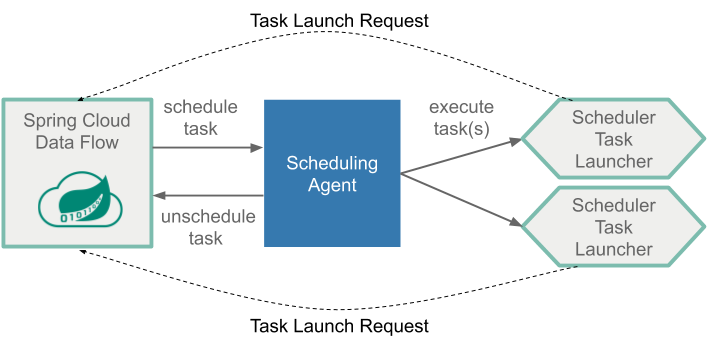
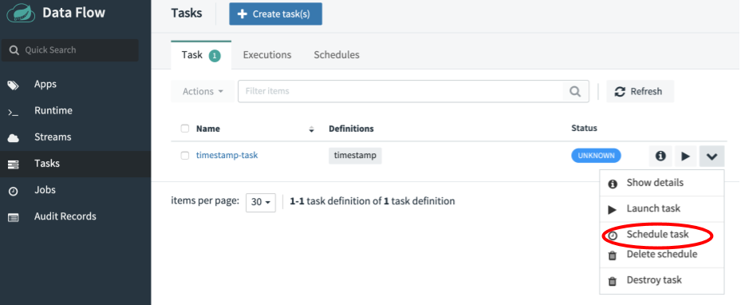
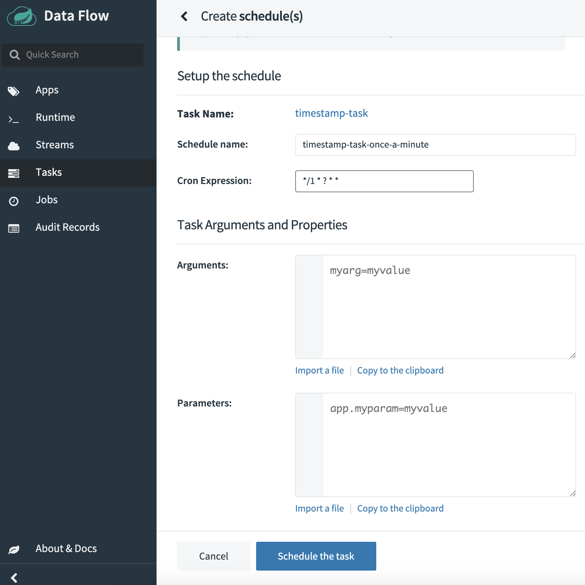
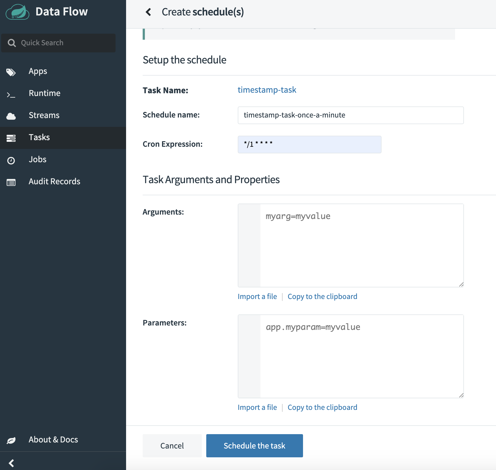
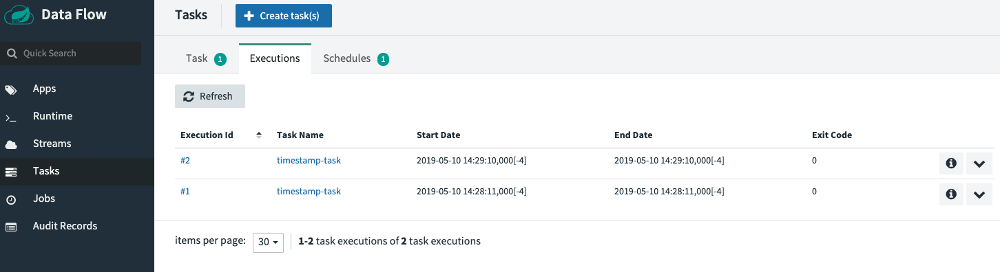
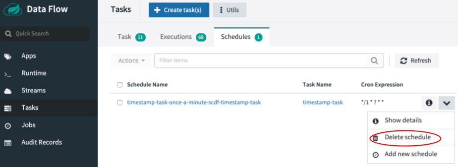

# Batch Job Scheduling

In the [Batch Developers Guide](%currentPath%/batch-developer-guides/), we showed you how to build batch applications and launch them in an ad-hoc fashion.  
However, batch jobs are typically launched at scheduled times or based on events.
In this section, we show you how you can schedule the launch of the batch jobs by using Spring Cloud Data Flow.

## Spring Cloud Data Flow Scheduling Overview

Spring Cloud Data Flow lets you schedule the launching of tasks by setting a cron expression. You can create a schedule through the RESTful API or through the Spring Cloud Data Flow UI.
Spring Cloud Data Flow schedules the execution of its tasks through a scheduling agent that is available on the cloud platform.

When using the Cloud Foundry platform, Spring Cloud Data Flow uses the PCF Scheduler.
When using Kubernetes, cron jobs are used.

## Scheduling a Batch Job

Make sure you have registered your timestamp application and created a definition for it as discussed in the [Getting Started Guide](%currentPath%/batch-developer-guides/getting-started/).
Using the UI, we schedule the `timestamp-task` by pressing the `drop down` button and selecting the "Schedule" option, as highlighted in the following image:

For this scenario, we want to launch this application once a minute. To do so, fill out the Schedule setup page as follows:

<!--TABS-->

<!--CloudFoundry-->

In the following sample, we set the name of the schedule to `timestamp-task-once-a-minute` and the [cron expression](https://docs.pivotal.io/pcf-scheduler/1-2/using-jobs.html#schedule-job) to `*/1 * ? * *`.
Notice that the cron expression is expressed in the format used by Quartz.
Also notice that we can add command line arguments and deployment parameters for this schedule, but we do not do so for this example.
Once you have entered the cron expression, press the **CREATE SCHEDULE(S)** button. Now PCF Scheduler handles the scheduled launches for your batch application.

<!--Kubernetes-->

In the following sample, we set the name of the schedule to `timestamp-task-once-a-minute`
and the [cron expression](https://kubernetes.io/docs/concepts/workloads/controllers/cron-jobs/) to `*/1 * * * *`.
Notice that we can add command line arguments and deployment parameters for this schedule, but we do not do so for this example.
Now press the **CREATE SCHEDULE(S)** button. Now a Cron Job has been created to handle the scheduled launches for your batch application.

<!--Local-->

Spring Cloud Data Flow does not offer an out-of-the-box solution for scheduling task launches on the local platform.  
However, there are at least two Spring Boot native solutions that provide a scheduling option. You can implement them as custom solutions to make scheduling work in SCDF running locally.

**Spring Boot Implementing a Quartz Scheduler**

One option is to create a Spring Boot application that uses the [Quartz scheduler](http://www.quartz-scheduler.org/) to create [RESTful API](https://docs.spring.io/spring-cloud-dataflow/docs/current/reference/htmlsingle/#api-guide-resources-task-executions) calls to launch tasks on Spring Cloud Data Flow.
For more information, see [here](https://docs.spring.io/spring-boot/docs/current/reference/html/spring-boot-features.html#boot-features-quartz).

**Spring Boot Implementing the `@Scheduled` annotation**

Another option is to create a Spring Boot application that uses the `@Scheduled` annotation on a method that creates [RESTful API](https://docs.spring.io/spring-cloud-dataflow/docs/current/reference/htmlsingle/#api-guide-resources-task-executions) calls to launch tasks on Spring Cloud Data Flow.
You can read more information about it in the [Spring Boot documentation](https://docs.spring.io/spring-boot/docs/current/reference/html/spring-boot-features.html#boot-features-task-execution-scheduling).

<!--END_TABS-->

When creating a task schedule, you can specify command line arguments and deployment properties for the scheduled application in the same way as you would specify them when launching a task.
More can be read about specifying deployment properties in the [Batch Feature Guide](%currentPath%/feature-guides/batch/deployment-properties/).

## Monitoring Task Launches

You can view the status of each scheduled launch on Spring Cloud Data Flow's `Tasks executions` tab.

## Deleting a Schedule

From the `Schedules` tab, press the `drop down` button next to the schedule you want to remove and select the "Destroy" option, as the following image shows:

When the confirmation dialog appears, press the **DELETE THE SCHEDULE** button.

