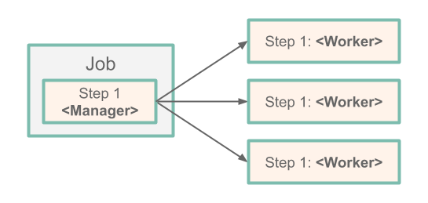

# Introduction to Remote Partitioning

The Batch Developer Guide showed you how to create a typical single threaded Spring Batch application.
While this is a great solution for most batch applications, there are cases where a particular step in the batch-job may take a significant amount time to do the work required.
Spring Batch has a solution that lets a [Batch Job](https://docs.spring.io/spring-batch/reference/html/domain.html#domainJob) partition a [Step](https://docs.spring.io/spring-batch/reference/html/domain.html#domainStep) execution so that each partition handles a segment of work.
In short, partitioning allows multiple instances of large batch applications to run concurrently.
The purpose of this is to reduce the elapsed time required to process long-running batch jobs.
Processes that can be successfully partitioned are those where the input file can be split or where the main database tables partitioned to allow the application to run against different sets of data.

So lets say we have a three-Step Job:



The Job runs on the left-hand side as a sequence of Step instances. In this case, we have one step (`Step 1`), and it is the `Manager` for the partition.
The `Manager Step` is responsible for allocating the work to and launching each `worker`.
In this case, the `worker` is another instance of the Spring Batch application that is started with a specific profile enabled.
The workers in our diagram are actually copies of our Spring Batch application that are deployed to the platform.
Spring Batch metadata in the `JobRepository` ensures that each worker is executed once and only once for each Job execution.

## Building our own Batch Application with Partitioning

In our sample application, we create a batch job that has a single step that is partitioned, and each partition prints its partition number.

You can view the completed project in the [Spring Cloud Task samples](https://github.com/spring-cloud/spring-cloud-task/tree/2.4.x/spring-cloud-task-samples/partitioned-batch-job).

### Initializr

To create our batch application, we need to visit the Spring Initializr site and create a project, as follows:

1. Visit the [Spring Initializr site](https://start.spring.io/).
1. Select the latest `2.7.x` release of spring boot.
1. Create a new Maven project with a Group name of `io.spring.cloud` and an Artifact name of `partition`.
1. In the **Dependencies** text box, type `task` to select the Cloud Task dependency.
1. In the **Dependencies** text box, type `jdbc` and then select the JDBC API dependency.
1. In the **Dependencies** text box, type `h2` and then select the H2 dependency.
   1. We use H2 for unit testing.
1. In the **Dependencies** text box, type `mariadb` and then select mariadb dependency (or your favorite database).
   1. We use mariadb for the runtime database.
1. In the **Dependencies** text box, type `batch` and then select Batch.
1. Click the **Generate Project** button.
1. Download the `partition.zip` file, unzip it, and import the project into your favorite IDE.

### Setting up MariaDB

Follow these instructions to run a MariaDB Docker image for this example:

1. Pull a MariaDB docker image by running the following command:

   ```bash
   docker pull mariadb:10.4.22
   ```

2. Start MariaDB by running the following command:

   ```bash
   docker run --name mariadb -d -p 3306:3306 -e MARIADB_ROOT_PASSWORD=password -e MARIADB_DATABASE=task mariadb:10.4.22
   ```

### Building The Application

To build the application:

1.  In your favorite IDE, create the `io.spring.cloud.partition.configuration` package.
1.  Using your favorite IDE add the following dependencies to your pom.xml.

```xml
		<dependency>
			<groupId>org.springframework.batch</groupId>
			<artifactId>spring-batch-integration</artifactId>
		</dependency>

		<dependency>
			<groupId>org.springframework.cloud</groupId>
			<artifactId>spring-cloud-deployer-local</artifactId>
			<version>%deployer-version%</version>
		</dependency>
```

1.  Create a Java configuration that specifies the beans required for the Partition `Job`. In this case, create a [`JobConfiguration`](https://github.com/spring-cloud/spring-cloud-task/blob/main/spring-cloud-task-samples/partitioned-batch-job/src/main/java/io/spring/JobConfiguration.java) class (in the `io.spring.cloud.partition.configuration`) that looks like the contents below.

    ```java
    @Configuration
    public class JobConfiguration {

        private static final int GRID_SIZE = 4;
        @Autowired
        public JobBuilderFactory jobBuilderFactory;
        @Autowired
        public StepBuilderFactory stepBuilderFactory;
        @Autowired
        public DataSource dataSource;
        @Autowired
        public JobRepository jobRepository;
        @Autowired
        private ConfigurableApplicationContext context;
        @Autowired
        private DelegatingResourceLoader resourceLoader;
        @Autowired
        private Environment environment;

        @Bean // <1>
        public PartitionHandler partitionHandler(TaskLauncher taskLauncher, JobExplorer jobExplorer) throws Exception {
            Resource resource = this.resourceLoader
                .getResource("maven://io.spring.cloud:partition:0.0.1-SNAPSHOT");

            DeployerPartitionHandler partitionHandler =
                new DeployerPartitionHandler(taskLauncher, jobExplorer, resource, "workerStep");

            List<String> commandLineArgs = new ArrayList<>(3);
            commandLineArgs.add("--spring.profiles.active=worker");
            commandLineArgs.add("--spring.cloud.task.initialize.enable=false");
            commandLineArgs.add("--spring.batch.initializer.enabled=false");
            partitionHandler
                .setCommandLineArgsProvider(new PassThroughCommandLineArgsProvider(commandLineArgs));
            partitionHandler
                .setEnvironmentVariablesProvider(new SimpleEnvironmentVariablesProvider(this.environment));
            partitionHandler.setMaxWorkers(1);
            partitionHandler.setApplicationName("PartitionedBatchJobTask");

            return partitionHandler;
        }

        @Bean // <2>
        @Profile("!worker")
        public Job partitionedJob(PartitionHandler partitionHandler) throws Exception {
            Random random = new Random();
            return this.jobBuilderFactory.get("partitionedJob" + random.nextInt())
                .start(step1(partitionHandler))
                .build();
        }

        @Bean // <3>
        public Step step1(PartitionHandler partitionHandler) throws Exception {
            return this.stepBuilderFactory.get("step1")
                .partitioner(workerStep().getName(), partitioner())
                .step(workerStep())
                .partitionHandler(partitionHandler)
                .build();
        }

        @Bean   // <4>
        public Partitioner partitioner() {
            return new Partitioner() {
                @Override
                public Map<String, ExecutionContext> partition(int gridSize) {

                    Map<String, ExecutionContext> partitions = new HashMap<>(gridSize);

                    for (int i = 0; i < GRID_SIZE; i++) {
                        ExecutionContext context1 = new ExecutionContext();
                        context1.put("partitionNumber", i);

                        partitions.put("partition" + i, context1);
                    }

                    return partitions;
                }
            };
        }

        @Bean   // <5>
        @Profile("worker")
        public DeployerStepExecutionHandler stepExecutionHandler(JobExplorer jobExplorer) {
            return new DeployerStepExecutionHandler(this.context, jobExplorer, this.jobRepository);
        }

        @Bean // <6>
        public Step workerStep() {
            return this.stepBuilderFactory.get("workerStep")
                .tasklet(workerTasklet(null))
                .build();
        }

        @Bean // <7>
        @StepScope
        public Tasklet workerTasklet(
            final @Value("#{stepExecutionContext['partitionNumber']}") Integer partitionNumber) {

            return new Tasklet() {
                @Override
                public RepeatStatus execute(StepContribution contribution, ChunkContext chunkContext) throws Exception {
                    System.out.println("This tasklet ran partition: " + partitionNumber);

                    return RepeatStatus.FINISHED;
                }
            };
        }
    }
    ```

    - <1> The [`PartitionHandler`](https://docs.spring.io/spring-batch/reference/html/scalability.html#partitionHandler) is the component that knows how the `Step` is partitioned. It sends `StepExecution` requests to the remote Steps.
    - <2> The [`Job`](https://docs.spring.io/spring-batch/reference/html/configureJob.html) manages the batch process.
    - <3> This [`Step`](https://docs.spring.io/spring-batch/reference/html/configureStep.html) is used by the manager to launch the worker steps
    - <4> The [`Partitioner`](https://docs.spring.io/spring-batch/reference/html/scalability.html#partitioning) generates execution contexts as input parameters for new step executions.
    - <5> The [`DeployerStepExecutionHandler`](https://docs.spring.io/spring-cloud-task/docs/%task-version%/reference/html/#batch-partitioning) uses [Spring Cloud Deployer](https://github.com/spring-cloud/spring-cloud-deployer) to launch the work step executions on the cloud platform.
    - <6> The workers use this [`Step`](https://docs.spring.io/spring-batch/reference/html/configureStep.html) to execute the [`Tasklet`](https://docs.spring.io/spring-batch/reference/html/configureStep.html#taskletStep).
    - <7> The [`Tasklet`](https://docs.spring.io/spring-batch/reference/html/configureStep.html#taskletStep) that executes the business logic for the partitioned set of work -- in our case, printing the partition number.

1.  Now we can add our `@EnableTask` and `@EnableBatchProcessing` annotations to the `PartitionApplication` class, as follows:

```java
@SpringBootApplication
@EnableTask  // <1>
@EnableBatchProcessing // <2>
public class PartitionApplication {

	public static void main(String[] args) {
		SpringApplication.run(PartitionApplication.class, args);
	}
}
```

- <1> The `@EnableTask` annotation sets up a `TaskRepository` that stores information about the task execution, such as the start and end time of the task and its exit code.
- <2> The `@EnableBatchProcessing` annotation enables Spring Batch features and provides a base configuration for setting up batch jobs.

## Deployment

This section covers how to deploy your Batch application.

### Local

This section covers how to deploy your Batch application to your local computer.

1.  Now we can take the next step of building the project.
    From a command line change, directory to the location of your project and build the project by using Maven:
    `./mvnw clean install -DskipTests`.

2.  Now we can execute the application with the configurations required to launch our Batch application.

    To configure the execution of the Batch application, add the following properties to your environment:

```
export spring_batch_initializeSchema=always // <1>
java -jar target/partition-0.0.1-SNAPSHOT.jar --spring.application.json='{"spring":{"datasource":{"url":"jdbc:mariadb://localhost:3306/task","username":"root","password":"password","driverClassName":"org.mariadb.jdbc.Driver"}}}'
```

- <1> `spring.batch.initializeSchema`: Initializes the database with the tables required for Spring Batch. In this example, we state that we `always` want to do this. This does not overwrite the tables if they already exist.

#### Cleanup

To stop and remove the MariaDB container running in the Docker instance, run the following commands:

```bash
docker stop mariadb
docker rm mariadb
```
