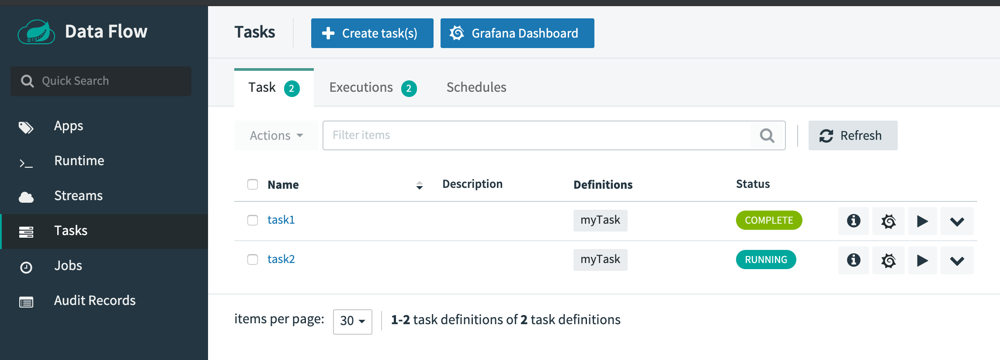
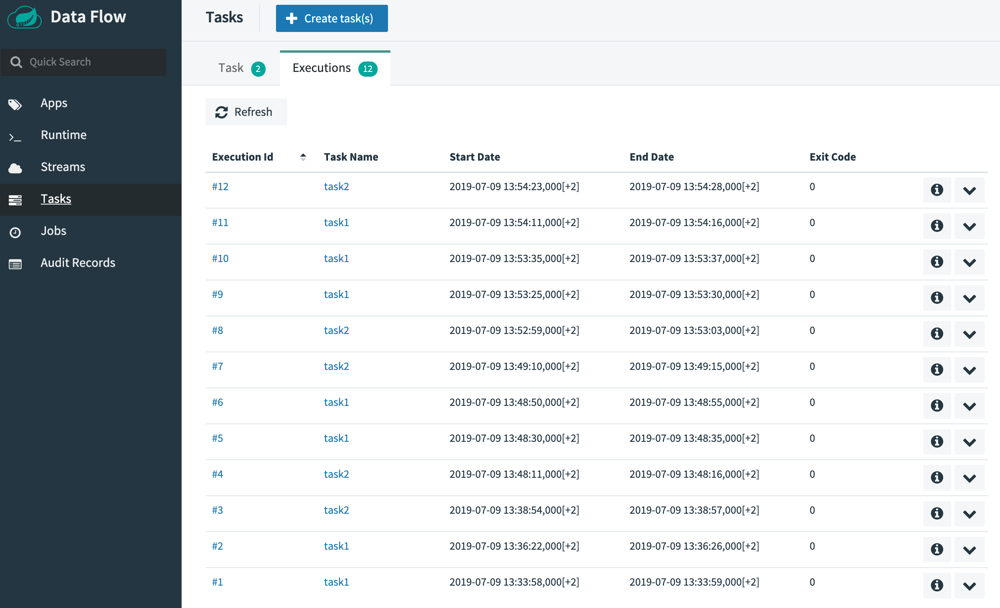

# Task and Batch Monitoring with Prometheus and InfluxDB

This section describes how to monitor the applications that were deployed as part of a Task definition in Data Flow. The setup for each platform is different, but the general architecture is the same across the platforms.

The Data Flow metrics architecture is designed around the [Micrometer](https://micrometer.io/) library, which is a vendor-neutral application metrics facade. It provides a simple facade over the instrumentation clients for the most popular monitoring systems. See the [Micrometer documentation](https://micrometer.io/docs) for the list of supported monitoring systems. The micrometer is the instrumentation library that powers the delivery of application metrics from Spring Boot. Spring Batch provides [additional integration](https://docs.spring.io/spring-batch/4.2.x/reference/html/monitoring-and-metrics.html) to expose metrics around task durations, rates, and errors, which is critical to the monitoring of deployed batch-jobs.

We will focus on using three Time Series Databases, Wavefront, Prometheus and InfluxDB.

[Wavefront](https://docs.wavefront.com/wavefront_introduction.html) is a high-performance streaming analytics platform that supports 3D observability (metrics, histograms, traces/spans). It scales to very high data ingestion rates and query loads while also collecting data many services and sources across your entire application stack.

[Prometheus](https://prometheus.io/) is a popular pull-based Time Series Database that pulls the metrics from the target applications with pre-configured endpoints and provides a query language to select and aggregate time series data in real time.

[InfluxDB](https://www.influxdata.com/) is a popular open-source push-based Time Series Database. It supports downsampling, automatically expiring and deleting unwanted data, and backup and restore. Analysis of data is done through an SQL-like query language.

<!--NOTE-->

The core of the Micrometer task integration is part of the Spring Cloud Task’s 2.2.0 release-line, which is a prerequisite for the Task-metrics and the Data Flow integration.
Task applications built on the Spring Cloud Task 2.2+ version can be configured to emit Task and Batch metrics to the pre-configured monitoring systems supported by Micrometer.

<!--END_NOTE-->

##### Enable Task Metrics

To enable Task metrics integration with Data Flow you must add the `spring-boot-starter-actuator` to your task application and import the `spring-cloud-dependencies` BOM.

```xml
<dependencies>
  <dependency>
      <groupId>org.springframework.boot</groupId>
      <artifactId>spring-boot-starter-actuator</artifactId>
  </dependency>
</dependencies>

<dependencyManagement>
	<dependencies>
		<dependency>
			<groupId>org.springframework.cloud</groupId>
			<artifactId>spring-cloud-dependencies</artifactId>
			<version>Hoxton.SR6</version>
			<type>pom</type>
			<scope>import</scope>
		</dependency>
	</dependencies>
</dependencyManagement>
```

Then include the desired Micrometer registry as the dependency in the Task POM:

<!--TABS-->

<!--Prometheus-->

Enable Prometheus metrics collection using `RSocket` with the following dependency:

```xml
<dependency>
	<groupId>io.micrometer.prometheus</groupId>
	<artifactId>prometheus-rsocket-spring</artifactId>
</dependency>
```

<!--Wavefront-->

Enable Wavefront metrics collection the `micrometer-registry-wavefront` dependency:

```xml
<dependency>
    <groupId>io.micrometer</groupId>
    <artifactId>micrometer-registry-wavefront</artifactId>
</dependency>

<dependency>
    <groupId>com.wavefront</groupId>
    <artifactId>wavefront-sdk-java</artifactId>
    <version>2.6.0</version>
</dependency>
```

<!--NOTE-->

The `wavefront-sdk-java` dependency overrides the version bundled with `micrometer-registry-wavefront:1.5.2` or older.
For `1.5.3` or newer the `wavefront-sdk-java` dependency should be dropped.

<!--END_NOTE-->

<!--InfluxDB-->

Enable the `InfluxDB` metrics collection with the following dependency:

```xml
<dependency>
    <groupId>io.micrometer</groupId>
    <artifactId>micrometer-registry-influx</artifactId>
</dependency>
```

<!--END_TABS-->

##### Build Docker Image

To build a Docker image, you could extend from the `springcloud/openjdk:latest` base-image. For example, your task `Dockerfile` could start like this:

```
FROM springcloud/openjdk:latest
...
```

To help you get started monitoring tasks, Data Flow provides [Grafana](https://grafana.com/) Dashboards that you can install and customize for your needs.

The following image shows the general architecture of how task applications are monitored:


<!--NOTE-->

Prometheus requires a Service Discovery component to automatically probe the configured endpoint for metrics. The Spring Cloud Data Flow server leverages the [Prometheus RSocket Proxy](https://github.com/micrometer-metrics/prometheus-rsocket-proxy), which uses `rsocket` protocol for the service-discovery mechanism. The RSocket Proxy approach is used so that we can monitor tasks, which are short lived, as well as long lived stream applications using the same architecture. See the micrometer documentation on [short-lived task/batch applications](https://github.com/micrometer-metrics/prometheus-rsocket-proxy#support-for-short-lived-or-serverless-applications) for more information. In addition, the RSocket approach allows for the same monitoring architecture to be used across all the platforms. Prometheus is configured to scrape each proxy instance. Proxies in turn use the RSocket connection to pull metrics from each application. The scraped metrics are then viewable through Grafana dashboards.

<!--END_NOTE-->

#### Spring Cloud Task Metric Tags

To allow aggregating metrics per application type and per instance id or per task name, the Spring Cloud Task applications are configured to use the following Micrometer tags:

- `task.name`: The name of the Task that contains the applications that send the metrics
- `task.execution.id`: [The instance id of the executed task](https://docs.spring.io/spring-cloud-task/docs/%task-version%/reference/#features-generated_task_id).
- `task.external.execution.id`: The [external Task ID](https://docs.spring.io/spring-cloud-task/docs/%task-version%/reference/#features-external_task_id) as present on the target platform (such as Cloud Foundry or Kubernetes) The type (Source, Processor, or Sink) of the application that reports the metrics
- `task.parent.execution.id`: The [parent task ID](https://docs.spring.io/spring-cloud-task/docs/%task-version%/reference/#features-parent_task_id) used to identify task that executes another task or tasks.

If the Data Flow server is started with the `spring.cloud.dataflow.metrics.dashboard.url` property pointing to your Grafana URL, the Grafana feature is enabled and the Data Flow UI provides you with Grafana buttons that can open a particular dashboard for a given task.

Installing Wavefront, Prometheus and InfluxDB is different depending on the platform on which you run. Links to installation instructions are provides in each section below.

## Local

This section describes how to view application metrics for tasks using either Prometheus or InfluxDB as the metrics store on your local machine.

<!--TABS-->

<!--Prometheus-->

### Prometheus

To install Prometheus and Grafana, follow the [Monitoring with Prometheus and Grafana](%currentPath%/installation/local/docker-customize/) Docker Compose instructions. This will bring up Spring Cloud Data Flow, Skipper, Apache Kafka, Prometheus, and prebuilt dashboards for Grafana.

Once all the containers are running, you can access the Spring Cloud Data Flow Dashboard at http://localhost:9393/dashboard

Also you can reach the Prometheus UI at http://localhost:9090/graph and http://localhost:9090/targets

You can access the Grafana dashboard at http://localhost:3000 using the credentials:

Now you can deploy a custom Task application (`task-demo-metrics`) and define two tasks (`task1` and `task2`):

```bash
dataflow:>app register --name myTask --type task --uri https://raw.githubusercontent.com/spring-cloud/spring-cloud-dataflow-samples/master/dataflow-website/feature-guides/batch/monitoring/prometheus-task-demo-metrics-0.0.1-SNAPSHOT.jar

dataflow:>task create --name task1 --definition "myTask"
dataflow:>task create --name task2 --definition "myTask"
```

Launch the tasks several times:

```bash
dataflow:>task launch --name task1
dataflow:>task launch --name task2
```

In the [DataFlow task execution UI](http://localhost:9393/dashboard/#/tasks/executions) you should see:



And in [Grafana dashboard for Tasks](http://localhost:3000/d/scdf-tasks/tasks?refresh=10s):


<!--Wavefront-->

### Wavefront

To install Data Flow with Wavefront support, follow the [Monitoring with Wavefront](%currentPath%/installation/local/docker-customize/#wavefront) Docker Compose instructions. This will bring up Spring Cloud Data Flow, Skipper, Apache Kafka, and it will also point to the Wavefront's Data Flow Integration Tile automatically.

The Wavefront is a SaaS offering. You need to create a user account first and use it to set the `WAVEFRONT_KEY` and `WAVEFRONT_URI` environment variables as explained below.

You should see dashboards similar to those shown in the following image:


<!--InfluxDB-->

### InfluxDB

To install InfluxDB and Grafana, follow the [Monitoring with InfluxDB and Grafana](%currentPath%/installation/local/docker-customize/#monitoring-with-influxdb-and-grafana) Docker Compose instructions. This will bring up Spring Cloud Data Flow, Skipper, Apache Kafka, InfluxDB, and prebuilt dashboards for Grafana.

Once all the containers are running, you can access the Spring Cloud Data Flow Dashboard at http://localhost:9393/dashboard. You can access the Grafana dashboard at http://localhost:3000 using the credentials:

- user: `admin`
- password: `admin`

Now you can deploy a custom Task application (`task-demo-metrics`) and define two tasks (`task1` and `task2`):

```bash
dataflow:>app register --name myTask --type task --uri https://raw.githubusercontent.com/spring-cloud/spring-cloud-dataflow-samples/master/dataflow-website/feature-guides/batch/monitoring/influx-task-demo-metrics-0.0.1-SNAPSHOT.jar

dataflow:>task create --name task1 --definition "myTask"
dataflow:>task create --name task2 --definition "myTask"
```

Launch the tasks several times:

```bash
dataflow:>task launch --name task1
dataflow:>task launch --name task2
```

In the [DataFlow task execution UI](http://localhost:9393/dashboard/#/tasks/executions) you should see list like this:


You should see dashboards similar to those shown in the following image:


<!--END_TABS-->

## Kubernetes

This section describes how to view application metrics for task using Prometheus or InfluxDB as the metrics store on Kubernetes.

<!--TABS-->

<!--Prometheus -->

### Prometheus

To install Prometheus and Grafana on Kubernetes, you will need to follow the instructions for a [kubectl based installation](%currentPath%/installation/kubernetes/kubectl/#deploy-prometheus-and-grafana).

<!--IMPORTANT-->

The address used to access the Grafana Dashboard depends on the Kubernetes platform the system is deployed to. If you are using (for example) GKE, the load balancer address would be used. If using Minikube (which does not provide a load balancer implementation), the IP of the Minikube (along with an assigned port) is used. In the following examples, for simplicity, we use Minikube.

<!--END_IMPORTANT-->

To obtain the URL of the Grafana UI when it is deployed to Minikube, run the following command:

```bash
$ minikube service --url grafana
http://192.168.99.100:31595
```

In the preceding example, you can reach the Grafana dashboard at http://192.168.99.100:31595. The default credentials are as follows:

- User name: admin
- Password: password

The Grafana instance is pre-provisioned with a dashboard:

- Tasks: http://192.168.99.100:31595/d/scdf-tasks/tasks?refresh=10s

You can collect metrics on a per-task or per-batch basis, or apply metrics collection to all deployed applications globally.

Let's use a custom Task application (i.e., `task-demo-metrics`) and define two different task definitions with this application (i.e., `task1` and `task2`):

```bash
dataflow:>app register --name myTask --type task --uri docker://springcloud/task-demo-metrics:latest

dataflow:>task create --name task1 --definition "myTask"
dataflow:>task create --name task2 --definition "myTask"
```

Launch the tasks several times:

```bash
dataflow:>task launch --name task1
dataflow:>task launch --name task2
dataflow:>task launch --name task1
dataflow:>task launch --name task2
dataflow:>task launch --name task1
dataflow:>task launch --name task2
```

To obtain the SCDF URL. When it is deployed to Minikube, run the following command:

```bash
minikube service --url scdf-server
http://192.168.99.100:32121
```

In the [DataFlow task execution UI](http://192.168.99.100:32121/dashboard/#/tasks/executions) you should see:


Open the [Grafana dashboard for Tasks](http://192.168.99.100:31595/d/scdf-tasks/tasks?refresh=10s):


<!--Wavefront -->

### Wavefront

The Wavefront is a SaaS offering. You need to create a user account first and obtain the `API-KEY` and `WAVEFRONT-URI` assigned to your account.

Follow the general [Data Flow Kubernetes installation instructions](%currentPath%/installation/kubernetes/).

Then add the following properties to your Spring Cloud Data Flow server configuration (e.g. `src/kubernetes/server/server-config.yaml`) for enabling the Wavefront Integration:

```yml
management:
  metrics:
    export:
      wavefront:
        enabled: true
        api-token: <YOUR API-KEY>
        uri: <YOUR WAVEFRONT-URI>
        source: demo-scdf-source
spring:
  cloud:
    dataflow:
      applicationProperties:
        task:
          management:
            metrics:
              export:
                wavefront:
                  enabled: true
                  api-token: <YOUR API-KEY>
                  uri: <YOUR WAVEFRONT-URI>
                  source: demo-scdf-source
```

Then on the Wavefront portal you should see dashboards similar to those shown in the following image:


<!--END_TABS-->

## Cloud Foundry

This section describes how to view application metrics for streams using Prometheus and InfluxDB as the metrics store on Cloud Foundry.

<!--TABS-->

<!--Prometheus-->

### Prometheus

To configure the Data Flow server's manifest to send metrics data from stream applications to the Prometheus RSocket gateway, follow the [Manifest based installation instructions](%currentPath%/installation/cloudfoundry/cf-cli/#configuration-for-prometheus).

With Prometheus, Grafana, Spring Cloud Data Flow, and any other services as defined in the [Getting Started - Cloud Foundry](%currentPath%/installation/cloudfoundry/cf-cli) section up and running, you are ready to collect metrics.

Depending on where you have installed Grafana, access the Grafana dashboard using the credentials:

- User name: admin
- Password: password

Provision Grafana with following task dashboards: [scdf-task-batch.json](https://github.com/spring-cloud/spring-cloud-dataflow/blob/master/src/grafana/prometheus/docker/grafana/dashboards/scdf-task-batch.json)

Now you can deploy a custom Task application (`task-demo-metrics`) and define two tasks (`task1` and `task2`):

```bash
dataflow:>app register --name myTask --type task --uri https://raw.githubusercontent.com/spring-cloud/spring-cloud-dataflow-samples/master/dataflow-website/feature-guides/batch/monitoring/prometheus-task-demo-metrics-0.0.1-SNAPSHOT.jar

dataflow:>task create --name task1 --definition "myTask"
dataflow:>task create --name task2 --definition "myTask"
```

Launch the tasks several times:

```bash
dataflow:>task launch --name task1
dataflow:>task launch --name task2
```

In the [DataFlow task execution UI](http://localhost:9393/dashboard/#/tasks/executions) you should see:


And in [Grafana dashboard for Tasks](http://localhost:3000/d/scdf-tasks/tasks?refresh=10s):


<!--Wavefront -->

### Wavefront

The Wavefront is a SaaS offering. You need to create a user account first and obtain the `API-KEY` and `WAVEFRONT-URI` assigned to your account.

To configure the Data Flow Server to send metrics data from stream applications to the Wavefront monitoring system, follow the [Manifest based Wavefront configuration instructions](%currentPath%/installation/cloudfoundry/cf-cli/#configuration-for-wavefront).

Then on the Wavefront portal you should see dashboards similar to those shown in the following image:


<!--InfluxDB-->

### InfluxDB

You can follow the general [Manifest based installation on Cloud Foundry](%currentPath%/installation/cloudfoundry/cf-cli/#manifest-based-installation-on-cloud-foundry) instructions for installing `Skipper` and `DataFlow` on Cloud Foundry.
To enabling the Task metrics integration follow the [Configuration for InfluxDB](%currentPath%/installation/cloudfoundry/cf-cli/#configuration-for-influxdb) instructions.

<!--END_TABS-->
