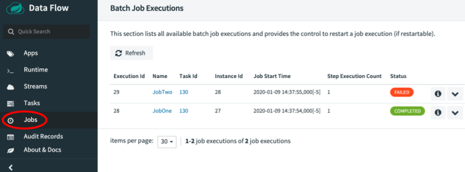
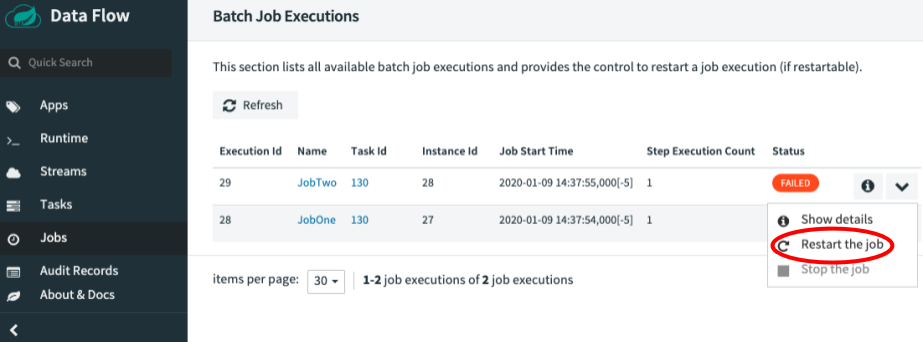
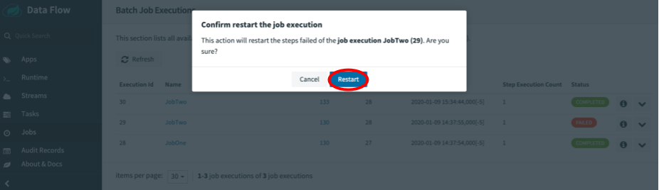
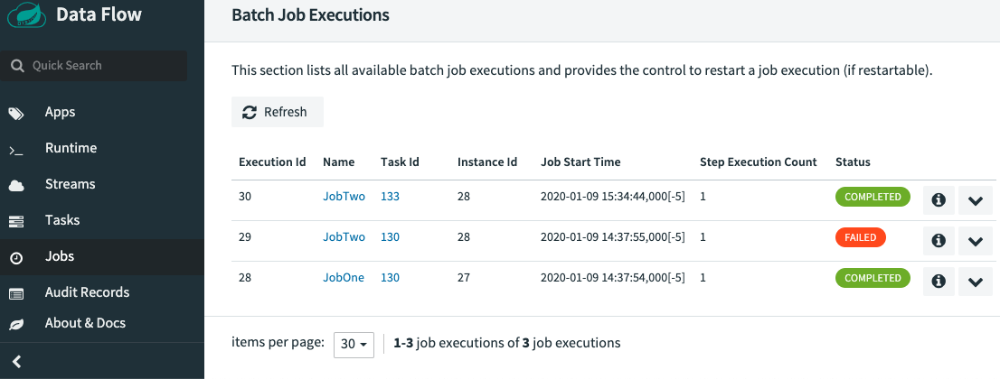

# Batch Job Restart

Spring Cloud Data Flow lets you restart a Spring Batch Job. For instance, if a Spring Batch Job fails to run, you can restarted it from the SCDF dashboard so that the batch-job can pick up the work where it left off. In this section, we show how you can restart batch-jobs.

## Restarting a Batch Job

To restart a Spring Batch Job, navigate to the Jobs page by clicking the **Jobs** tab located on the left hand side of the UI.

Now identify the job you wish to restart. In our example (shown in the following image), `JobTwo` shows a status of `FAILED`. Thus, the UI provides an option to restart this batch job.
To do so, click the dropdown button associated with `JobTwo` and select **Restart**.

Now a dialog box appears and asks whether you wish to restart the job. Click the **RESTART** button.

At this point, Spring Cloud Data Flow relaunchs the task for this Spring Batch Job.
Once the Job has finished its operation without any errors, you can see that `JobTwo` completed successfully.

