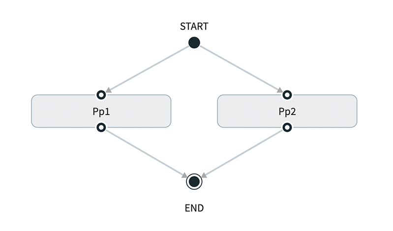

# Python/Docker as SCDF Task

This example illustrates how run an Python script as [Data Flow Task](http://docs.spring.io/spring-cloud-dataflow/docs/2.1.0.BUILD-SNAPSHOT/reference/htmlsingle/#spring-cloud-dataflow-task).

**TODO: Describe what the Task is doing**

A small helper class [TaskStatus](https://github.com/tzolov/scdf-polyglot-experiments/blob/master/python_task_with_status/util/task_status.py) is used to write task state to the Task table created by Data Flow.

The source code can be found [here](https://github.com/tzolov/scdf-polyglot-experiments/tree/master/python_task_with_status)

**TODO provide a .zip file of all the source code**
**TODO: Source code to be moved into data flow samples repo in a directory structure that mimics the dataflow.io directory structure. There is already some content in there to get an idea of the directory structure.**

## Description

The [python_task.py](https://github.com/tzolov/scdf-polyglot-experiments/blob/master/python_task_with_status/python_task.py) script will sleep for 60 seconds and exit successfully unless the command line argument `error.message` is passed to the application.

```python
from util.task_status import TaskStatus
from util.task_args import get_task_id, get_db_url, get_task_name, get_cmd_arg

try:
    status = TaskStatus(get_task_id(), get_db_url())

    status.running()

    # Do something
    print('Start task:{}, id:{}'.format(get_task_name(), get_task_id()))

    print('Wait for 60 seconds ...')
    sys.stdout.flush()
    time.sleep(60)

    if get_cmd_arg('error.message') is not None:
        raise Exception(get_cmd_arg('error.message'))

    status.completed()

except Exception as exp:
    # set status to FAILED
    status.failed(1, 'Task failed: {}'.format(exp))
```

If the `--error.message=<SomeText>` is added as a launch argument the pyton_task.py will imitate an execution failure.

The TaskStatus class inside [task_status.py](https://github.com/tzolov/scdf-polyglot-experiments/blob/master/python_task_with_status/util/task_status.py) utility can update the content of the `TASK_EXECUTION` table to emulate the status life cycle changes.
The TaskStatus is initialized with the `task id` and `sqlalchemy url` computed from the command arguments with the help of the `task_args.py`.
The TaskStatus can set the task status to `running`, `completed` or `failed(with exitCode, errorMessage)`.

To let the task access the Data Flow's database we need to retrieve the database connection properties that Data Flow will provide as command line arguments:

```
--spring.datasource.username=root
--spring.datasource.url=jdbc:mysql://10.109.81.186:3306/mysq
--spring.datasource.password=yourpassword
--spring.cloud.task.executionid=26
```

The `spring.cloud.task.executionid` property represents the Task id as persisted in the `TASK_EXECUTION` table.

The [task_args.py](https://github.com/tzolov/scdf-polyglot-experiments/blob/master/python_task_with_status/util/task_args.py) utility helps extracting the task arguments for default (e.g. exec) [entry point style](http://docs.spring.io/spring-cloud-dataflow/docs/2.1.0.BUILD-SNAPSHOT/reference/htmlsingle/#_entry_point_style_2).

The utility also constructs [sqlalchemy](https://www.sqlalchemy.org/) urls for the different databases, that might be configured with SCDF (currently only mysql is tested). Check the [get_db_url()](https://github.com/tzolov/scdf-polyglot-experiments/blob/master/python_task_with_status/util/task_args.py#L22) implementation.

## Build

\*\*TODO: This needs to move into this document

Follow the [README](https://github.com/tzolov/scdf-polyglot-experiments/blob/master/python_task_with_status/README.md) instructions to build the Docker image and push to Docker Hub.

## Usage

Then you can test it like this:

```bash
dataflow:>app import --uri http://bit.ly/Elston-GA-task-applications-docker
dataflow:>app register --type task  --name python-task-with-status --uri docker://tzolov/python_task_with_status:0.1
dataflow:>task create --name python-task --definition "python-task-with-status"
dataflow:>task launch --name python-task
```

Use `kubectl get all` and `kubectl logs -f po/python-task-XXXXXX` to monitor the output of the task. Use the SCDF UI/task or shell (task list) to monitor the status of the python-task.

\*\*TODO: It would be nice to see the task execution as being successful or not from the UI to give it a bit more 'splash'.

## Composed Tasks

\*\*TODO: Need to use a variable in the link to ref docs

With the provided task status management the Docker/Python tasks can be used inside [Composed Tasks](http://docs.spring.io/spring-cloud-dataflow/docs/2.1.0.BUILD-SNAPSHOT/reference/htmlsingle/#spring-cloud-dataflow-composed-tasks).

For example for a parallel task execution:

```bash
dataflow:>task create compose2 --definition "<pp1: python-task-with-status || pp2: python-task-with-status>”
dataflow:>task launch --name compose2
```

would launch the python-task twice in parallel:



While the following composed task will launch the defined tasks in sequence:

```bash
dataflow:>task create sequence1 --definition "t1: timestamp && python-task-with-status && t2: timestamp”
dataflow:>task launch --name sequence1
```


