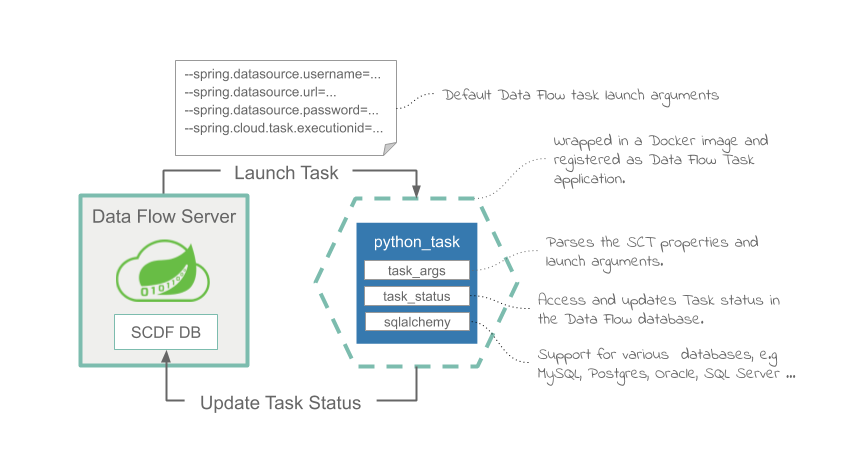
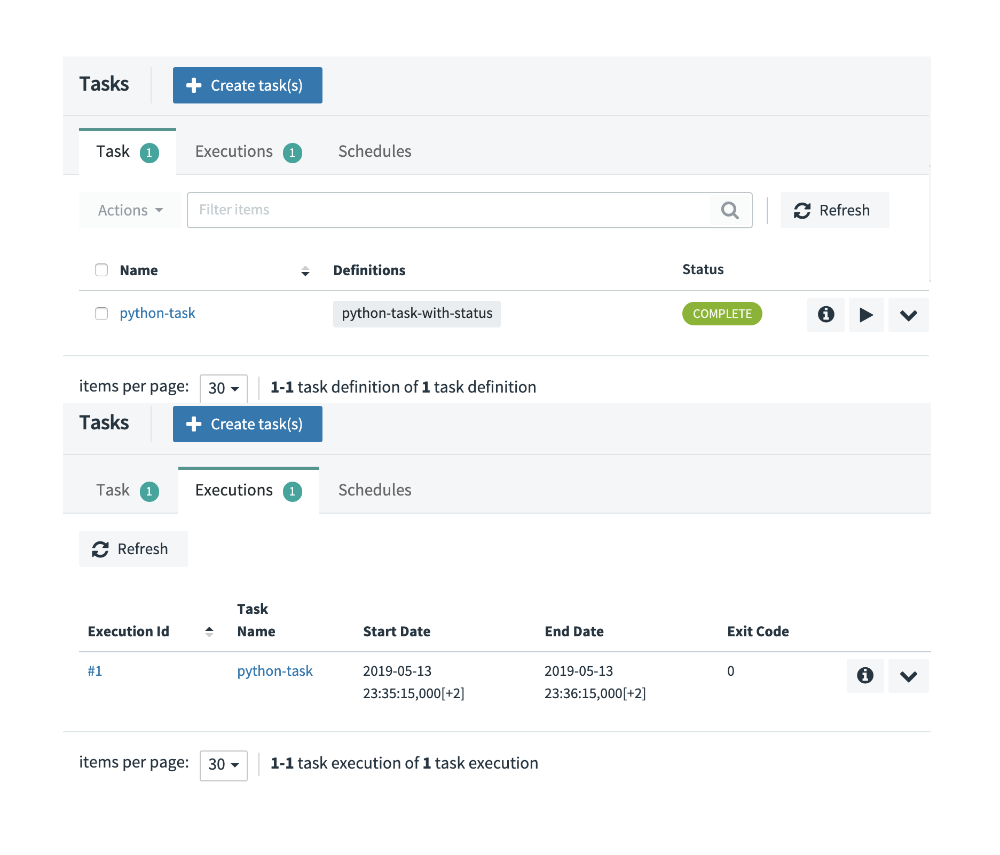
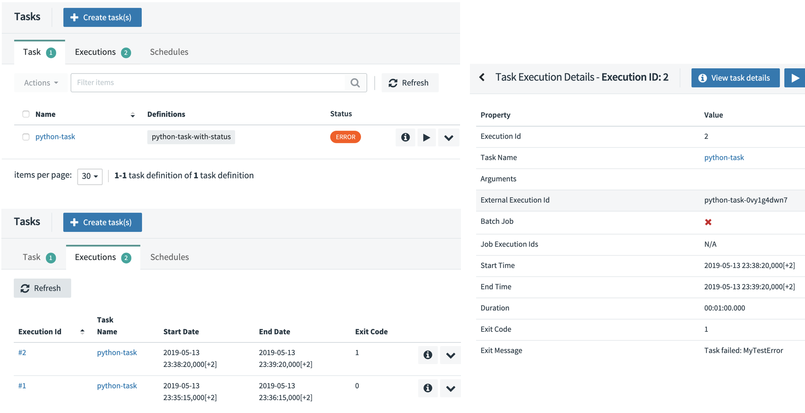

# Create and Deploy a Python Task

This recipe shows how to run a custom Python script as a [Data Flow Task](https://docs.spring.io/spring-cloud-dataflow/docs/%dataflow-version%/reference/htmlsingle/#spring-cloud-dataflow-task) and how to orchestrate later as [Composed Tasks](https://docs.spring.io/spring-cloud-dataflow/docs/%dataflow-version%/reference/htmlsingle/#spring-cloud-dataflow-composed-tasks).

The approach requires the Python script to be bundled in a docker image, which can then be used in SCDF's `Local` and `Kubernetes` implementations.

Following diagram walks through the architecture and the various components involved in the solution.



When Data Flow launches the Python script as a task, the script runs and completes with either a success or failure status.
Because this is not a standard Sprint Cloud Task application, it is the user's responsibility to manage the life cycle and update the state to the shared database that is also used by Data Flow.
Utilities are provided to help handle the launch arguments and manage the task status within the Data Flow database.

The source code can be found in the samples GitHub [repo](https://github.com/spring-cloud/spring-cloud-dataflow-samples/tree/master/dataflow-website/recipes/polyglot/polyglot-python-task) or downloaded as a zipped archive: [polyglot-python-task.zip](https://github.com/spring-cloud/spring-cloud-dataflow-samples/raw/master/dataflow-website/recipes/polyglot/polyglot-python-task.zip). Follow the [Build](#build) instructions for building and using the project.

## Development

The [python_task.py](https://github.com/spring-cloud/spring-cloud-dataflow-samples/blob/master/dataflow-website/recipes/polyglot/polyglot-python-task/python_task.py) below illustrates a sample Python script that can be registered as Spring Cloud Task.
When launched, the Python script prints an acknowledgment message, it then sleeps for 60 seconds and completes afterward.
If the `--error.message=<Text>` launch argument is present, then the script throws an exception to simulate an execution failure.

```python
from util.task_status import TaskStatus
from util.task_args import get_task_id, get_db_url, get_task_name, get_cmd_arg

try:
    # Connect to SCDF's database.
    status = TaskStatus(get_task_id(), get_db_url())

    # Set task's status to RUNNING.
    status.running()

    # Do something.
    print('Start task:{}, id:{}'.format(get_task_name(), get_task_id()))

    print('Wait for 60 seconds ...')
    sys.stdout.flush()
    time.sleep(60)

    if get_cmd_arg('error.message') is not None:
        raise Exception(get_cmd_arg('error.message'))

    # Set task's status to COMPLETED.
    status.completed()

except Exception as exp:
    # Set task's status to FAILED.
    status.failed(1, 'Task failed: {}'.format(exp))
```

<!--IMPORTANT-->

Since the Python script is not managed by `Spring Cloud Task`, it is the user's responsibility to manage and update the progress with the Data Flow database.

<!--END_IMPORTANT-->

To parse the input arguments and to manage its state in Data Flow, the custom script uses the following utilities:

- The [task_status.py](https://github.com/spring-cloud/spring-cloud-dataflow-samples/blob/master/dataflow-website/recipes/polyglot/polyglot-python-task/util/task_status.py) helps to access and update the Data Flow `TASK_EXECUTION` table in order to reflect task's life cycle events. The `TaskStatus` class takes `task id` and `sqlalchemy url` arguments, computed from the command line arguments and provides API for setting the task status to `running`, `completed` or `failed(with exitCode, errorMessage)`.
  To access the Data Flow database, the `task_status` uses the following launch arguments, automatically provided by Data Flow on every task launch:

  ```bash
  --spring.datasource.username=root
  --spring.datasource.password=yourpassword
  --spring.datasource.url=jdbc:mysql://<mysql-host>:<port>/mysq
  --spring.cloud.task.executionid=26
  ```

  The `spring.cloud.task.executionid` property represents the Task id as known inside Data Flow and persisted in the `TASK_EXECUTION` table.

- The [task_args.py](https://github.com/spring-cloud/spring-cloud-dataflow-samples/blob/master/dataflow-website/recipes/polyglot/polyglot-python-task/util/task_args.py) utility helps extracting the task arguments for default (e.g. exec) [entry point style](https://docs.spring.io/spring-cloud-dataflow/docs/%dataflow-version%/reference/htmlsingle/#_entry_point_style_2).
  The utility also constructs [sqlalchemy](https://www.sqlalchemy.org/) urls for the different databases, that might be configured with SCDF (currently only mysql is tested). Check the [get_db_url()](https://github.com/spring-cloud/spring-cloud-dataflow-samples/blob/master/dataflow-website/recipes/polyglot/polyglot-python-task/util/task_args.py#L22) implementation.

For the `python_task.py` to act as a Data Flow task it needs to be bundled in a docker image and uploaded to `DockerHub`. Following [Dockerfile](https://github.com/spring-cloud/spring-cloud-dataflow-samples/blob/master/dataflow-website/recipes/polyglot/polyglot-python-task/Dockerfile) illustrates how to bundle a Python script into docker image:

```docker
FROM python:3.7.3-slim

RUN apt-get update
RUN apt-get install build-essential -y
RUN apt-get install default-libmysqlclient-dev -y
RUN pip install mysqlclient
RUN pip install sqlalchemy

ADD python_task.py /
ADD util/* /util/

ENTRYPOINT ["python","/python_task.py"]
CMD []
```

It installs the required dependencies and adds the task script(s) (e.g. `ADD python_task.py`) and utilities (under the `util` folder above).

<!--TIP-->

Leave the command empty (e.g. `[]`) and set the entry point explicitly.

<!--END_TIP-->

### Build

- Checkout the [sample project](https://github.com/spring-cloud/spring-cloud-dataflow-samples) and navigate to the `polyglot-python-task` folder:

  ```bash
  git clone https://github.com/spring-cloud/spring-cloud-dataflow-samples
  cd ./spring-cloud-dataflow-samples/dataflow-website/recipes/polyglot/polyglot-python-task/
  ```

- Build the docker image and push it to (your) the DockerHub.

  ```bash
  docker build -t springcloud/python-task-with-status:0.1 .
  docker push springcloud/python-task-with-status:0.1
  ```

  Tip: replace `springcloud` with your docker hub prefix.

* Register the docker image as Data Flow `task` application:

  ```bash
  app register --type task  --name python-task-with-status --uri docker://springcloud/python-task-with-status:0.1
  ```

## Deployment

Follow the [installation instructions](%currentPath%/installation/kubernetes/) to set up Data Flow on Kubernetes.

Create and launch the python script as a Data Flow Task:

```bash
task create --name python-task --definition "python-task-with-status"
task launch --name python-task
```

<!--TIP-->

Use `kubectl get all` and `kubectl logs -f po/python-task-XXXXXX` to monitor the output of the task.
Use the Data Flow UI/task or shell (task list) to monitor the status of the python-task.

<!--END_TIP-->

On successful task launch, you should see the following report in your Data Flow Task UI:



If the `python-task` is launched again, this time with the `--error.message=MyTestError` launch argument (e.g simulate an error):

```
task launch --name python-task --arguments "--error.message=MyTestError"
```

The second task execution (e. g. #2) fails as shown in the Data Flow Task UI:



## Use with Composed Tasks

With the provided task status management the Docker/Python tasks can be used inside [Composed Tasks](https://docs.spring.io/spring-cloud-dataflow/docs/%dataflow-version%/reference/htmlsingle/#spring-cloud-dataflow-composed-tasks).

For example for a parallel task execution:

```bash
task create compose2 --definition "<pp1: python-task-with-status || pp2: python-task-with-status>"
task launch --name compose2
```

would launch the python-task twice in parallel:


While the following composed task will launch the defined tasks in sequence:

```bash
task create sequence1 --definition "t1: timestamp && python-task-with-status && t2: timestamp”
task launch --name sequence1
```


