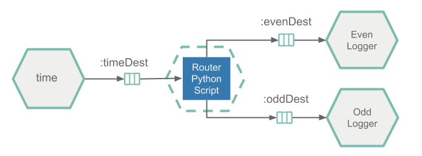

# Python/Docker as SCDF APP

This recipe illustrates how to deploy a Python script as an Data Flow [application](http://docs.spring.io/spring-cloud-dataflow/docs/%scdf-version-latest%/reference/htmlsingle/#spring-cloud-dataflow-stream-app-dsl).
Unlike the other applications types (e.g. `source`, `processor` or `sink`), the `app` application type is not provided by Data Flow with environment variables that wire up the producers and consumers or set any other application properties by default. It is the developer’s responsibility to 'wire up' the multiple applications when deploying in order for them to communicate.

The approach requires the Python script to be bundled in a docker image, which can then be registered as Data Flow's application of type `App`.
This approach can be used with the Data Flow `Local` or `Kubernetes` runtimes. The instructions below assumes that Kubernetes is being used.

We will demonstrate the recipe with a simple Barista data processing pipeline. Pipeline takes `customer` `orders` from an input channel, depending on the order it produces `cold` or `hot` drinks and delivers later to dedicated `hotDrink` or `coldDrink` downstream channels.
Following diagram shows the architecture of the Barista processing pipelines.



The `Consumer`, represented by a [Time Source](https://docs.spring.io/spring-cloud-stream-app-starters/docs/%streaming-apps-latest%/reference/htmlsingle/#spring-cloud-stream-modules-time-source) starter application, continuously emits orders (e.g. timestamps) to a downstream Kafka topic called `orders`. The `Barista` app, implemented by the Python script, consumes the incoming orders (e.g. timestamps) and produces hot drinks for the even timestamps and cold drinks for the odd ones. Produced drinks (represented by text messages) are send downstream to ether the `hotDrink` or `coldDrink` Kafka topics.
the `Deliver Hot Drink` and `Deliver Cold Drink` components are [log-sink] SCSt applications that consume the `hotDrink` or `coldDrink` topics and print the incoming message in on the console.

<!--TIP-->

The source code can be found in the samples GitHub [repo](https://github.com/spring-cloud/spring-cloud-dataflow-samples/tree/master/dataflow-website/recipes/polyglot/polyglot-python-app) or downloaded as a zipped archive: [polyglot-python-task.zip](https://github.com/spring-cloud/spring-cloud-dataflow-samples/raw/master/dataflow-website/recipes/polyglot/polyglot-python-app.zip). Follow the [Build](#build) instructions for building and using the project and the [Usage](#usage) section for step-by-step instructions to apply the recipe.

<!--END_TIP-->

The [barista_app.py](https://github.com/spring-cloud/spring-cloud-dataflow-samples/blob/master/dataflow-website/recipes/polyglot/polyglot-python-app/barista_app.py) implements the Barista application logic.

```python
from util.actuator import Actuator
from util.arguments import get_kafka_brokers, get_env_info, get_channel_topic

class Barista:

 def __init__(self, info, kafka_brokers, orders, hot_drinks, cold_drinks):
   self.kafka_brokers = kafka_brokers
   self.orders_topic = orders
   self.hot_drink_topic = hot_drinks
   self.cold_drink_topic = cold_drinks

   Actuator.start(port=8080, info=info)

   self.consumer = KafkaConsumer(self.orders_topic, bootstrap_servers=self.kafka_brokers)
   self.producer = KafkaProducer(bootstrap_servers=self.kafka_brokers)

 def process_orders(self):
   while True:
     for message in self.consumer:
       if message.value is not None:
         if self.is_even_order(message.value):
           self.producer.send(self.hot_drink_topic, b'Serve Hot drink')
         else:
           self.producer.send(self.cold_drink_topic, b'Serve Cold drink')

Barista(
   get_env_info(),
   get_kafka_brokers(),
   get_channel_topic('orders'),
   get_channel_topic('hot.drink'),
   get_channel_topic('cold.drink')
).process_orders()

```

[[note]]
| If the `print` command is used inside the Python script, later must be flushed with `sys.stdout.flush()` to prevent the output buffer being filled up, causing disruption to the Kafka’s consumer/producer flow!

- The [kafka-python](https://github.com/dpkp/kafka-python) library is used to consume and produce Kafka messages. The process_orders method continuously consumes orders from the input channel and send hot or cold drinks to the output channels.

- The [Actuator](https://github.com/spring-cloud/spring-cloud-dataflow-samples/blob/master/dataflow-website/recipes/polyglot/polyglot-python-app/util/actuator.py#L7) class inside [actuator.py](https://github.com/spring-cloud/spring-cloud-dataflow-samples/blob/master/dataflow-website/recipes/polyglot/polyglot-python-app/util/actuator.py) utility is used to expose operational information about the running application, such as health, liveliness, info, etc.
  It runs an embedded HTTP server in a separate thread and exposes the `/actuator/health` and `/actuator/info` entry-points handles the Kubernetes liveness and readiness probes requests.

- The [arguments.py](https://github.com/spring-cloud/spring-cloud-dataflow-samples/blob/master/dataflow-website/recipes/polyglot/polyglot-python-app/util/arguments.py) utility helps to retrieve the required input parameters from the command line arguments and environment variables.
  The utility assumes default (e.g. exec) [entry point style](http://docs.spring.io/spring-cloud-dataflow/docs/%scdf-version-latest%/reference/htmlsingle/#_entry_point_style_2).
  Note that Data Flow passes the Kafka broker connection properties as environment variables.

For the `barista_app.py` to act as a Data Flow `app` it needs to be bundled in a docker image and uploaded to `DockerHub`. Following [Dockerfile](https://github.com/spring-cloud/spring-cloud-dataflow-samples/blob/master/dataflow-website/recipes/polyglot/polyglot-python-app/Dockerfile) illustrates how to bundle a Python script into docker image:

```docker
FROM python:3.7.3-slim
RUN pip install kafka-python
RUN pip install flask
ADD /util/* /util/
ADD barista_app.py /
ENTRYPOINT ["python","/barista_app.py"]
```

The Dockerfile installs the required dependencies, adds the barista script (e.g. `ADD barista_app.py`) and utilities (under the `util` folder above) and sets the command entry.

<!--TIP-->

Leave the command empty (e.g. `[]`) and set the entry point explicitly.

<!--END_TIP-->

Follow the [Build](#build) instructions for building and publishing the `polyglot-python-app` image.
Once published in Docker Hub, the image can be registered in Data Flow as explained below.

## Usage

Retrieve the Data Flow url from minikube (minikube service --url scdf-server) and configure your Data Flow shell:
`dataflow config server --uri http://192.168.99.100:30868`

Import the SCDF app starters and register the polyglot-python-app as barista-app of type `app`

```bash
dataflow:> app import --uri http://bit.ly/Einstein-SR2-stream-applications-kafka-docker
dataflow:> app register --type app --name barista-app --uri docker://springcloud/polyglot-python-app:0.1
```

The `docker://springcloud/polyglot-python-app:0.1` is resolved from the [DockerHub repository](https://hub.docker.com/r/springcloud/polyglot-python-app).

Create the orders, cold-drink-line and hot-drink-line, bar pipelines:

```bash
dataflow:> stream create --name orders-pipeline --definition "customer: time > :orders" --deploy
dataflow:> stream create --name hot-drink-pipeline --definition ":hotDrinks > hot-drink-log: log" --deploy
dataflow:> stream create --name cold-drink-pipeline --definition ":coldDrinks > cold-drink-log: log" --deploy
dataflow:> stream create --name bar-pipeline --definition "barista-app"
```

As result the following stream pipelines are created and all but the `bar-pipeline` are deployed:


- `orders-pipeline` generates drink orders (e.g. timestamps) using the `time` source application and sends them to a Kafka topic: `orders`.
- `hot-drink-pipeline` logs the hot drinks coming through the Kafka topic named `hotDrinks`.
- `cold-drink-line` logs the cold drinks coming through Kafka topic named `coldDrinks`.

<!--IMPORTANT-->

The `barista-app` is registered as [App](http://docs.spring.io/spring-cloud-dataflow/docs/%scdf-version-latest%/reference/htmlsingle/#spring-cloud-dataflow-stream-app-dsl) type application and therefore can have multiple input and output bindings (e.g. channels). Data Flow does not make any assumptions about the flow of data from one application to another. It is the developer’s responsibility to 'wire up' the multiple applications when deploying in order for them to communicate.

<!--END_IMPORTANT-->

Keeping this in mind we deploy the `bar-pipeline` with the following deployment properties:
**TODO how to format this so the the properties are shown but the copy to buffer still creates a valid string to cut-n-paste into the shell?**

```bash
dataflow:> stream deploy --name bar-pipeline --properties app.barista-app.spring.cloud.stream.bindings.orders.destination=orders,app.barista-app.spring.cloud.stream.bindings.hot.drink.destination=hotDrinks,app.barista-app.spring.cloud.stream.bindings.cold.drink.destination=coldDrinks
```

[[tip]]
| the app.barista-app.xxx prefix is a Data Flow convention to map the properties specified after the prefix to the barista-app in the bar stream.

The orders channel is bound to the orders Kafka topic, the hot.drink barista output channel is bound to the hotDrinks topic and the cold.drink channel is bound to the coldDrinks topic.
After the deployment the data flow would look like this:


- Use `kubectl get all` command to list the statuses of the deployed k8s containers. Use `kubectl logs -f xxx` to observe the hot and cold drink pipeline output.
  For example `kubectl logs -f po/cold-drink-line-cold-drinks-xxx` should show output:

  

  For example `kubectl logs -f po/hot-drink-line-hot-drinks-xxx` should show output:

  

## Build

- Checkout the [sample project](https://github.com/spring-cloud/spring-cloud-dataflow-samples) and navigate to the `polyglot-python-app` folder:

  ```bash
  git clone https://github.com/spring-cloud/spring-cloud-dataflow-samples
  cd ./spring-cloud-dataflow-samples/dataflow-website/recipes/polyglot/polyglot-python-app/
  ```

- From within the `polyglot-python-app`, build and push the polyglot-python-app Docker image to DockerHub:

  ```bash
  docker build -t springcloud/polyglot-python-app:0.1 .
  docker push springcloud/polyglot-python-app:0.1
  ```

  Tip: replace `springcloud` with your docker hub prefix.
