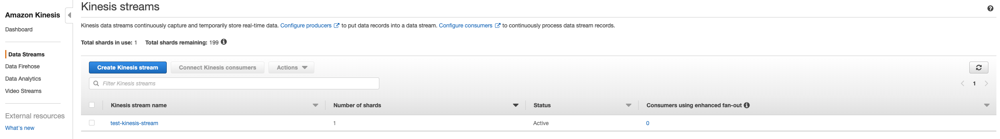
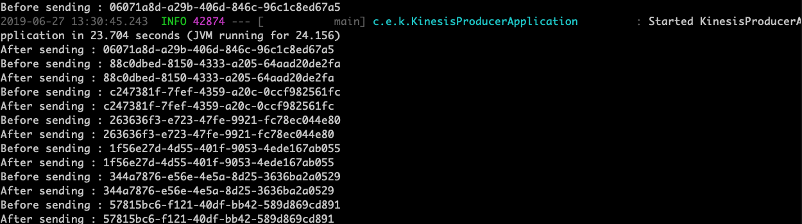
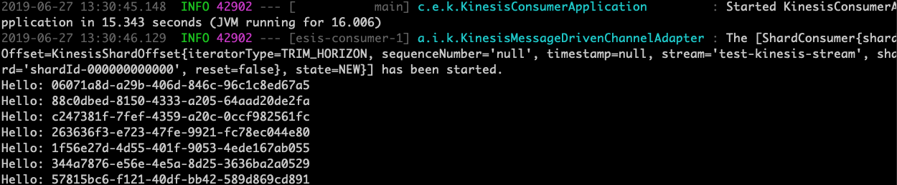

# Amazon Kinesis Sample

The Spring team currently maintains the Spring Cloud Stream Kinesis binder with the help of community contributions.
You can read more about the binder implementation at [spring-cloud/spring-cloud-stream-binder-aws-kinesis](https://github.com/spring-cloud/spring-cloud-stream-binder-aws-kinesis).

In this walk-through, though, we will review a simple use-case to showcase how the Kinesis binder can be used with Spring Cloud Stream.

## Prerequisite

The only requirement for the demonstration is the "Access Key", "Secret Key", and "Region" credentials, which can be gathered from your AWS account.

Alternatively, if you decide to run the applications directly as AWS EC2 instances, you do not need to explicitly provide any of these credentials.
They are automatically discovered and autoconfigured while bootstrapping.

## Applications

As for the sample producer and consumer applications, you can clone the repository at [spring-cloud-dataflow-samples/kinesisdemo](https://github.com/spring-cloud/spring-cloud-dataflow-samples/tree/master/dataflow-website/recipes/kinesisdemo) to follow along with the sample walk-through.

We will start with a simple producer that simply generates a new random UUID every two seconds.
Each of the generated UUID payloads are published to a Kinesis stream, and the sample consumer bound to the same Kinesis stream will consume the payload and log it as a result.

Let's review the producer and consumer's application code:

<!--TABS-->

<!--KinesisProducerApplication-->

```java
@EnableScheduling
@EnableBinding(Source.class)
@SpringBootApplication
public class KinesisProducerApplication {

	public static void main(String[] args) {
		SpringApplication.run(KinesisProducerApplication.class, args);
	}

	@Autowired
	private Source source;

	@Scheduled(fixedRate = 2000L)
	public void sendMessage() {
		UUID id = UUID.randomUUID();
		System.out.println("Before sending : " + id);
		source.output().send(MessageBuilder.withPayload(id).build());
		System.out.println("After sending : " + id);
	}
}
```

<!--KinesisConsumerApplication-->

```java
@EnableBinding(Sink.class)
@SpringBootApplication
public class KinesisConsumerApplication {

	public static void main(String[] args) {
		SpringApplication.run(KinesisConsumerApplication.class, args);
	}

	@StreamListener("input")
	public void input(String foo) {
		System.out.println("Hello: " + foo);
	}
}
```

<!--END_TABS-->

[[note]]
| Both of the applications _require_ `spring-cloud-stream-binder-kinesis` dependency in the classpath.
| Refer to [spring-cloud-dataflow-samples/kinesisdemo](https://github.com/spring-cloud/spring-cloud-dataflow-samples/tree/master/dataflow-website/recipes/kinesisdemo) for more details.

Let's review the producer and consumer's binder configurations:

<!--TABS-->

<!--KinesisProducer Configuration-->

```yaml
spring:
  cloud:
    stream:
      bindings:
        output:
          destination: test-kinesis-stream
          content-type: text/plain

cloud:
  aws:
    credentials:
      accessKey: # <YOUR_ACCESS_KEY>
      secretKey: # <YOUR_SECRET_KEY>
    region:
      static: # <YOUR_REGION>
    stack:
      auto: false
```

<!--KinesisConsumer Configuration-->

```yaml
spring:
  cloud:
    stream:
      bindings:
        input:
          destination: test-kinesis-stream
          group: test-kinesis-stream-group
          content-type: text/plain

cloud:
  aws:
    credentials:
      accessKey: # <YOUR_ACCESS_KEY>
      secretKey: # <YOUR_SECRET_KEY>
    region:
      static: # <YOUR_REGION>
    stack:
      auto: false
```

<!--END_TABS-->

[[note]]
| You would need to replace `<YOUR_ACCESS_KEY>`, `<YOUR_SECRET_KEY>`, and `<YOUR_REGION>` with your credentials.

## Deployment

Once when you're ready to test it with AWS Kinesis, you'd simply start the producer and consumer applications after a Maven build.

Start the producer from the cloned directory.

```bash
java -jar kinesisproducer/target/kinesisproducer-0.0.1-SNAPSHOT.jar
```

Start the consumer from the cloned directory.

```bash
java -jar kinesisconsumer/target/kinesisconsumer-0.0.1-SNAPSHOT.jar
```

## Results

You will notice the `test-kinesis-stream` Kinesis stream automatically created by the producer application when it bootstraps.



Once when both the applications are up and running, you should see the following in the consoles.

Producer:



Consumer:



Since we stopped the application after 7 records, you will notice that 7 records were processed in Kinesis from the monitoring page in AWS console.


That's all! This concludes the demonstration.

Though this is only a simple demonstration, the Kinesis binder provides comprehensive coverage in terms of binder configurations, both on the producer and consumer side (including support for [DynamoDB Streams](https://github.com/spring-cloud/spring-cloud-stream-binder-aws-kinesis/blob/master/spring-cloud-stream-binder-kinesis-docs/src/main/asciidoc/overview.adoc#dynamodb-streams)!), so check out the [binder-documentation](https://github.com/spring-cloud/spring-cloud-stream-binder-aws-kinesis/blob/master/spring-cloud-stream-binder-kinesis-docs/src/main/asciidoc/overview.adoc#configuration-options) for more details.
