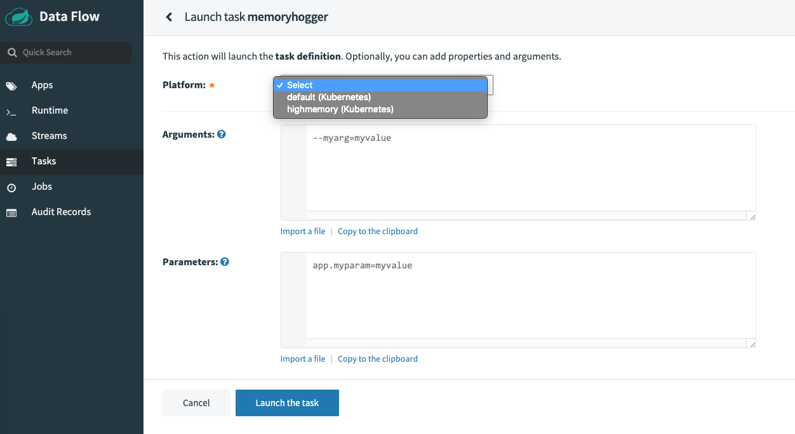

# Role of Multiple Platform Deployments

The goal of this recipe is to unpack the scenarios for when multiple platform deployments becomes a necessity. Let's start
with the use-cases and then dive into the details of how that can be set up in Spring Cloud Data Flow.

## Use Cases

- For certain use-cases, there is the desire to distinguish the deployment of streaming and the batch data pipelines to
  a unique environment. For instance, you may want to run a predictive model training routine that requires high memory. That
  compute is usually defined with specific boundaries, and only the particular workloads are allowed to run on them.
  In other words, you don't want the regular applications to use the high-compute resource pool and saturate its availability.
  This is particularly important when you're running machines on a pay-by-use basis, to avoid premium costs.

- Similar to the previous use-case, there might be a need to run the applications closer to where the message broker is
  (i.e., run the business logic close to where the data is). Doing so can avoid the I/O latency to meet the high throughput
  and low latency service-level agreements (SLAs). Once again, having to orchestrate a deployment pattern where the streaming
  applications can be targeted to deploy on the same VMs where Kafka is running could help with the SLAs.

- There's evidence of users using the "single" Spring Cloud Data Flow instance to orchestrate a deployment
  model in which the streaming and batch data pipelines are deployed and launched to multiple environments. This
  deployment pattern is primarily curated in order to organize the deployment topologies with well-defined boundaries, where
  a single SCDF mothership can centrally orchestrate, monitor, and manage the data pipelines.

Above scenarios require Spring Cloud Data Flow to deploy streaming and batch applications with flexible platform
configurations. Thankfully, though, starting with v2.0, Spring Cloud Data Flow supports the multi-platform deployment
support. With that, users can declaratively configure the desired number of platforms accounts upfront, and use the
defined accounts at the deployment time to distinguish the boundaries.

Now that we have the understanding of the use-case requirements, let's review the steps to configure multiple platform
accounts in Kubernetes and Cloud Foundry.

## Configurations

### Kubernetes

Let's suppose you'd want to deploy a stream with 3 applications to `kafkazone` namespace. Likewise, if you'd want to launch
a batch-job to `highmemory` namespace, the following configurations can be defined in the SCDF's deployment files.

Since the streaming data pipelines are managed through Skipper, you'd change the `skipper-config-kafka.yaml` with the
following.

[[note]]
| If RabbitMQ is the broker, you'd have to change `skipper-config-rabbit.yaml` instead.

```yaml
apiVersion: v1
kind: ConfigMap
metadata:
  name: skipper
  labels:
    app: skipper
data:
  application.yaml: |-
    spring:
      cloud:
        skipper:
          server:
            platform:
              kubernetes:
                accounts:
                  default:
                    namespace: default
                    environmentVariables: 'SPRING_CLOUD_STREAM_KAFKA_BINDER_BROKERS=${KAFKA_SERVICE_HOST}:${KAFKA_SERVICE_PORT},SPRING_CLOUD_STREAM_KAFKA_BINDER_ZK_NODES=${KAFKA_ZK_SERVICE_HOST}:${KAFKA_ZK_SERVICE_PORT}'
                    limits:
                      memory: 1024Mi
                      cpu: 500m
                    readinessProbeDelay: 120
                    livenessProbeDelay: 90
                  kafkazone:
                    namespace: kafkazone
                    environmentVariables: 'SPRING_CLOUD_STREAM_KAFKA_BINDER_BROKERS=${KAFKA_SERVICE_HOST}:${KAFKA_SERVICE_PORT},SPRING_CLOUD_STREAM_KAFKA_BINDER_ZK_NODES=${KAFKA_ZK_SERVICE_HOST}:${KAFKA_ZK_SERVICE_PORT}'
                    limits:
                      memory: 2048Mi
                      cpu: 500m
                    readinessProbeDelay: 180
                    livenessProbeDelay: 120
      datasource:
        url: jdbc:mysql://${MYSQL_SERVICE_HOST}:${MYSQL_SERVICE_PORT}/skipper
        username: root
        password: ${mysql-root-password}
        driverClassName: org.mariadb.jdbc.Driver
        testOnBorrow: true
        validationQuery: "SELECT 1"
```

[[note]]
| Notice that the inclusion of a platform account with the name `kafkazone`. Also, the default memory for the deployed
| pod is set to 2GB along with readiness and liveness probe customizations.

For batch data pipelines, however, you'd have to change the configurations in `server-config.yaml` as follows.

```yaml
apiVersion: v1
kind: ConfigMap
metadata:
  name: scdf-server
  labels:
    app: scdf-server
data:
  application.yaml: |-
    spring:
      cloud:
        dataflow:
          applicationProperties:
            stream:
              management:
                metrics:
                  export:
                    prometheus:
                      enabled: true
                      rsocket:
                        enabled: true
                        host: prometheus-proxy
                        port: 7001
            task:
              management:
                metrics:
                  export:
                    prometheus:
                      enabled: true
                      rsocket:
                        enabled: true
                        host: prometheus-proxy
                        port: 7001
          grafana-info:
            url: 'https://grafana:3000'
          task:
            platform:
              kubernetes:
                accounts:
                  default:
                    namespace: default
                    limits:
                      memory: 1024Mi
                  highmemory:
                    namespace: highmemory
                    limits:
                      memory: 4096Mi
      datasource:
        url: jdbc:mysql://${MYSQL_SERVICE_HOST}:${MYSQL_SERVICE_PORT}/mysql
        username: root
        password: ${mysql-root-password}
        driverClassName: org.mariadb.jdbc.Driver
        testOnBorrow: true
        validationQuery: "SELECT 1"
```

[[note]]
| Notice that the inclusion of a platform account with the name `highmemory`. Also, the default memory for the deployed
| pod is set to 4GB.

With these configurations, when deploying a stream from SCDF, you will have the option to select the platform.

List the available platforms.

```bash
dataflow:>stream platform-list
╔═════════╤══════════╤═════════════════════════════════════════════════════════════════════════════════╗
║  Name   │   Type   │                                   Description                                   ║
╠═════════╪══════════╪═════════════════════════════════════════════════════════════════════════════════╣
║default  │kubernetes│master url = [https://10.0.0.1:443/], namespace = [default], api version = [v1]  ║
║kafkazone│kubernetes│master url = [https://10.0.0.1:443/], namespace = [kafkazone], api version = [v1]║
╚═════════╧══════════╧═════════════════════════════════════════════════════════════════════════════════╝

dataflow:>task platform-list
╔═════════════╤═════════════╤══════════════════════════════════════════════════════════════════════════════════╗
║Platform Name│Platform Type│                                   Description                                    ║
╠═════════════╪═════════════╪══════════════════════════════════════════════════════════════════════════════════╣
║default      │Kubernetes   │master url = [https://10.0.0.1:443/], namespace = [default], api version = [v1]   ║
║highmemory   │Kubernetes   │master url = [https://10.0.0.1:443/], namespace = [highmemory], api version = [v1]║
╚═════════════╧═════════════╧══════════════════════════════════════════════════════════════════════════════════╝
```

Create a stream.

```bash
dataflow:>stream create foo --definition "cardata | predict | cassandra"
Created new stream 'foo'
```

Deploy a stream.

```bash
dataflow:>stream deploy --name foo --platformName kafkazone
```

Verify deployment.

```bash
kubectl get svc -n kafkazone
NAME          TYPE           CLUSTER-IP    EXTERNAL-IP     PORT(S)                      AGE
kafka         ClusterIP      10.0.7.155    <none>          9092/TCP                     7m29s
kafka-zk      ClusterIP      10.0.15.169   <none>          2181/TCP,2888/TCP,3888/TCP   7m29s

kubectl get pods -n kafkazone
NAME                                READY   STATUS    RESTARTS   AGE
foo-cassandra-v1-5d79b8bdcd-94kw4   1/1     Running   0          63s
foo-cardata-v1-6cdc98fbd-cmrr2      1/1     Running   0          63s
foo-predict-v1-758dc44575-tcdkd     1/1     Pending   0          63s
```

Alternatively, the platform dropdown in the SCDF Dashboard can be used to make the selection to create and launch Tasks.



### Cloud Foundry

For the same use-case requirement, if you'd want to deploy a stream with 3 applications to a ORG/Space where Kafka service
is running, and likewise a batch-job to a ORG/Space with more compute power, the configurations in SCDF for Cloud Foundry
could be as follows.

Since the streaming data pipelines are managed through Skipper, you'd change Skipper's `manifest.yml` to include Kafka
ORG/space connection credentials.

```yaml
applications:
  - name: skipper-server
    host: skipper-server
    memory: 1G
    disk_quota: 1G
    instances: 1
    timeout: 180
    buildpack: java_buildpack
    path: <PATH TO THE DOWNLOADED SKIPPER SERVER UBER-JAR>
    env:
      SPRING_APPLICATION_NAME: skipper-server
      SPRING_PROFILES_ACTIVE: cloud
      JBP_CONFIG_SPRING_AUTO_RECONFIGURATION: '{enabled: false}'
      SPRING_APPLICATION_JSON: |-
        {
          "spring.cloud.skipper.server" : {
             "platform.cloudfoundry.accounts":  {
                   "default": {
                       "connection" : {
                           "url" : <cf-api-url>,
                           "domain" : <cf-apps-domain>,
                           "org" : <org>,
                           "space" : <space>,
                           "username": <email>,
                           "password" : <password>,
                           "skipSsValidation" : false 
                       }
                       "deployment" : {
                           "deleteRoutes" : false,
                           "services" : "rabbitmq",
                           "enableRandomAppNamePrefix" : false,
                           "memory" : 2048
                       }
                  },
                  "kafkazone": {
                     "connection" : {
                         "url" : <cf-api-url>,
                         "domain" : <cf-apps-domain>,
                         "org" : kafka-org,
                         "space" : kafka-space,
                         "username": <email>,
                         "password" : <password>,
                         "skipSsValidation" : false 
                     }
                     "deployment" : {
                         "deleteRoutes" : false,
                         "services" : "kafkacups",
                         "enableRandomAppNamePrefix" : false,
                         "memory" : 3072
                     }
                  }
              }
           }
        }
services:
  - <services>
```

[[note]]
| Notice that the inclusion of a platform account with the name `kafkazone`. Also, the default memory for the deployed
| application is set to 3GB.

For batch data pipelines, however, you'd have to change the configurations in SCDF's `manifest.yml` file.

```yaml
applications:
  - name: data-flow-server
    host: data-flow-server
    memory: 2G
    disk_quota: 2G
    instances: 1
    path: { PATH TO SERVER UBER-JAR }
    env:
      SPRING_APPLICATION_NAME: data-flow-server
      SPRING_PROFILES_ACTIVE: cloud
      JBP_CONFIG_SPRING_AUTO_RECONFIGURATION: '{enabled: false}'
      SPRING_CLOUD_SKIPPER_CLIENT_SERVER_URI: https://<skipper-host-name>/api
      SPRING_APPLICATION_JSON: |-
        {
           "maven" : {
               "remoteRepositories" : {
                  "repo1" : {
                    "url" : "https://repo.spring.io/libs-snapshot"
                  }
               }
           }, 
           "spring.cloud.dataflow" : {
                "task.platform.cloudfoundry.accounts" : {
                    "default" : {
                        "connection" : {
                            "url" : <cf-api-url>,
                            "domain" : <cf-apps-domain>,
                            "org" : <org>,
                            "space" : <space>,
                            "username" : <email>,
                            "password" : <password>,
                            "skipSsValidation" : true 
                        }
                        "deployment" : {
                          "services" : "postgresSQL"
                        }
                    },
                    "highmemory" : {
                        "connection" : {
                            "url" : <cf-api-url>,
                            "domain" : <cf-apps-domain>,
                            "org" : highmemory-org,
                            "space" : highmemory-space,
                            "username" : <email>,
                            "password" : <password>,
                            "skipSsValidation" : true 
                        }
                        "deployment" : {
                          "services" : "postgresSQL",
                          "memory" : 5120
                        }
                    }
                }
           }
        }
services:
  - postgresSQL
```

[[note]]
| Notice that the inclusion of a platform account with the name `highmemory`. Also, the default memory for the deployed
| application is set to 5GB.

List the available platforms.

```bash
dataflow:>stream platform-list
╔═════════╤════════════╤════════════════════════════════════════════════════════════════════════════╗
║  Name   │    Type    │                               Description                                  ║
╠═════════╪════════════╪════════════════════════════════════════════════════════════════════════════╣
║default  │cloudfoundry│org = [scdf-%%], space = [space-%%%%%], url = [https://api.run.pivotal.io]  ║
║kafkazone│cloudfoundry│org = [kafka-org], space = [kafka-space], url = [https://api.run.pivotal.io]║
╚═════════╧════════════╧════════════════════════════════════════════════════════════════════════════╝

dataflow:>task platform-list
╔═════════════╤═════════════╤══════════════════════════════════════════════════════════════════════════════════════╗
║Platform Name│Platform Type│                               Description                                            ║
╠═════════════╪═════════════╪══════════════════════════════════════════════════════════════════════════════════════╣
║default      │Cloud Foundry│org = [scdf-%%], space = [space-%%%%%], url = [https://api.run.pivotal.io]            ║
║highmemory   │Cloud Foundry│org = [highmemory-org], space = [highmemory-space], url = [https://api.run.pivotal.io]║
╚═════════════╧═════════════╧══════════════════════════════════════════════════════════════════════════════════════╝
```

Create a stream.

```bash
dataflow:>stream create foo --definition "cardata | predict | cassandra"
Created new stream 'foo'
```

Deploy a stream.

```bash
dataflow:>stream deploy --name foo --platformName kafkazone
```

Verify deployment.

```bash
cf apps
Getting apps in org kafka-org / space kafka-space as kafka@com.io...
OK

name                           requested state   instances   memory   disk   urls
j6wQUU3-foo-predict-v1          started           1/1         3G       1G     j6wQUU3-foo-predict-v1.cfapps.io
j6wQUU3-foo-cardata-v1          started           1/1         3G       1G     j6wQUU3-foo-cardata-v1.cfapps.io
j6wQUU3-foo-cassandra-v1        started           1/1         3G       1G     j6wQUU3-foo-cassandra-v1.cfapps.io
```

Alternatively, the platform dropdown in the SCDF Dashboard can be used to make the selection to create and launch Tasks.
