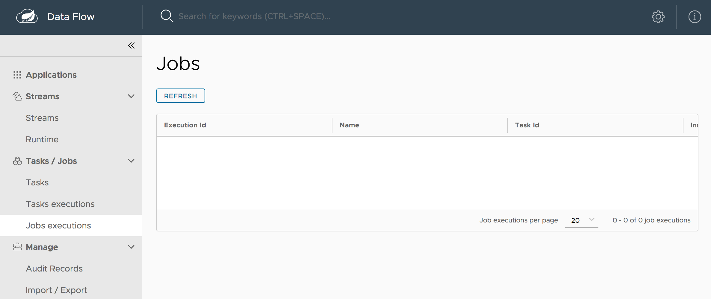

# Batch-only Mode

This recipe addresses how to configure Spring Cloud Data Flow with Spring Batch (and Spring Cloud Task) and not with Spring Cloud Streams. By doing so, you can use Spring Cloud Data Flow to control your batch jobs and tasks without other features.

For more about managing batch jobs with Spring Cloud Data Flow, see the [Batch Developer Guides](%currentPath/feature-guides/batch/%).

## Prerequisites

Batch-only mode requires only Spring Cloud Data Flow Server. You do not need Spring Cloud Data Flow Shell or Spring Cloud Skipper, though you can still use it. See

To use Spring Cloud Data Flow for batch processing but not for stream processing, you can do so by defining a few settings that control the Spring Cloud Data Flow server. In particular, you need:

- `SPRING_CLOUD_DATAFLOW_FEATURES_STREAMS_ENABLED=false` to turn off the orchestration of streams.
- `SPRING_CLOUD_DATAFLOW_FEATURES_SCHEDULES_ENABLED=false` to turn off schedules, because Batch does not support scheduling for the local environment.
- `SPRING_CLOUD_DATAFLOW_FEATURES_TASKS_ENABLED=true` to enable batch processing.

Batch processing requires an external data store. To set up an external data store, you need to specify the database's connection settings. We cover those settings in the next section. For additional detail, see [the main Spring Batch developer guide](%currentPath%/batch-developer-guides/batch/spring-batch/#local).

Spring Cloud Data Flow supports MySQL (with the MariaDB driver), HSQLDB, and PostgreSQL without additional configuration. You can use other databases with additional configuration. See the [Spring Cloud Data Flow Reference Guide](https://docs.spring.io/spring-cloud-dataflow/docs/2.5.0.BUILD-SNAPSHOT/reference/htmlsingle/#configuration-kubernetes-rdbms) for more detail.

### Installing the Server

To install Spring Cloud Data Flow Server, run the following command:

```bash
wget https://repo.spring.io/%spring-maven-repo-type%/org/springframework/cloud/spring-cloud-dataflow-server/%dataflow-version%/spring-cloud-dataflow-server-%dataflow-version%.jar
```

### Setting up Environment Variables

You can use environment variables to enable and disable features and to configure an external data store. The following listing shows how to set the required environment variables:

```bash
export SPRING_CLOUD_DATAFLOW_FEATURES_STREAMS_ENABLED=false
export SPRING_CLOUD_DATAFLOW_FEATURES_SCHEDULES_ENABLED=false
export SPRING_CLOUD_DATAFLOW_FEATURES_TASKS_ENABLED=true
export spring_datasource_url=jdbc:mariadb://localhost:3306/task
export spring_datasource_username=root
export spring_datasource_password=password
export spring_datasource_driverClassName=org.mariadb.jdbc.Driver
export spring_datasource_initialization_mode=always
```

NOTE: Do not disable both streaming and batch. Spring Cloud Data Flow requires at least one of them to be enabled.

If you do not already have a database named `task`, you need to create one. Alternatively, you could change the name of the database in the datasource URL to the name of the database in which you store your tasks.

For the sake of demonstration, we use `root` and `password` as the username and password. You should never do so for real applications.

### Running the Server

With the configuration details set up in environment variables, you can run Spring Cloud Data Flow Server in batch-only mode by running the following command:

```bash
java -jar spring-cloud-dataflow-server-%dataflow-version%.jar
```

## Viewing the Dashboard

Once the server has started, you can view the Spring Cloud Data Flow dashboard by visiting `http://localhost:9393/dashboard` in a web browser. From there, you can create and manage batch jobs. See the topics [here](%currentPath%/feature-guides/batch/) for more detail.
The following image shows the Jobs page of the Spring Cloud Data Flow dashboard, where you could add a batch job.



## Using Spring Cloud Data Flow Shell

You can use the Spring Cloud Data Flow Shell. For more about that, see the [Shell topic in the Tooling page](%currentPath%/concepts/tooling/#shell).
