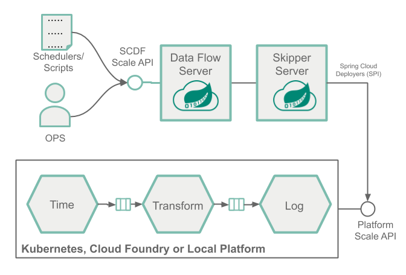
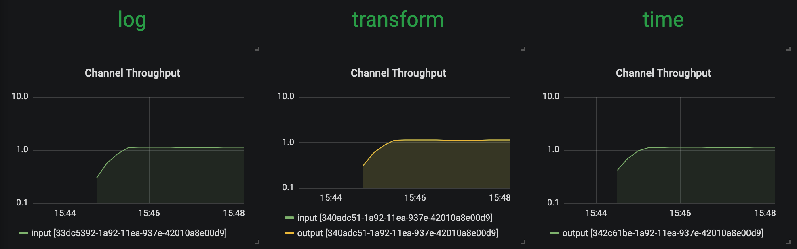
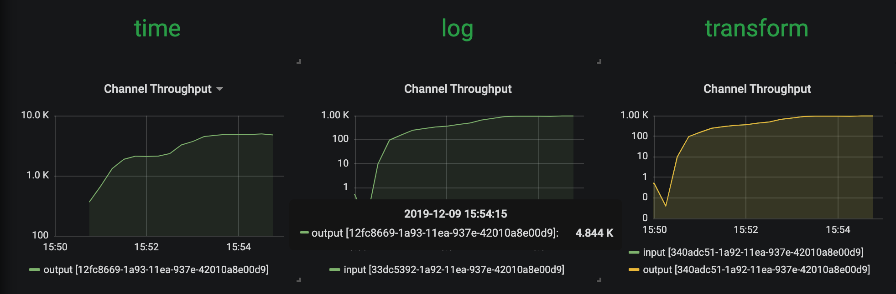
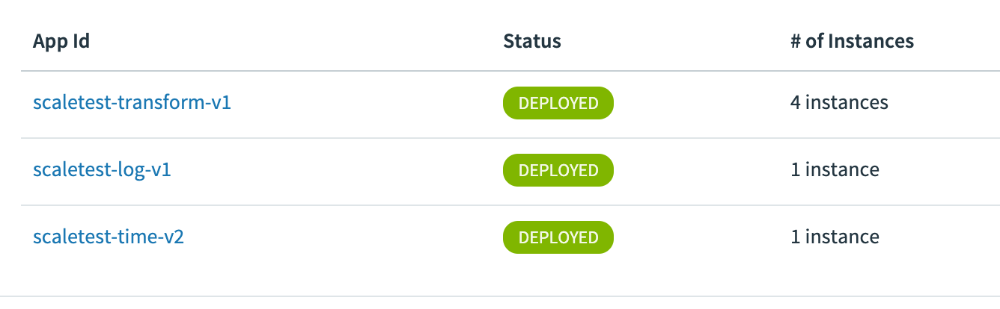
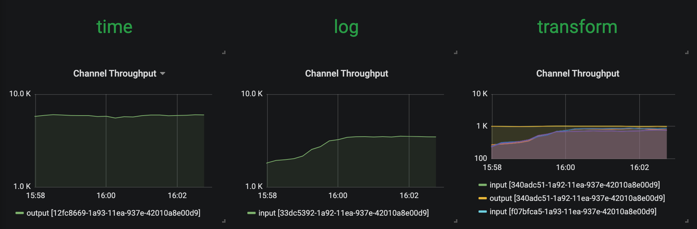
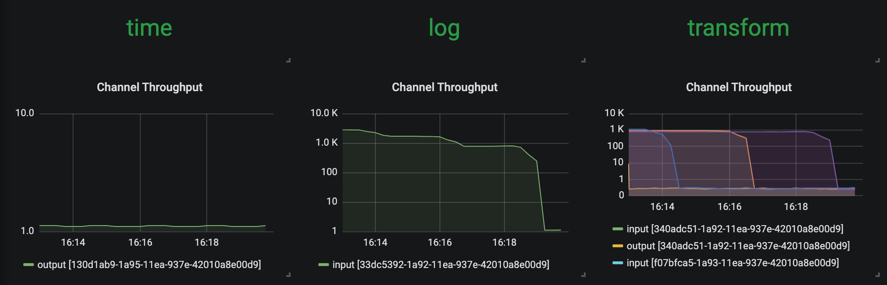
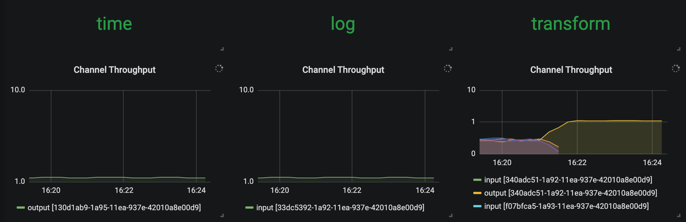

# Scale-out a streaming pipeline with SCDF shell

To learn about the basic scaling concepts in Spring Cloud Data Flow, please consult the [Scaling](%currentPath%/feature-guides/streams/scaling/) guide.

## Overview

Let's deploy a streaming data pipeline, simulate a resource strangling scenario (e.g., high CPU spike) and then use the SCDF shell to manually increase the number of consumer application instances to handle the increased load.



This manual approach allows the Operators and Developers to intervene and scale-out when they observe high-load in a given application. For example, a retail store may want to architect a scale-out design upfront to meet with the high-load and demanding days such as Black Friday.

When a more sophisticated approach is required to control the scale-out and scale-in operations in an automated manner, with the help of SCDF's monitoring support using Prometheus, users can configure and set up autoscaling rules. Check the [Autoscale streaming data pipelines with SCDF and Prometheus](%currentPath%/recipes/scaling/autoscaling/) recipe to learn how to do this.

## Prerequisite

This recipe uses the Kubernetes platform. Follow the [Kubectl](%currentPath%/installation/kubernetes/kubectl/) or the [Helm](%currentPath%/installation/kubernetes/helm/) installation instructions to setup Spring Cloud Data Flow with Kafka broker.

```shell
helm install --name my-release stable/spring-cloud-data-flow --set kafka.enabled=true,rabbitmq.enabled=false,kafka.persistence.size=10Gi
```

And register the latest [kafka-docker](https://dataflow.spring.io/kafka-docker-latest) app starters.

Start a SCDF Shell and connect it to your Data Flow Server:

```shell
server-unknown:>dataflow config server http://<SCDF IP>
```

## Scaling Recipe

### Create data pipeline

```shell
stream create --name scaletest --definition "time --fixed-delay=995 --time-unit=MILLISECONDS | transform --expression=\"payload + '-' + T(java.lang.Math).exp(700)\" | log"
```

The `time` source generates current timestamp messages on a fixed time-interval (995ms = ~1msg/s), the `transform` processor performs a math operation to simulate a high CPU processing, and the `log` sink prints the transformed message payload.

### Deploy data pipeline with data partitioning

```shell
stream deploy --name scaletest --properties "app.time.producer.partitionKeyExpression=payload,app.transform.spring.cloud.stream.kafka.binder.autoAddPartitions=true,app.transform.spring.cloud.stream.kafka.binder.minPartitionCount=4"
```

The `producer.partitionKeyExpression=payload` property configures time’s output binding for partitioning. The partition key expression uses the message payload (e.g. the toString() value of the current timestamp) to compute how the data needs to be partitioned to the downstream output channels.
The `spring.cloud.stream.kafka.binder.autoAddPartitions` deployment property instructs the Kafka binder to create new partitions when required. This is required if the topic is not already over-partitioned.
The `spring.cloud.stream.kafka.binder.minPartitionCount` property sets the minimum number of partitions that the Kafka binder configures on the topic, which is where the transform-processor is subscribing for new data.

Once the `scaletest` stream is deployed you should see:

Singe application instances for each application.

Use the SCDF's built-in Grafana dashboard to review the [stream application's throughput and the other application metrics](%currentPath%/feature-guides/streams/monitoring/#prometheus-1):



The `time`, `transform` and `log` applications maintain the same message throughput (~1 msg/s). The `transform` copes fine with the current load.

### Increase data pipeline load

Now, let's increase the load by increasing the time-source's message production rate. By changing time's `time-unit` property from `MILLISECONDS` to `MICROSECONDS` the input rate will increase from one to a couple of thousands of messages per second.
Note that the [stream rolling-update](%currentPath%/stream-developer-guides/continuous-delivery/) functionality allows to rolling-update just the time application without stopping the entire stream:

```shell
stream update --name scaletest --properties "app.time.trigger.time-unit=MICROSECONDS"
```

Now `time` source emits messages with a rate of `~5000 msg/s`. The `transform` processor, though, is capped at around `1000 msg/s` and that in turn, it halts the throughput of the entire stream to a certain level. This is an indicator that the `transform` has become the bottleneck.



### Scale-Out

Use the SCDF Shell to scale the `transform` instances to 4:

```shell
stream scale app instances --name scaletest --applicationName transform --count 4
```

As a result of the previous command, 3 additional transform instances are deployed:



With the help of the additional instances of the `transform` processor, the entire data pipeline catches up to match with the `time` source's production rate.



### Decrease data pipeline load and Scale-In

If we reduce the source's data production rate back to the original rate (i.e., 1 msg/s):

```shell
stream update --name scaletest --properties "app.time.trigger.time-unit=MILLISECONDS"
```

The extra `transform` processor instances aren't altering the overall throughput rate anymore. These extra instances can be scaled back in:



thus, allowing us to reduce the number of transform application instances to the original capacity:

```shell
stream scale app instances --name scaletest --applicationName transform --count 1
```


