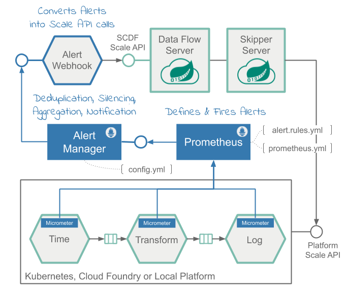
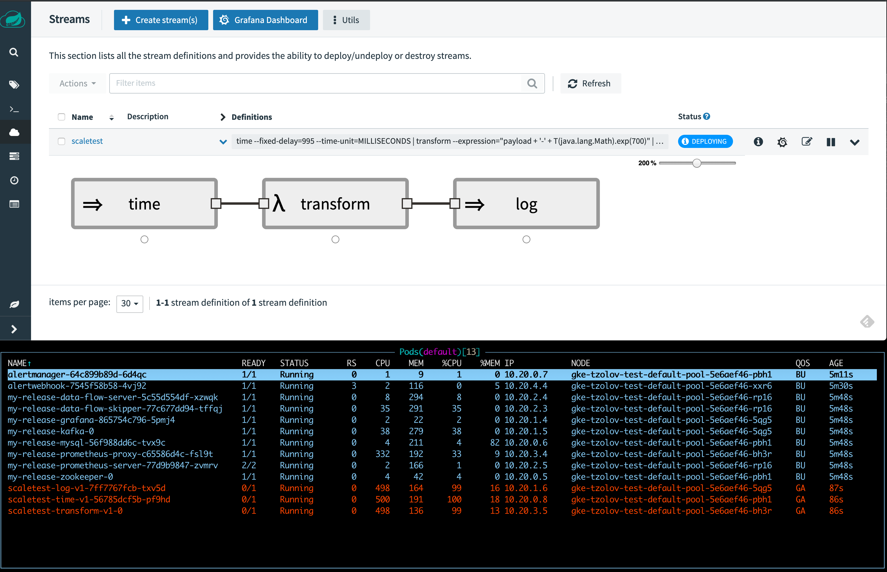
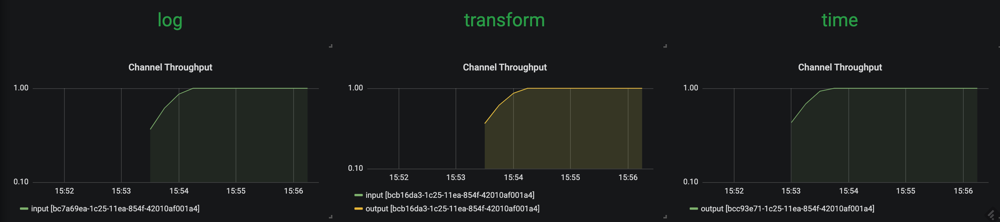
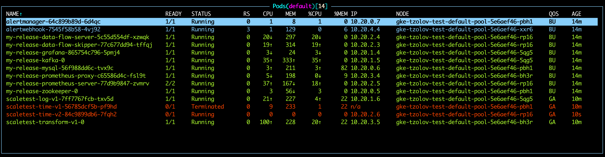
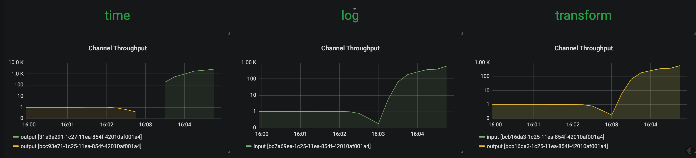
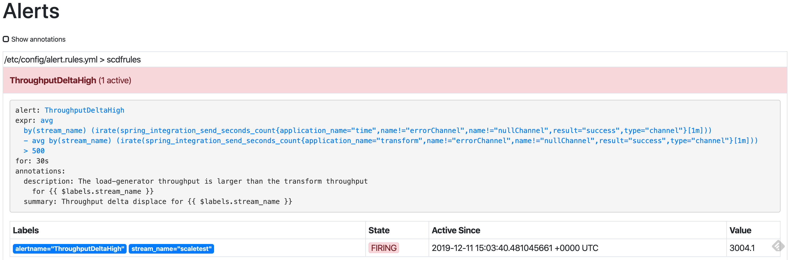
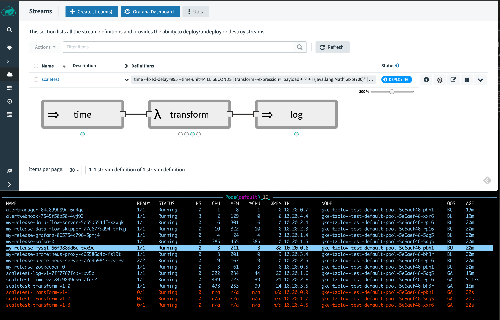
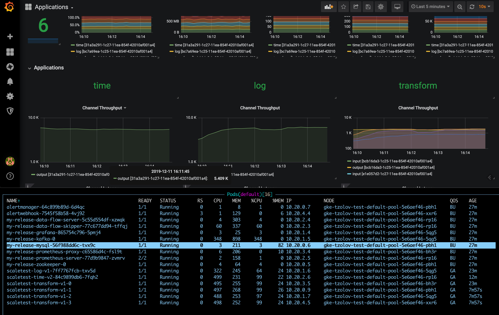
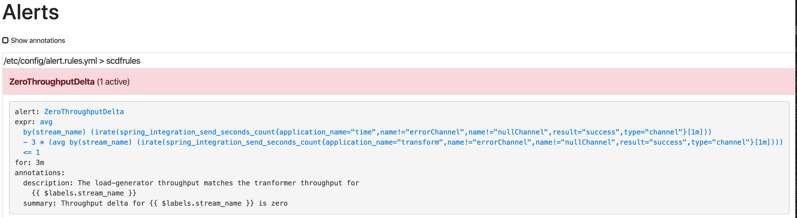
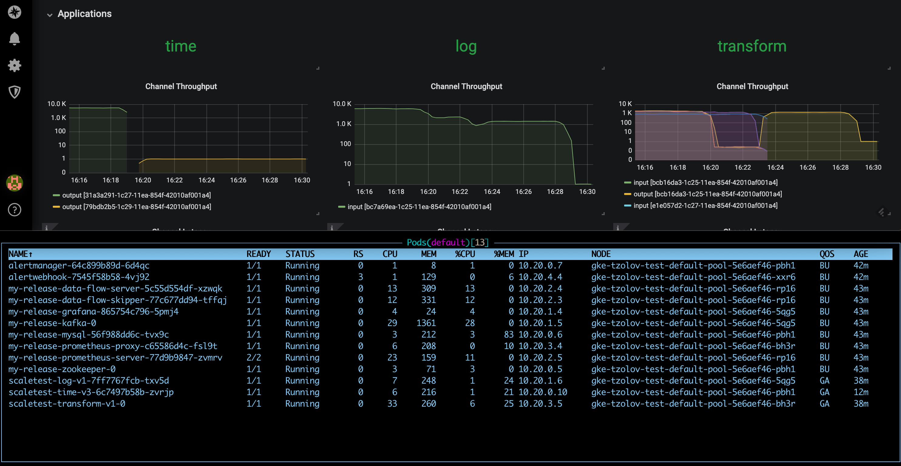

# Autoscaling with Prometheus, Alertmanager and SCDF Scale API

To learn about the basic scaling concepts in Spring Cloud Data Flow, please consult the [Scaling](%currentPath%/feature-guides/streams/scaling/) guide.

## Overview

The solution leverages the [Prometheus Alert Rules](https://prometheus.io/docs/prometheus/latest/configuration/alerting_rules/) for defining scale-out and scale-in alerts based on application throughput metrics. The alerts are managed by the [Prometheus AlertManager](https://prometheus.io/docs/alerting/alertmanager) and a custom [webhook](https://github.com/prometheus/alertmanager), which in turn triggers the [Scale API](https://docs.spring.io/spring-cloud-dataflow/docs/%dataflow-version%/reference/htmlsingle/#api-guide-resources-stream-deployment-scale) calls in SCDF.

For a streaming data pipeline:`time | transform | log`, we will show how to measure the throughput rates between the `time` and the `transform` applications, so we can use that as the deciding factor for alerts. When the defined threshold exceeds the set rules, we will discuss how the alerts are triggered and likewise the autoscale calls are triggered.
Following pseudocode illustrates the logic of such alert rules:

```java
rateDifference = rate(time) - rate(transform)                         // <1>
if rateDifference > 500 for 1 minute do fire HighThroughputDifference // <2>
if rateDifference == 0 for 3 minutes do fire ZeroThroughputDifference // <3>
```

- <1> Query expression that computes, in real-time, the throughput (e.g. rate) difference between the `time` and `transform` applications.
- <2> `HighThroughputDifference` alert rule that fires when the rate difference exceed `500 msg/s` for the duration of `1 min`.
- <3> `ZeroThroughputDifference` alert rule that fires if the rate difference stays `0 msg/s` for at least `3 min`.

Following diagram shows the high level architecture.



The [Data Flow metrics architecture](%currentPath%/concepts/monitoring/) is designed with the help of the Micrometer library. Prometheus can be one of the monitoring backends that can collect various application metrics for performance analysis, and it allows for alert configurations, as well.

The alerting in Prometheus is divided into:

- `Alert Rules` - defined inside and triggered by the Prometheus service.
- `Alertmanager` - a standalone service that receives and manages the fired alerts and in turn sends out notifications to a pre-registered webhooks.

The [Alert Rules](https://prometheus.io/docs/prometheus/latest/configuration/alerting_rules/) are based on the [Prometheus Expression Language (PQL)](https://prometheus.io/docs/prometheus/latest/querying/basics/).
They are used to define and send the scale alerts to `Alertmanager`.
For example the scale-out alert rule definition looks something like this:

```sql
alert: HighThroughputDifference
expr:  avg(irate(spring_integration_send_seconds_count{application_name="time"}[1m])) by(stream_name) -
       avg(irate(spring_integration_send_seconds_count{application_name="transform"}[1m])) by(stream_name) > 500
for: 30s
```

<!--TIP-->

Check [alert.rule.yml](https://github.com/spring-cloud/spring-cloud-dataflow-samples/blob/master/dataflow-website/recipes/scaling/kubernetes/prometheus/prometheus-configmap.yaml#L8-L23) (and [here](https://github.com/spring-cloud/spring-cloud-dataflow-samples/blob/master/dataflow-website/recipes/scaling/kubernetes/helm/prometheus/prometheus-configmap.yaml#L8-L23) for the kubectl installation) to see the used alert rules definitions.

<!--END_TIP-->

<!--TIP-->

The `spring_integration_send_seconds_count` metrics comes from the `spring integration` [micrometer support](https://docs.spring.io/spring-integration/docs/5.2.2.RELEASE/reference/html/system-management.html#micrometer-integration) and is used for computing the message rate.

<!--END_TIP-->

The [Alertmanager](https://prometheus.io/docs/alerting/alertmanager) is a standalone service that manages the alerts, including silencing, inhibition, aggregation and sending out notifications to pre-configured webhooks.

The [AlertWebHookApplication](https://github.com/spring-cloud/spring-cloud-dataflow-samples/blob/master/dataflow-website/recipes/scaling/scdf-alert-webhook/src/main/java/io/spring/cloud/dataflow/alert/webhook/AlertWebHookApplication.java) (part of the [scdf-alert-webhook](https://github.com/spring-cloud/spring-cloud-dataflow-samples/tree/master/dataflow-website/recipes/scaling/scdf-alert-webhook) Spring Boot app) is a custom Spring Boot application, registered as a [Alertmanager Webhook Receiver](https://prometheus.io/docs/alerting/configuration/#webhook_config) via the [config.yml](https://github.com/spring-cloud/spring-cloud-dataflow-samples/blob/master/dataflow-website/recipes/scaling/kubernetes/alertmanager/prometheus-alertmanager-configmap.yaml#L8-L15).
The `AlertWebHookApplication` receives the alert notifications (in JSON format) from Prometheus. With the help of [SCDF's Scale API](https://docs.spring.io/spring-cloud-dataflow/docs/%dataflow-version%/reference/htmlsingle/#api-guide-resources-stream-deployment-scale), it can then trigger the scale-out request to autoscale the referred by the alert streaming data pipelines in SCDF.

<!--TIP-->

The alert notifications contain also the metrics labels used in the alert PQL expressions.
For our example that means that the `stream_name` label is passed along with the notifications alerts allowing the `AlertWebHookApplication` to determine the name of the data pipeline that has to be scaled.

<!--END_TIP-->

The [Data Flow Scale REST API](https://docs.spring.io/spring-cloud-dataflow/docs/%dataflow-version%/reference/htmlsingle/#api-guide-resources-stream-deployment-scale) provides a platform agnostic mechanism for scaling data pipeline applications.

The `AlertWebHookApplication` uses the `spring.cloud.dataflow.client.server-uri` property to configure the Scale API endpoint. Check [alertwebhook-deployment.yaml](https://github.com/spring-cloud/spring-cloud-dataflow-samples/blob/master/dataflow-website/recipes/scaling/kubernetes/alertwebhook/alertwebhook-deployment.yaml) for the entire deployment configuration.

Following video animation illustrates the Data Flow auto-scaling flow:

<!--VIDEO:https://www.youtube.com/embed/IDH6X1pmgxc-->

## Prerequisite

This recipe uses the Kubernetes platform.

The recipes is successfully tested on GKE cluster with 5 nodes.

The high CPU requirements due to the multiple app instances would make it difficult or imposable to run the recipe on minikube.

<!--TABS-->

<!--For Kubectl installation-->

- Follow the [Kubectl](%currentPath%/installation/kubernetes/kubectl/) installation instructions to setup Spring Cloud Data Flow with Kafka broker.

- Then install the `Alertmanager` and the `AlertWebHook` and reconfigure the `Prometheus` services:

  ```shell
  kubectl apply -f https://raw.githubusercontent.com/spring-cloud/spring-cloud-dataflow-samples/master/dataflow-website/recipes/scaling/kubernetes/alertwebhook/alertwebhook-svc.yaml
  kubectl apply -f https://raw.githubusercontent.com/spring-cloud/spring-cloud-dataflow-samples/master/dataflow-website/recipes/scaling/kubernetes/alertwebhook/alertwebhook-deployment.yaml
  kubectl apply -f https://raw.githubusercontent.com/spring-cloud/spring-cloud-dataflow-samples/master/dataflow-website/recipes/scaling/kubernetes/alertmanager/prometheus-alertmanager-service.yaml
  kubectl apply -f https://raw.githubusercontent.com/spring-cloud/spring-cloud-dataflow-samples/master/dataflow-website/recipes/scaling/kubernetes/alertmanager/prometheus-alertmanager-deployment.yaml
  kubectl apply -f https://raw.githubusercontent.com/spring-cloud/spring-cloud-dataflow-samples/master/dataflow-website/recipes/scaling/kubernetes/alertmanager/prometheus-alertmanager-configmap.yaml
  wget https://raw.githubusercontent.com/spring-cloud/spring-cloud-dataflow-samples/master/dataflow-website/recipes/scaling/kubernetes/prometheus/prometheus-configmap.yaml
  kubectl patch cm my-release-prometheus-server --patch "$(cat ./prometheus-configmap.yaml)"
  kubectl delete pods -l app=prometheus
  ```

<!--For Helm installation-->

- Follow the [Helm](%currentPath%/installation/kubernetes/helm/) installation instructions to setup Spring Cloud Data Flow with Kafka broker. You can use `features.monitoring.enabled=true` with at least `10Gi` storage space:

  ```shell
  helm install --name my-release stable/spring-cloud-data-flow --set features.monitoring.enabled=true,kafka.enabled=true,rabbitmq.enabled=false,kafka.persistence.size=10Gi
  ```

- Then install the `Alertmanager` and the `AlertWebHook` and reconfigure the `Prometheus` services:

  ```shell
  kubectl apply -f https://raw.githubusercontent.com/spring-cloud/spring-cloud-dataflow-samples/master/dataflow-website/recipes/scaling/kubernetes/helm/alertwebhook/alertwebhook-svc.yaml
  kubectl apply -f https://raw.githubusercontent.com/spring-cloud/spring-cloud-dataflow-samples/master/dataflow-website/recipes/scaling/kubernetes/helm/alertwebhook/alertwebhook-deployment.yaml
  kubectl apply -f https://raw.githubusercontent.com/spring-cloud/spring-cloud-dataflow-samples/master/dataflow-website/recipes/scaling/kubernetes/alertmanager/prometheus-alertmanager-service.yaml
  kubectl apply -f https://raw.githubusercontent.com/spring-cloud/spring-cloud-dataflow-samples/master/dataflow-website/recipes/scaling/kubernetes/alertmanager/prometheus-alertmanager-deployment.yaml
  kubectl apply -f https://raw.githubusercontent.com/spring-cloud/spring-cloud-dataflow-samples/master/dataflow-website/recipes/scaling/kubernetes/alertmanager/prometheus-alertmanager-configmap.yaml
  wget https://raw.githubusercontent.com/spring-cloud/spring-cloud-dataflow-samples/master/dataflow-website/recipes/scaling/kubernetes/helm/prometheus/prometheus-configmap.yaml
  kubectl patch cm my-release-prometheus-server --patch "$(cat ./prometheus-configmap.yaml)"
  ```

<!--END_TABS-->

Register latest [kafka-docker](https://dataflow.spring.io/kafka-docker-latest) app starters:

```shell
app import --uri https://dataflow.spring.io/kafka-docker-latest
```

Start a SCDF Shell and connect it to your Data Flow Server:

```shell
server-unknown:>dataflow config server http://<SCDF IP>
```

## Autoscaling Recipe

### Create data pipeline

```shell
stream create --name scaletest --definition "time --fixed-delay=995 --time-unit=MILLISECONDS | transform --expression=\"payload + '-' + T(java.lang.Math).exp(700)\" | log"
```

The `time` source generates current timestamp messages on a fixed time-interval (995ms = ~1 msg/s), the `transform` processor performs a math operation to simulate a high CPU processing, and the `log` sink prints the transformed message payload.

### Deploy data pipeline with data partitioning

```shell
stream deploy --name scaletest --properties "app.time.producer.partitionKeyExpression=payload,app.transform.spring.cloud.stream.kafka.binder.autoAddPartitions=true,app.transform.spring.cloud.stream.kafka.binder.minPartitionCount=4"
```

The `producer.partitionKeyExpression=payload` property configures time’s output binding for partitioning. The partition key expression uses the message payload (e.g. the toString() value of the current timestamp) to compute how the data needs to be partitioned to the downstream output channels.
The `spring.cloud.stream.kafka.binder.autoAddPartitions` deployment property instructs the Kafka binder to create new partitions when required. This is required if the topic is not already over-partitioned.
The `spring.cloud.stream.kafka.binder.minPartitionCount` property sets the minimum number of partitions that the Kafka binder configures on the topic, which is where the transform-processor is subscribing for new data.



Use the SCDF's built-in Grafana dashboard to review the [stream application's throughput and the other application metrics](%currentPath%/feature-guides/streams/monitoring/#prometheus-1):



The `time`, `transform` and `log` applications maintain the same message throughput (~1 msg/s). The `transform` copes fine with the current load.

### Increase data pipeline load

Now, let's increase the load by increasing the time-source's message production rate. By changing time's `time-unit` property from `MILLISECONDS` to `MICROSECONDS` the input rate will increase from one to a couple of thousands of messages per second.
Note that the [stream rolling-update](%currentPath%/stream-developer-guides/continuous-delivery/) functionality allows to rolling-update the time application without stopping the entire stream:

```shell
stream update --name scaletest --properties "app.time.trigger.time-unit=MICROSECONDS"
```

The `time` app is re-deployed with the new time-unit property:


Now `time` source emits messages with a rate of `~5000 msg/s`. The `transform` processor, though, is capped at around `1000 msg/s` and that in turn, it halts the throughput of the entire stream to a certain level. This is an indicator that the `transform` has become the bottleneck.



The `HighThroughputDifference` Prometheus alert rule detects the rate discrepancy and fires a scale-out alert:



in result 3 additional transform instances are added:



with the help of the additional instances of the `log` sink the entire data pipeline catches up to match with the `time` source's production rate:



### Reduce data pipeline load

If we reduce the source's data production rate back to the original rate (i.e., `1 msg/s`):

```shell
stream update --name scaletest --properties "app.time.trigger.time-unit=MILLISECONDS"
```

The extra `transform` processor instances aren't altering the overall throughput rate anymore.
Eventually the rate difference becomes zero and the `ZeroThroughputDifference` alert is fired. The alert in turn triggers a scale-in action and the extra instances can be scaled back in:



With a single `transform` instance the throughput of the entire data pipeline is normalized back to `~1 msg/s` :


