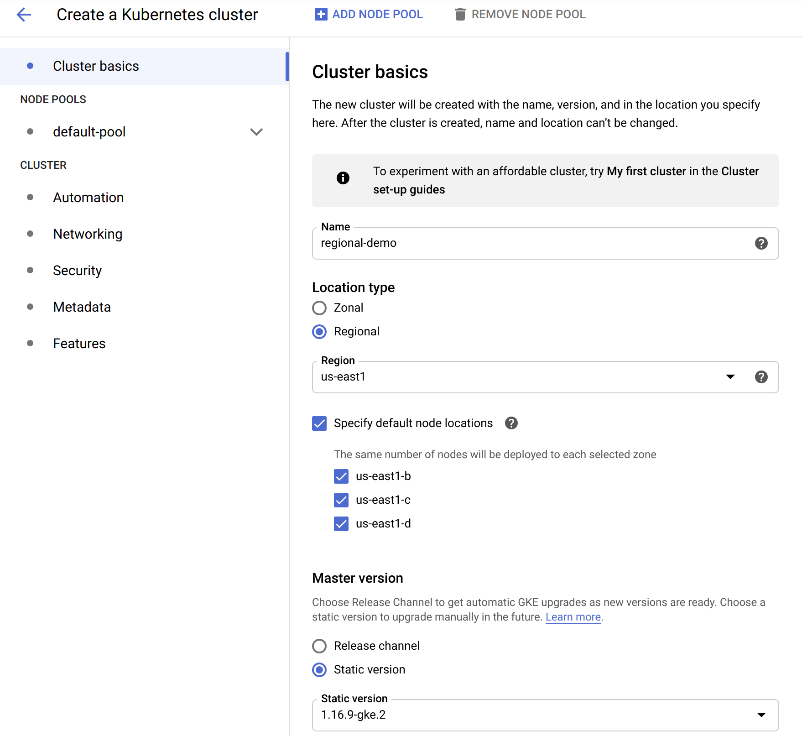

# Deploying Spring Cloud Data Flow to a GKE Regional Cluster

When deploying applications to an environment, it is often ideal to have a strategy set up to handle infrastructure outages. Outages could range from hardware failures to complete data centers going offline, resulting in applications becoming unavailable. Rather than having those workloads potentially halt operations until an outage is resolved, another option is to have those workloads migrated to another part of your infrastructure to continue operations. It may also be useful to specify where particular applications must reside or be co-located with other applications.

With [Kubernetes](https://kubernetes.io/), failure of nodes and the workloads running on them are automatically handled by rescheduling those workloads onto other available nodes. In a simple use case, a Kubernetes cluster consisting of a single control plane and multiple worker nodes residing in the same location is often implemented by default. This type of configuration, in the event of a failure, does not provide any high availability.

As this recipe is focused on GKE as the cloud provider, location will mean one or more "zones" inside a particular "region". A "region" refers to a specific geographical location, for example, `us-east1`. Within a "region", there are multiple "zones" such as `us-east1-b`, `us-east1-c`, and so on that are isolated from other zones. It's important to choose regions and zones based on your specific needs, such as CPU/GPU types, disk types, compute power, etc. More in-depth information that should be reviewed can be found in the [Regions and Zones](https://cloud.google.com/compute/docs/regions-zones/) documentation.

Beyond a single-zone cluster, GKE supports two other types of clusters:

- Multi-zonal clusters - Single replica of the control plane running in a single zone with worker nodes running in multiple zones of a given region
- Regional clusters - Multiple replicas of the control plane running in multiple zones within a given region with nodes running in the same zone as each control plane

This recipe will focus on `Regional clusters` as it provides a greater level of high availability than `Single Zone` or `Multi-zonal` clusters.

## Prerequisites

A [Google Cloud](https://cloud.google.com/gcp/) (GCP) account with permissions to create new [Google Kubernetes Engine](https://cloud.google.com/kubernetes-engine/) (GKE) clusters is required. A web interface is provided to interact with GCP/GKE as well as a CLI, which can be obtained via the [Google Cloud SDK](https://cloud.google.com/sdk) and installed. Standard tooling such as [Kubectl](https://github.com/kubernetes/kubectl/releases) needs to be installed for interaction with Kubernetes clusters.

## Creating the Cluster

In this recipe, we will use the GKE web console to create the cluster. We will utilize the defaults in most cases, except for the location type and instance sizes. When creating a new cluster, the first bits of information to select is the "Cluster Basics". The screenshot below shows the options chosen for this demo:



The important parts of this section are:

- `Regional` is selected as the `Location Type`
- `Region` is selected, in this case, `us-east1`. This value should be determined by your specific requirements as described above.
- `Specify default node locations` has 3 zones selected. 3 zones will be selected automatically, but in the event, there are more than 3, this section allows explicit selection of zones.

Other values on this section such as `Name`, and `Master version` settings can be customized as appropriate.

Next the machine type is selected in the `Nodes` subsection of `Node Pools -> default-pool` as shown in the screenshot below:


The main change in this section is selecting a machine type of `n1-standard-4 (4 vCPU, 15GB memory)`. This gives us a bit more room to work with than the default. Settings can be customized as appropriate.

<!--TIP-->

The number of nodes and machine type will vary based on your specific requirements for base needs in addition to failover tolerance. For example, the selected configuration may be sized based on the expected number of applications that may be spread across those nodes. Still, in the event of a node or even one or more region failures, clusters should be sized to support this extra load. Failing to do so will result in workloads un-schedulable until capacity is available. Various strategies can be implemented, for example, upfront sizing, using a [Cluster Autoscaler](https://cloud.google.com/kubernetes-engine/docs/concepts/cluster-autoscaler) and so on.

<!--END_TIP-->

With the customizations made, the cluster can be created by clicking the "Create" button as shown in the below screenshot:


<!--TIP-->

It's worth pointing out that while using the GKE UI can be convenient to customize your cluster configuration, the same can be done from the Google Cloud CLI. A handy way to generate this command is by clicking on the `command line` link which will generate the appropriate gcloud CLI command that can be used to create the same cluster configuration.

<!--END_TIP-->

When the cluster finishes creating, there will be 3 worker nodes deployed to each of the 3 regions, for a total of 9 worker nodes. Please note, GKE does not provide the ability to access control plane nodes.

Lastly, the credentials need to be fetched via the `gcloud` CLI so `kubectl` can interact with the cluster:

```
$ gcloud container clusters get-credentials regional-demo --zone us-east1 --project PROJECT_ID
```

Replacing PROJECT_ID with your GKE project ID. Additionally, to make it easier to identify the context name:

```
$ kubectl config rename-context gke_PROJECT_ID_us-east1_regional-demo regional-demo
```

Verify the correct current context is set with `kubectl` (indicated by `*`):

```
$ kubectl config get-contexts
CURRENT   NAME            CLUSTER                                                   AUTHINFO                                                  NAMESPACE
*         regional-demo   gke_PROJECT_ID_us-east1_regional-demo   gke_PROJECT_ID_us-east1_regional-demo
```

## Verify the Cluster Creation

Verify the worker nodes are available:

```
$ kubectl get nodes
NAME                                           STATUS   ROLES    AGE   VERSION
gke-regional-demo-default-pool-e121c001-k667   Ready    <none>   13m   v1.16.9-gke.2
gke-regional-demo-default-pool-e121c001-zhrt   Ready    <none>   13m   v1.16.9-gke.2
gke-regional-demo-default-pool-e121c001-zpv4   Ready    <none>   13m   v1.16.9-gke.2
gke-regional-demo-default-pool-ea10f422-5f72   Ready    <none>   13m   v1.16.9-gke.2
gke-regional-demo-default-pool-ea10f422-ntdk   Ready    <none>   13m   v1.16.9-gke.2
gke-regional-demo-default-pool-ea10f422-vw3c   Ready    <none>   13m   v1.16.9-gke.2
gke-regional-demo-default-pool-fb3e6608-0lx2   Ready    <none>   13m   v1.16.9-gke.2
gke-regional-demo-default-pool-fb3e6608-0rcc   Ready    <none>   13m   v1.16.9-gke.2
gke-regional-demo-default-pool-fb3e6608-2qsk   Ready    <none>   13m   v1.16.9-gke.2
```

As shown, there are 9 nodes with 3 in each pool.

Each node will have a label applied by the key of `failure-domain.beta.kubernetes.io/zone` and a value of the zone it is located in. To identify which nodes are placed in which zones, we can select on the label, for example:

```
$ kubectl get nodes -l failure-domain.beta.kubernetes.io/zone=us-east1-b
NAME                                           STATUS   ROLES    AGE   VERSION
gke-regional-demo-default-pool-ea10f422-5f72   Ready    <none>   29m   v1.16.9-gke.2
gke-regional-demo-default-pool-ea10f422-ntdk   Ready    <none>   29m   v1.16.9-gke.2
gke-regional-demo-default-pool-ea10f422-vw3c   Ready    <none>   29m   v1.16.9-gke.2
```

```
$ kubectl get nodes -l failure-domain.beta.kubernetes.io/zone=us-east1-c
NAME                                           STATUS   ROLES    AGE   VERSION
gke-regional-demo-default-pool-e121c001-k667   Ready    <none>   29m   v1.16.9-gke.2
gke-regional-demo-default-pool-e121c001-zhrt   Ready    <none>   29m   v1.16.9-gke.2
gke-regional-demo-default-pool-e121c001-zpv4   Ready    <none>   29m   v1.16.9-gke.2
```

```
$ kubectl get nodes -l failure-domain.beta.kubernetes.io/zone=us-east1-d
NAME                                           STATUS   ROLES    AGE   VERSION
gke-regional-demo-default-pool-fb3e6608-0lx2   Ready    <none>   29m   v1.16.9-gke.2
gke-regional-demo-default-pool-fb3e6608-0rcc   Ready    <none>   29m   v1.16.9-gke.2
gke-regional-demo-default-pool-fb3e6608-2qsk   Ready    <none>   29m   v1.16.9-gke.2
```

## Deploying Spring Cloud Data Flow

At this point there is now a fully functional multi-node cluster spread across 3 zones in 1 region, with 3 worker nodes in each.

Spring Cloud Data Flow provides manifest files to deploy Data Flow, Skipper and service dependencies such as a database and messaging middleware. These files are located in the `src/kubernetes` directory of the [Spring Cloud Data Flow](https://github.com/spring-cloud/spring-cloud-dataflow/) Git repository.

The relevant files can be applied as-is letting Kubernetes handle where they should be scheduled, but we can also modify where we want these applications deployed, the number of instances and so on using standard Kubernetes constructs.

In this recipe, we will implement the following use-case for our deployment:

- 3 replicas of Skipper should be deployed, one replica per region
- 3 replicas of Data Flow should be deployed, one replica per region, co-located on the same node as Skipper
- MySQL will be used as the database and will be placed in a specific zone
- RabbitMQ will be used as the messaging middleware and be placed in a specific zone

### Deploying MySQL

<!--NOTE-->

In this recipe, an instance of MySQL is being deployed to a single zone. Please see the relevant high availability documentation of the [MySQL](https://dev.mysql.com/doc/) product for more details. In the event of a zone failure, MySQL may be unavailable. Setting up MySQL for HA is outside the scope of SCDF and this recipe.

<!--END_NOTE-->

The deployment of MySQL will consist of 1 replica. MySQL uses persistent storage and the creation/access of that storage is governed by the rules outlined in [Persistent storage in regional clusters](https://cloud.google.com/kubernetes-engine/docs/concepts/regional-clusters#pd). Unless a `StorageClass` is defined referencing a specific zone which it should be created, GKE will choose a random zone. A custom `StorageClass` would then be referenced in the `PVC` configuration for MySQL.

A default StorageClass is automatically created by GKE, which we will use for simplicity. Any pods referencing a provisioned disk will be automatically scheduled in that same zone the disk is provisioned in. Since we have 3 nodes in each zone, in the event of a node failure the MySQL pod will be rescheduled to another node in the zone.

Deploy the manifests:

```
$ kubectl create -f mysql/
deployment.apps/mysql created
persistentvolumeclaim/mysql created
secret/mysql created
service/mysql created
```

Get the volume name:

```
$ kubectl get pvc/mysql
NAME    STATUS   VOLUME                                     CAPACITY   ACCESS MODES   STORAGECLASS   AGE
mysql   Bound    pvc-24f2acb5-17cd-45e1-8064-34bf602e408f   8Gi        RWO            standard       3m1s
```

Check the zone the volume is located in:

```
$ kubectl get pv/pvc-24f2acb5-17cd-45e1-8064-34bf602e408f -o jsonpath='{.metadata.labels.failure-domain\.beta\.kubernetes\.io/zone}'
us-east1-d
```

Check the MySQL pod to verify its running and the node allocated to:

```
$ kubectl get pod/mysql-b94654bd4-9zpt2 -o=custom-columns=NAME:.metadata.name,STATUS:.status.phase,NODE:.spec.nodeName
NAME                    STATUS    NODE
mysql-b94654bd4-9zpt2   Running   gke-regional-demo-default-pool-fb3e6608-0rcc
```

And finally, the zone the node resides in can be verified by:

```
$ kubectl get node gke-regional-demo-default-pool-fb3e6608-0rcc -o jsonpath='{.metadata.labels.failure-domain\.beta\.kubernetes\.io/zone}'
us-east1-d
```

### Deploying RabbitMQ

<!--NOTE-->

In this recipe, an instance of RabbitMQ is being deployed to a single zone. Please see the relevant high availability documentation of the [RabbitMQ](https://www.rabbitmq.com/documentation.html) product for more details. In the event of a zone failure, RabbitMQ may be unavailable. Setting up RabbitMQ for HA is outside the scope of SCDF and this recipe.

<!--END_NOTE-->

The deployment of RabbitMQ will consist of 1 replica. The provided manifests do not configure any persistent storage as with MySQL. In order to place RabbitMQ in a specific zone, we can use a simple [nodeSelector](https://kubernetes.io/docs/concepts/scheduling-eviction/assign-pod-node/#nodeselector).

The node in which a the pod gets scheduled to may not be a concern, just that it resides in a specific zone. All nodes in the cluster automatically get labels assigned, one of those representing the zone the node resides which we will utilize.

Make the following modification to the `rabbitmq/rabbitmq-deployment.yaml` file to place RabbitMQ on a node in the `us-east1-b` zone:

```
    spec:
      nodeSelector:
        failure-domain.beta.kubernetes.io/zone: us-east1-b
```

Deploy the manifests:

```
$ kubectl create -f rabbitmq/
deployment.apps/rabbitmq created
service/rabbitmq created
```

Get the node the pod is deployed to:

```
$ kubectl get pod/rabbitmq-6d65f675d9-4vksj -o jsonpath='{.spec.nodeName}'
gke-regional-demo-default-pool-ea10f422-5f72
```

Get the zone the node resides in:

```
$ kubectl get node gke-regional-demo-default-pool-ea10f422-5f72 -o jsonpath='{.metadata.labels.failure-domain\.beta\.kubernetes\.io/zone}'
us-east1-b
```

### Deploying Skipper

he deployment of Skipper will consist of 3 replicas. No persistent storage is needed and its desired to have a replica running in each zone. Multiple replicas should not reside in the same zone as another. One way to do this would be using [Pod Anti Affinity](https://kubernetes.io/docs/concepts/scheduling-eviction/assign-pod-node/#inter-pod-affinity-and-anti-affinity).

Make the following modifications to the `skipper/skipper-deployment.yaml` file bumping up the replica count and adding the pod anti-affinity:

```
spec:
  replicas: 3
```

```
    spec:
      affinity:
        podAntiAffinity:
          requiredDuringSchedulingIgnoredDuringExecution:
          - labelSelector:
              matchExpressions:
              - key: app
                operator: In
                values:
                - skipper
            topologyKey: failure-domain.beta.kubernetes.io/zone
```

Deploy the manifests:

```
$ kubectl create -f server/server-roles.yaml
$ kubectl create -f server/server-rolebinding.yaml
$ kubectl create -f server/service-account.yaml
$ kubectl create -f skipper/skipper-config-rabbit.yaml
$ kubectl create -f skipper/skipper-deployment.yaml
$ kubectl create -f skipper/skipper-svc.yaml
```

Get the nodes the pods are deployed to:

```
$ kubectl get pods -l app=skipper -o=custom-columns=NAME:.metadata.name,STATUS:.status.phase,NODE:.spec.nodeName
NAME                       STATUS    NODE
skipper-6fd7bb796c-flm44   Running   gke-regional-demo-default-pool-e121c001-zhrt
skipper-6fd7bb796c-l99dj   Running   gke-regional-demo-default-pool-ea10f422-5f72
skipper-6fd7bb796c-vrf9m   Running   gke-regional-demo-default-pool-fb3e6608-0lx2
```

Get the zones the nodes reside in:

```
$ kubectl get node gke-regional-demo-default-pool-e121c001-zhrt -o jsonpath='{.metadata.labels.failure-domain\.beta\.kubernetes\.io/zone}'
us-east1-c
$ kubectl get node gke-regional-demo-default-pool-ea10f422-5f72 -o jsonpath='{.metadata.labels.failure-domain\.beta\.kubernetes\.io/zone}'
us-east1-b
$ kubectl get node gke-regional-demo-default-pool-fb3e6608-0lx2 -o jsonpath='{.metadata.labels.failure-domain\.beta\.kubernetes\.io/zone}'
us-east1-d
```

### Deploying Data Flow

The deployment of Data Flow will consist of 3 replicas. No persistent storage is needed and its desired to have a replica running in each zone. Multiple replica's should not reside in the same zone as another. Additionally since Data Flow makes calls to Skipper often, co-locate it on the same node in each region. One way to do this would be using [Pod Affinity](https://kubernetes.io/docs/concepts/scheduling-eviction/assign-pod-node/#inter-pod-affinity-and-anti-affinity).

Make the following modifications to the `server/server-deployment.yaml` file bumping up the replica count and adding the pod affinity:

```
spec:
  replicas: 3
```

```
  affinity:
    podAffinity:
      requiredDuringSchedulingIgnoredDuringExecution:
      - labelSelector:
          matchExpressions:
          - key: app
            operator: In
            values:
            - skipper
        topologyKey: kubernetes.io/hostname
```

Deploy the manifests:

```
$ kubectl create -f server/server-config.yaml
$ kubectl create -f server/server-svc.yaml
$ kubectl create -f server/server-deployment.yaml
```

Get the nodes the pods are deployed to:

```
$ kubectl get pods -l app=scdf-server -o=custom-columns=NAME:.metadata.name,STATUS:.status.phase,NODE:.spec.nodeName
NAME                           STATUS    NODE
scdf-server-5ddf7bbd4f-dpnmm   Running   gke-regional-demo-default-pool-fb3e6608-0lx2
scdf-server-5ddf7bbd4f-hlf9h   Running   gke-regional-demo-default-pool-e121c001-zhrt
scdf-server-5ddf7bbd4f-vnjh6   Running   gke-regional-demo-default-pool-ea10f422-5f72
```

Verify the pods are deployed to the same nodes as Skipper:

```
$ kubectl get pods -l app=skipper -o=custom-columns=NAME:.metadata.name,STATUS:.status.phase,NODE:.spec.nodeName
NAME                       STATUS    NODE
skipper-6fd7bb796c-flm44   Running   gke-regional-demo-default-pool-e121c001-zhrt
skipper-6fd7bb796c-l99dj   Running   gke-regional-demo-default-pool-ea10f422-5f72
skipper-6fd7bb796c-vrf9m   Running   gke-regional-demo-default-pool-fb3e6608-0lx2
```

Verify connectivity to Data Flow:

```
$ SCDF_IP=$(kubectl get svc/scdf-server -o jsonpath='{.status.loadBalancer.ingress[*].ip}')
$ curl -s http://$SCDF_IP/about | jq
{
  "featureInfo": {
    "analyticsEnabled": true,
    "streamsEnabled": true,
    "tasksEnabled": true,
    "schedulesEnabled": true,
    "grafanaEnabled": true
  },
  "versionInfo": {
    "implementation": {
      "name": "spring-cloud-dataflow-server",
      "version": "2.6.0.BUILD-SNAPSHOT"
    },
...
...
...
```

## Deploying Streams and Tasks

Streams and Tasks deployed through Data Flow can also benefit from various placement options, just as with server components. There may be situations where certain streams or tasks should only be deployed to specific zones or even nodes themselves. Deployed streams and tasks are applications just like any others, so they also benefit from Kubernetes re-scheduling them onto other nodes in the event of failures.

Since streams and tasks are deployed to Kubernetes via Data Flow and Skipper, rather than applying these features to YAML manifests, they are set through deployer properties. See the [Deployer Property](https://docs.spring.io/spring-cloud-dataflow/docs/current/reference/htmlsingle/#configuration-kubernetes-deployer) section of the Spring Cloud Data Flow reference manual for a full list of available deployer properties.

The deployer properties of interest are:

Node selector:

- deployment.nodeSelector

Tolerations:

- tolerations.key
- tolerations.effect
- tolerations.operator
- tolerations.tolerationSeconds
- tolerations.value

Node Affinity:

- affinity.nodeAffinity

Pod Affinity:

- affinity.podAffinity

Pod Anti-Affinity:

- affinity.podAntiAffinity

For a concrete example of how to set deployment properties at the application or server level, see the [Tolerations](https://docs.spring.io/spring-cloud-dataflow/docs/current/reference/htmlsingle/#_tolerations) section of the reference manual. The same pattern applies to other properties, using different property names and values.

## Conclusion

In this recipe, we have set up a Regional cluster in GKE, providing the infrastructure to provide high availability control planes and workers across multiple zones in a region. We explored different options for application placement using constructs such as node selector, pod affinity, and pod anti-affinity. Each application and environment will have their own specialized needs, but this recipe should provide a starting point on how standard Kubernetes constructs can be used with Data Flow.
