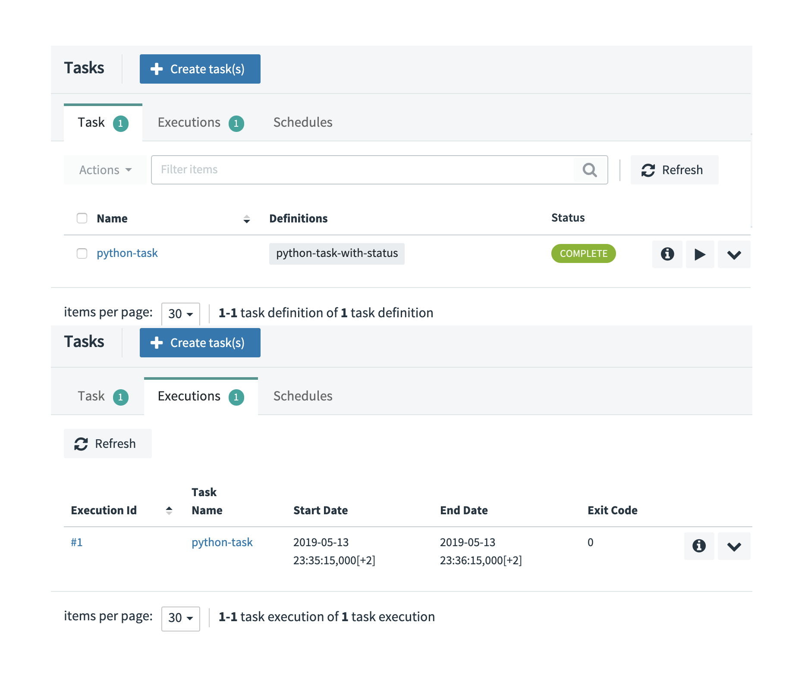
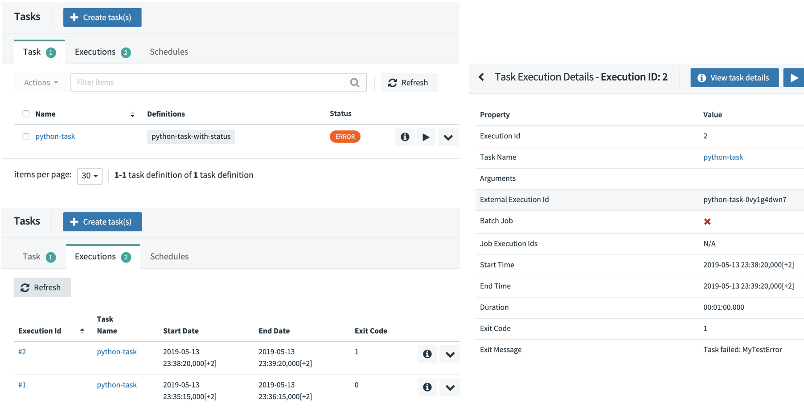
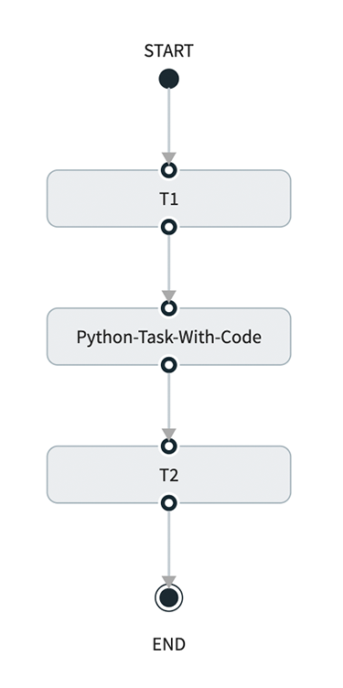

# Create and Deploy a Python Task

This recipe shows how to run a custom Python script as a [Data Flow Task](https://docs.spring.io/spring-cloud-dataflow/docs/%dataflow-version%/reference/htmlsingle/#spring-cloud-dataflow-task) and how to later orchestrate the tasks as [Composed Tasks](https://docs.spring.io/spring-cloud-dataflow/docs/%dataflow-version%/reference/htmlsingle/#spring-cloud-dataflow-composed-tasks).

The approach requires the Python script to be bundled in a docker image, which can then be used in SCDF's `Local` and `Kubernetes` implementations.

The following diagram walks through the architecture and the various components involved in the solution:


When Data Flow launches the Python script as a task, the script runs and completes with either a success or a failure status.
Because this is not a standard Spring Cloud Task application, it is the user's responsibility to manage the life cycle and update the state to the shared database that is also used by Data Flow.
Utilities are provided to help handle the launch arguments and manage the task status within the Data Flow database.

You can find the source code in the samples GitHub [repository](https://github.com/spring-cloud/spring-cloud-dataflow-samples/tree/master/dataflow-website/recipes/polyglot/polyglot-python-task) or download it as a zipped archive: [polyglot-python-task.zip](https://github.com/spring-cloud/spring-cloud-dataflow-samples/raw/master/dataflow-website/recipes/polyglot/polyglot-python-task.zip). Follow the [Build](#build) instructions for building and using the project.

## Development

The [python_task.py](https://github.com/spring-cloud/spring-cloud-dataflow-samples/blob/master/dataflow-website/recipes/polyglot/polyglot-python-task/python_task.py) script in the next example shows a sample Python script that you can register as a Spring Cloud Task.
When launched, the Python script prints an acknowledgment message. It then sleeps for 60 seconds and completes afterward.
If the `--error.message=<Text>` launch argument is present, the script throws an exception to simulate an execution failure.

```python
from util.task_status import TaskStatus
from util.task_args import get_task_id, get_db_url, get_task_name, get_cmd_arg

try:
    # Connect to SCDF's database.
    status = TaskStatus(get_task_id(), get_db_url())

    # Set task's status to RUNNING.
    status.running()

    # Do something.
    print('Start task:{}, id:{}'.format(get_task_name(), get_task_id()))

    print('Wait for 60 seconds ...')
    sys.stdout.flush()
    time.sleep(60)

    if get_cmd_arg('error.message') is not None:
        raise Exception(get_cmd_arg('error.message'))

    # Set task's status to COMPLETED.
    status.completed()

except Exception as exp:
    # Set task's status to FAILED.
    status.failed(1, 'Task failed: {}'.format(exp))
```

<!--IMPORTANT-->

Since the Python script is not managed by `Spring Cloud Task`, it is the user's responsibility to manage and update the progress with the Data Flow database.

<!--END_IMPORTANT-->

To parse the input arguments and to manage its state in Data Flow, the custom script uses the following utilities:

- The [task_status.py](https://github.com/spring-cloud/spring-cloud-dataflow-samples/blob/master/dataflow-website/recipes/polyglot/polyglot-python-task/util/task_status.py) helps to access and update the Data Flow `TASK_EXECUTION` table in order to reflect task's life cycle events. The `TaskStatus` class takes `task id` and `sqlalchemy url` arguments (computed from the command line arguments) and provides API for setting the task status to `running`, `completed`, or `failed(with exitCode, errorMessage)`.
  To access the Data Flow database, the `task_status` uses the following launch arguments, automatically provided by Data Flow on every task launch:

  ```bash
  --spring.datasource.username=root
  --spring.datasource.password=yourpassword
  --spring.datasource.url=jdbc:mariadb://<mariadb-host>:<port>/mariadb
  --spring.cloud.task.executionid=26
  ```

  The `spring.cloud.task.executionid` property represents the Task ID, as known inside Data Flow and persisted in the `TASK_EXECUTION` table.

- The [task_args.py](https://github.com/spring-cloud/spring-cloud-dataflow-samples/blob/master/dataflow-website/recipes/polyglot/polyglot-python-task/util/task_args.py) utility helps extract the task arguments for the default (that is, exec) [entry point style](https://docs.spring.io/spring-cloud-dataflow/docs/%dataflow-version%/reference/htmlsingle/#_entry_point_style_2).
  The utility also constructs [sqlalchemy](https://www.sqlalchemy.org/) URLs for the different databases, which might be configured with SCDF (currently only MariaDB is tested). Check the [get_db_url()](https://github.com/spring-cloud/spring-cloud-dataflow-samples/blob/master/dataflow-website/recipes/polyglot/polyglot-python-task/util/task_args.py#L22) implementation.

For `python_task.py` to act as a Data Flow task, it needs to be bundled in a Docker image and uploaded to `DockerHub`. The following [Dockerfile](https://github.com/spring-cloud/spring-cloud-dataflow-samples/blob/master/dataflow-website/recipes/polyglot/polyglot-python-task/Dockerfile) illustrates how to bundle a Python script into docker image:

```docker
FROM python:3.7.3-slim

RUN apt-get update
RUN apt-get install build-essential -y
RUN apt-get install libmariadbclient-dev -y
RUN pip install mariadb
RUN pip install sqlalchemy

ADD python_task.py /
ADD util/* /util/

ENTRYPOINT ["python","/python_task.py"]
CMD []
```

It installs the required dependencies and adds the task script(s) (for example, `ADD python_task.py`) and utilities (under the `util` folder).

<!--TIP-->

Leave the command empty (`[]`) and set the entry point explicitly.

<!--END_TIP-->

### Build

1. Checkout the [sample project](https://github.com/spring-cloud/spring-cloud-dataflow-samples) and navigate to the `polyglot-python-task` folder:

```bash
git clone https://github.com/spring-cloud/spring-cloud-dataflow-samples
cd ./spring-cloud-dataflow-samples/dataflow-website/recipes/polyglot/polyglot-python-task/
```

1. Build the Docker image and push it to DockerHub:

```bash
docker build -t springcloud/python-task-with-status:0.1 .
docker push springcloud/python-task-with-status:0.1
```

Tip: replace `springcloud` with your docker hub prefix.

1. Register the docker image as a Data Flow `task` application:

```bash
app register --type task  --name python-task-with-status --uri docker://springcloud/python-task-with-status:0.1
```

## Deployment

Follow the [installation instructions](%currentPath%/installation/kubernetes/) to set up Data Flow on Kubernetes.

Create and launch the Python script as a Data Flow Task:

```bash
task create --name python-task --definition "python-task-with-status"
task launch --name python-task
```

<!--TIP-->

Use `kubectl get all` and `kubectl logs -f po/python-task-XXXXXX` to monitor the output of the task.
Use the Data Flow UI/task or shell (task list) to monitor the status of the python-task.

<!--END_TIP-->

On successful task launch, you should see the following report in your Data Flow Task UI:



Launch the `python-task` again, with the `--error.message=MyTestError` launch argument (to simulate an error):

```
task launch --name python-task --arguments "--error.message=MyTestError"
```

The second task execution (#2) fails, as shown in the Data Flow Task UI:



## Use with Composed Tasks

With the provided task status management, you can use the Docker and Python tasks in [Composed Tasks](https://docs.spring.io/spring-cloud-dataflow/docs/%dataflow-version%/reference/htmlsingle/#spring-cloud-dataflow-composed-tasks).

The following example defines a parallel task execution:

```bash
task create compose2 --definition "<pp1: python-task-with-status || pp2: python-task-with-status>"
task launch --name compose2
```

The preceding example would launch the python-task twice in parallel, as follows:


Conversely, the following composed task launches the defined tasks in sequence:

```bash
task create sequence1 --definition "t1: timestamp && python-task-with-status && t2: timestamp”
task launch --name sequence1
```


