# Launching Apps Across Multiple Platforms

Spring Cloud Data Flow lets you orchestrate the launching of applications on different platforms from a single instance.
A platform is a location where an application can be launched. For this document, a platform can be a Kubernetes cluster and namespace, a Cloud Foundry organization and space, or a physical server.
The purpose of this document is to showcase a couple of ways to take advantage of deploying across multiple platforms.

## Launching Tasks Across Multiple Kubernetes Name Spaces

The following image shows a common scenario for launching tasks across namespaces:

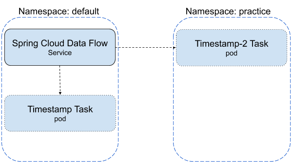
In this scenario, a Spring Cloud Data Flow is running in a Kubernetes cluster in the default namespace and the user wants to be able to launch tasks in both the default and the practice namespaces.
For this exercise, we deploy Spring Cloud Data Flow by using SCDF's provided YAML files onto Minikube.

### Configuring Spring Cloud Data Flow and Setting up the Environment

1. Download the SCDF repository, as described in [Deploying With kubectl](https://dataflow.spring.io/docs/installation/kubernetes/kubectl/#deploying-with-kubectl).
   However, before continuing to the `Choose a Message Broker` section, we need to create the namespaces and add the platform configuration to Spring Cloud Data Flow.

2. Create the `practice` namespace (`default` is already created for you) by running the following command:

```shell script
kubectl create namespace practice
```

3. Configure the platforms that Spring Cloud Data Flow uses. Us a text editor to open the `<{>SCDF Dir>/src/kubernetes/server/server-deployment.yaml` file and replace the `SPRING_APPLICATION_JSON` property with the following value:

```yaml
- name: SPRING_APPLICATION_JSON
  value: '{ "maven": { "local-repository": null, "remote-repositories": { "repo1": { "url": "https://repo.spring.io/libs-snapshot"} } },"spring.cloud.dataflow.task":{"platform.kubernetes.accounts":{"default":{"namespace" : "default"},"practice":{"namespace" : "practice"}}} }'
```

1. Continue following the instructions, picking up at the [Choose a Message Broker](https://dataflow.spring.io/docs/installation/kubernetes/kubectl/#choose-a-message-broker) step, till all steps are completed.
1. To let Spring Cloud Data Flow launch tasks across multiple namespaces, the RBAC policy for Spring Cloud Data Flow service needs to be updated. To do so, run the following command:

```shell script
kubectl create clusterrolebinding scdftestrole --clusterrole cluster-admin --user=system:serviceaccount:default:scdf-sa
```

<!--NOTE-->

Setting the cluster role to `cluster-admin` for the `scdf-sa` user is not something that is recommended for production, but in this case it is meant for demo purposes.

<!--END_NOTE-->

### Registering Pre-built Tasks

This exercise uses the pre-built timestamp application provided by Spring Cloud Data Flow. If you have not already registered your pre-built task applications:

1. Bring up the Spring Cloud Data Flow UI in a browser.
1. Click the **Applications** tab on the left side of the page.
1. Click the **ADD APPLICATION(S)** button at the top of the page.
   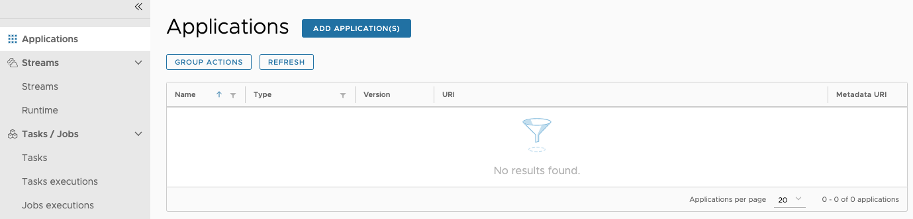
1. When the **Add Applications(s)** page appears, click the `Import application starters from dataflow.spring.io.` option.
   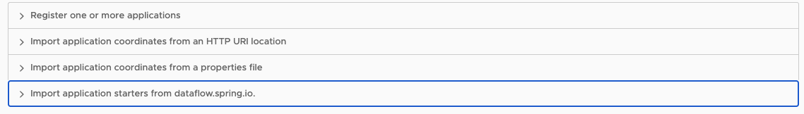
1. Click the **Task application starters for Docker** radio button.
   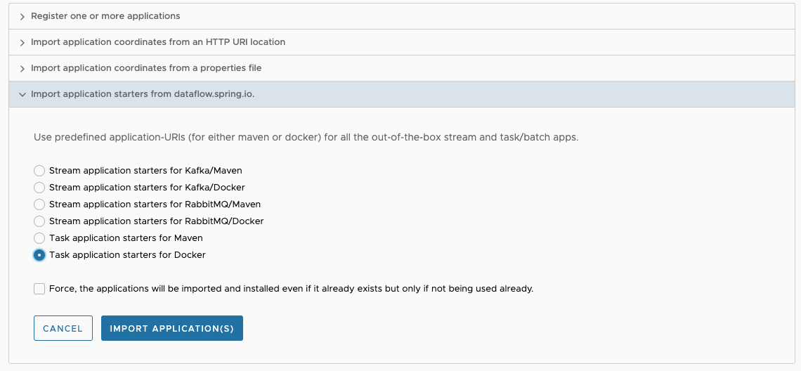
1. Click the **IMPORT APPLICATION(S)** button on the bottom of the page.

### Create Task Definitions

In this section, we create two task definitions: `timestamp-task` and `timestamp-task-2`. We launch each task definition on a specific platform.

To create the `timestamp-task` definition:

1. Click the **Tasks** tab on the left side of the UI.  
   
1. Click the **CREATE TASK** button on the page.
1. Type `timestamp` in the text box.
1. Click the **CREATE TASK** button.
   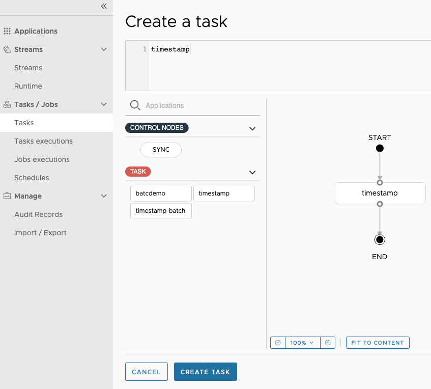
1. When the **Create Task** dialog appears, type `timestamp-task` in the **Name** field.
1. Click the **CREATE THE TASK** button.
   

To create the `timestamp-task-2` definition, follow the `timestamp-task` instructions shown earlier, except that, for the step when the `Create Task` dialog appears, the name is `timestamp-task-2`.

Now both task definitions are available, as shown below:  
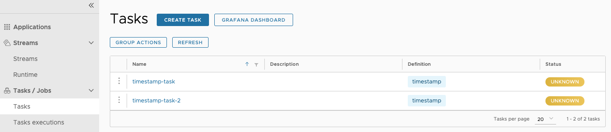

### Launching Tasks

In this section, we launch `timestamp-task` in the default platform and then launch `timestamp-task-2` in the practice platform. To do so:

1. Click the option control associated with the `timestamp-task` task definition and select the **Launch** option.
   
1. Now select the platform on which you want the `timestamp-task` to be launched -- in this case, the `default` namespace.
   
1. Click the **LAUNCH THE TASK** button at the bottom of the page.

To verify that the pod executed, you can view the result in the task execution page or run the following `kubectl` command to view the pods in the `default` namespace:

```shell script
kubectl get pods --namespace default
NAME                         READY   STATUS      RESTARTS   AGE
mysql-b94654bd4-k8vr7        1/1     Running     1          7h38m
rabbitmq-545bb5b7cb-dn5rd    1/1     Running     39         124d
scdf-server-dff599ff-68949   1/1     Running     0          8m27s
skipper-6b4d48ddc4-9p2x7     1/1     Running     0          12m
timestamp-task-v9jrm66p55    0/1     Completed   0          87s
```

To launch a task in the `practice` name space:

1. Click the option control associated with the `timestamp-task-2` task definition and select the **Launch** option.
   
1. Select the platform you want the `timestamp-task` to be launched -- in this case, the `practice` namespace.
   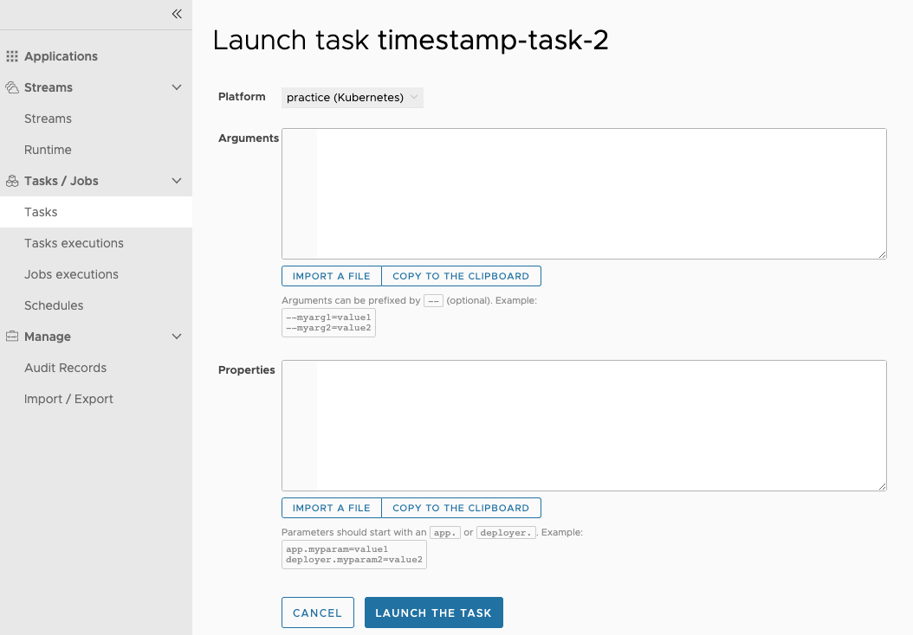
1. Click the **LAUNCH THE TASK** button at the bottom of the page.

To verify that the pod executed, you can view the result in the task execution page or run the following `kubectl` command to view the pods in the `default` namespace:

```shell script
kubectl get pods --namespace practice
NAME                          READY   STATUS      RESTARTS   AGE
timestamp-task-2-nwvk4r89vy   0/1     Completed   0          59s
```

### Scheduling Tasks

In this section, we create two schedules, each on a different platform.
By using Spring Cloud Data Flow's shell, we create a schedule to launch the `timestamp-task` once a minute on the `default` platform. To do so:

1. Schedule the task by running the following command from the Spring Cloud Data Flow shell:

```shell script
task schedule create --name timestamp-task-sched --definitionName timestamp-task --expression "*/1 * * * *" --platform default
```

It looks something like this:

```shell script
dataflow:>task schedule create --name timestamp-task-sched --definitionName timestamp-task --expression "*/1 * * * *" --platform default
Created schedule 'timestamp-task-sched'
```

2. Verify that the schedule was created by running the `task schedule list --platform default` command:

```shell script
dataflow:>task schedule list --platform default
╔════════════════════╤════════════════════╤════════════════════════════════════════════════════╗
║   Schedule Name    │Task Definition Name│                     Properties                     ║
╠════════════════════╪════════════════════╪════════════════════════════════════════════════════╣
║timestamp-task-sched│timestamp-task      │spring.cloud.scheduler.cron.expression = */1 * * * *║
╚════════════════════╧════════════════════╧════════════════════════════════════════════════════╝
```

3. To verify that the scheduled application was properly created and launched by the CronJob, you can view the result by running the following command `task execution list` from the SCDF shell:
   (Alternatively, you can run the following `kubectl` command and see the `timestamp-task-sched` pods start appearing after one minute.)

```shell script
kubectl get pods --namespace default
NAME                                    READY   STATUS      RESTARTS   AGE
mysql-b94654bd4-k8vr7                   1/1     Running     1          29h
rabbitmq-545bb5b7cb-dn5rd               1/1     Running     39         125d
scdf-server-845879c9b7-xs8t6            1/1     Running     3          4h45m
skipper-6b4d48ddc4-bkvph                1/1     Running     0          4h48m
timestamp-task-sched-1591904880-p48cx   0/1     Completed   0          33s
```

4. To delete the schedule, run the following command:

```shell script
dataflow:>task schedule destroy --name timestamp-task-sched --platform default
Deleted task schedule 'timestamp-task-sched'
```

Using Spring Cloud Data Flow's shell, we create a schedule that launches the `timestamp-task-2` once a minute on the `practice` platform.

1. To schedule the task, run the following command from the Spring Cloud Data Flow shell:

```shell script
task schedule create --name timestamp-task-2-sched --definitionName timestamp-task --expression "*/1 * * * *" --platform practice
```

It looks something like this:

```shell script
dataflow:>task schedule create --name timestamp-task-2-sched --definitionName timestamp-task --expression "*/1 * * * *" --platform practice
Created schedule 'timestamp-task-2-sched'
```

2. Verify that the schedule was created by running the `task schedule list --platform practice` command as shown below.

```shell script
dataflow:>task schedule list --platform practice
╔══════════════════════╤════════════════════╤════════════════════════════════════════════════════╗
║    Schedule Name     │Task Definition Name│                     Properties                     ║
╠══════════════════════╪════════════════════╪════════════════════════════════════════════════════╣
║timestamp-task-2-sched│timestamp-task-2    │spring.cloud.scheduler.cron.expression = */1 * * * *║
╚══════════════════════╧════════════════════╧════════════════════════════════════════════════════╝
```

3. You can verify the result by running the following command `task execution list` from the SCDF shell. Alternatively, you can launch the `kubectl` command with the following command and view the result:

```shell script
glennrenfro ~/scripts: kubectl get pods --namespace practice
NAME                                      READY   STATUS      RESTARTS   AGE
timestamp-task-2-sched-1591905600-rnfks   0/1     Completed   0          17s
```

4. To delete the schedule, run the following command:

```shell script
dataflow:>task schedule destroy --name timestamp-task-2-sched --platform practioce
Deleted task schedule 'timestamp-task-2-sched'
```

## Launching Tasks Across Multiple Platforms from an External Spring Cloud Data Flow


In this scenario, a Spring Cloud Data Flow and its data store are running outside the Kubernetes cluster, and the user wants to be able to launch tasks in both the default and practice namespaces while being able to monitor the task execution from SCDF.

### Configuring Spring Cloud Data Flow

For this exercise, you need to have access to a shell.
Set the following environment properties for Spring Cloud Data Flow and launch it:

```shell script
export spring_datasource_url=<your database url>
export spring_datasource_username=<your username>
export spring_datasource_password=<your password>
export spring_datasource_driverClassName=<your driverClassName>
export spring_profiles_active=cloud
export jbp_config_spring_auto_reconfiguration='{enabled: false}'
export spring_cloud_dataflow_features_schedulesEnabled=true
export spring_cloud_dataflow_features_tasks_enabled=true
export SPRING_APPLICATION_JSON="{\"spring.cloud.dataflow.task\":{\"platform.local.accounts\":{\"default\":{\"timeout\" : \"60\"}},\"platform.kubernetes.accounts\":{\"kzone\":{\"namespace\" : \"default\"},\"practice\":{\"namespace\" : \"practice\"}}}}"

java -jar spring-cloud-dataflow-server/target/spring-cloud-dataflow-server-<version>.jar
```

### Configuring Database Service in Kubernetes to Connect to an External Database

The tasks that are launched in this exercise need to have access to a database service that connects to the external database that is being used by SCDF.
To do this, we create a database service along with an endpoint that refers to the external database. For this example, we connect to a MySql database.

1. Set up the database service:

```yaml
apiVersion: v1
kind: Service
metadata:
  name: mysql-mac
spec:
  ports:
    - protocol: TCP
      port: 1443
      targetPort: 3306
```

2. Set up an endpoint to your local MySql:

```yaml
apiVersion: v1
kind: Endpoints
metadata:
  name: mysql-mac
subsets:
  - addresses:
      - ip: 192.168.1.72
    ports:
      - port: 3306
```

3. Now, obtain the `cluster ip` for the newly created `mysql-mac` service so that you can use it to launch and schedule tasks. To do so, run the following command (in this case a MySql instance running on your local machine):

```shell script
kubectl get svc mysql-mac
```

The result of this command looks something like:

```shell script
NAME        TYPE        CLUSTER-IP      EXTERNAL-IP   PORT(S)    AGE
mysql-mac   ClusterIP   <ext db conn>   <none>        1443/TCP   44m
```

### Registering Applications

To register the applications needed for the exercise, follow the instructions in this [section](#registering-pre-built-tasks).

### Launching Tasks

Add the following command-line argument when launching the task (replace `<ext db conn>` with the CLUSTER-IP provided by the `kubectl get svc mysql-mac`):

`--spring.datasource.url=jdbc:mysql://<ext db conn>:1443/<your db>`

It should look something like the following image:
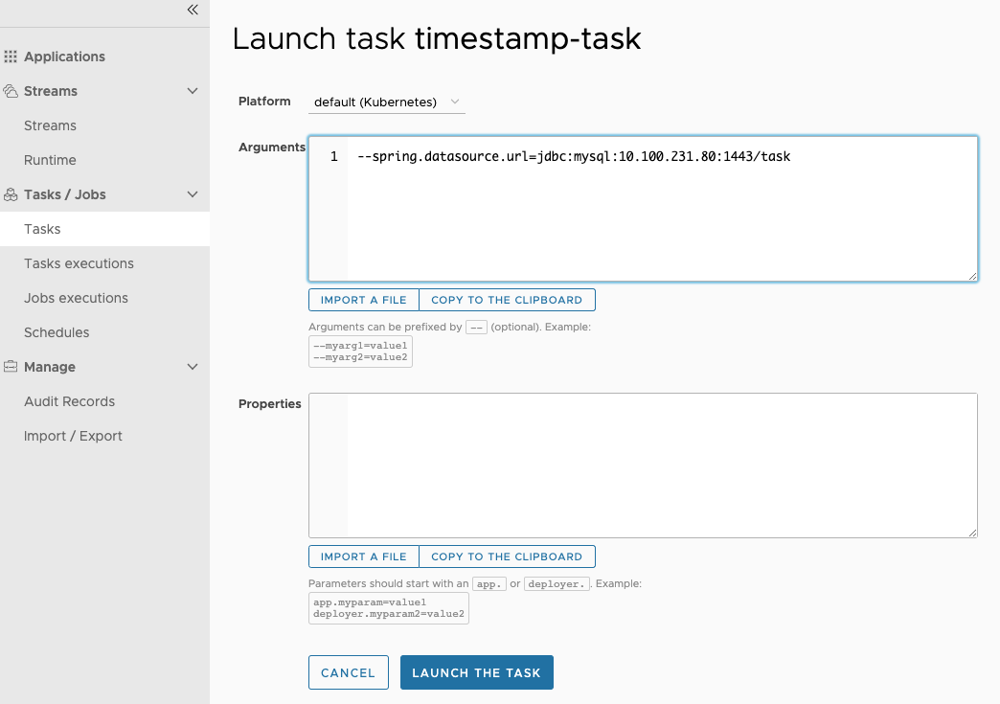

To verify that the task was launched, select the **Task executions** tab on the left side of the page to see results that look like the following image:


Also, you can verify the launch by viewing the pod list for the `default` namespace:

```shell script
kubectl get pods --namespace default
NAME                          READY   STATUS      RESTARTS   AGE
timestamp-task-kzkpqjp936     0/1     Completed   0          38s
```

Add the following command-line argument when launching the task:

`--spring.datasource.url=jdbc:mysql://<ext db conn>:1443/<your db>`

It should look something like the following image:


To verify that the task was launched, select the **Task executions** tab on the left side of the page to see results that look like the following image:
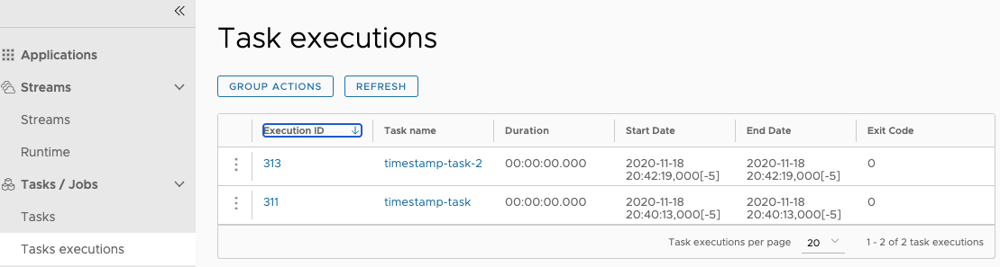

Also, you can verify the launch by viewing the pod list for the `practice` namespace, as the following example shows:

```shell script
kubectl get pods --namespace practice
NAME                          READY   STATUS      RESTARTS   AGE
timestamp-task-2-pkwzevl0mp   0/1     Completed   0          48s
```

### Scheduling Tasks

In this section, we create two schedules, each on a different platform.
By using Spring Cloud Data Flow's shell, we create a schedule that launches the `timestamp-task` once a minute on the `default` platform.

1. To schedule the task, run the following command from the Spring Cloud Data Flow shell:

```shell script
task schedule create --name timestamp-task-sched --definitionName timestamp-task --expression "*/1 * * * *" --platform default --properties "app.docker-timestamp.spring.datasource.url=jdbc:mysql://<ext db conn>:1443/<your db>"
```

It looks something like this:

```shell script
dataflow:>task schedule create --name timestamp-task-sched --definitionName timestamp-task --expression "*/1 * * * *" --platform default --properties "app.docker-timestamp.spring.datasource.url=jdbc:mysql://10.100.231.80:1443/task"
Created schedule 'timestamp-task-sched'
```

2. To verify that the schedule was created, run the `task schedule list --platform default` command and view the result:

```shell script
dataflow:>task schedule list --platform default
╔════════════════════╤════════════════════╤════════════════════════════════════════════════════╗
║   Schedule Name    │Task Definition Name│                     Properties                     ║
╠════════════════════╪════════════════════╪════════════════════════════════════════════════════╣
║timestamp-task-sched│timestamp-task      │spring.cloud.scheduler.cron.expression = */1 * * * *║
╚════════════════════╧════════════════════╧════════════════════════════════════════════════════╝
```

3. To verify that the scheduled application was properly created and launched by the CronJob, run the `task execution list` from the SCDF Shell or run the following `kubectl` command to see the `timestamp-task-sched` pods start appearing after one minute:

```shell script
kubectl get pods --namespace default
NAME                                    READY   STATUS      RESTARTS   AGE
timestamp-task-sched-1592229780-f5w6w   0/1     Completed   0          15s
```

4. To delete the schedule, run the following command:

```shell script
dataflow:>task schedule destroy --name timestamp-task-sched --platform default
Deleted task schedule 'timestamp-task-sched'
```

By using Spring Cloud Data Flow's shell, we create a schedule that launches the `timestamp-task-2` once a minute on the `practice` platform.

1. To schedule the task, run the following command from the Spring Cloud Data Flow shell:

```shell script
task schedule create --name timestamp-task-2-sched --definitionName timestamp-task --expression "*/1 * * * *" --platform practice --properties "app.docker-timestamp.spring.datasource.url=jdbc:mysql://<ext db conn>:1443/<your db>"
```

It looks something like this:

```shell script
dataflow:>task schedule create --name timestamp-task-2-sched --definitionName timestamp-task --expression "*/1 * * * *" --platform practice --properties "app.docker-timestamp.spring.datasource.url=jdbc:mysql://10.100.231.80:1443/task"
Created schedule 'timestamp-task-2-sched'
```

2. To verify that the schedule was created, run the `task schedule list --platform practice` command and view the result:

```shell script
dataflow:>task schedule list --platform practice
╔══════════════════════╤════════════════════╤════════════════════════════════════════════════════╗
║    Schedule Name     │Task Definition Name│                     Properties                     ║
╠══════════════════════╪════════════════════╪════════════════════════════════════════════════════╣
║timestamp-task-2-sched│timestamp-task-2    │spring.cloud.scheduler.cron.expression = */1 * * * *║
╚══════════════════════╧════════════════════╧════════════════════════════════════════════════════╝

dataflow:>task schedule destroy --name timestamp-task-2-sched --platform practice
Deleted task schedule 'timestamp-task-2-sched'
```

3. To verify that the scheduled app was properly created and launched by the CronJob, run the `task execution list` from the SCDF Shell or run the following `kubectl` command to see the `timestamp-task-sched` pods start appearing after one minute:

```shell script
glennrenfro ~/scripts: kubectl get pods --namespace practice
NAME                                      READY   STATUS      RESTARTS   AGE
timestamp-task-2-sched-1592230980-bngbc   0/1     Completed   0          19s
```

4. To delete the schedule, run the following command:

```shell script
dataflow:>task schedule destroy --name timestamp-task-2-sched --platform practice
Deleted task schedule 'timestamp-task-2-sched'
```

## Launching Tasks on Different Types of Platforms

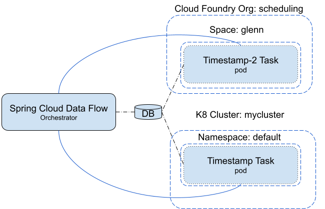
In this scenario, Spring Cloud Data Flow is running outside of Kubernetes and Cloud Foundry and you want to launch tasks on both platforms.

### Configuring Spring Cloud Data Flow

For this exercise, you need access to a shell. Set the following environment properties for Spring Cloud Data Flow and launch it:

```shell script
export spring_datasource_url=<your database url>
export spring_datasource_username=<your username>
export spring_datasource_password=<your password>
export spring_datasource_driverClassName=<your database driverClassNanme>
export spring_profiles_active=cloud
export jbp_config_spring_auto_reconfiguration='{enabled: false}'
export spring_cloud_dataflow_features_schedulesEnabled=true
export spring_cloud_dataflow_features_tasks_enabled=true
export SPRING_APPLICATION_JSON="{\"spring.cloud.dataflow.task\":{\"platform.kubernetes.accounts\":{\"kzone\":{\"namespace\" : \"default\"}},\"platform.cloudfoundry.accounts\":{\"cfzone\":{\"connection\":{\"url\":\"https://myconnection\",\"domain\":\"mydomain\",\"org\":\"myorg\",\"space\":\"myspace\",\"username\":\"admin\",\"password\":\"password\",\"skipSslValidation\":true},\"deployment\":{\"deleteRoutes\":false,\"services\":\"garsql,atscheduler\",\"enableRandomAppNamePrefix\":false,\"memory\":3072},\"schedulerProperties\":{\"schedulerUrl\":\"https://scheduler.cf.navy.springapps.io\"}}}}}{\"spring.cloud.dataflow.task\":{\"platform.kubernetes.accounts\":{\"kzone\":{\"namespace\" : \"default\"}}}}{\"spring.cloud.dataflow.task\":{\"platform.local.accounts\":{\"local\":{\"timeout\" : \"60\"}}}}"

java -jar spring-cloud-dataflow-server/target/spring-cloud-dataflow-server-2.6.0.BUILD-SNAPSHOT.jar
```

<!--NOTE-->

This exercise assumes that the user has an external database that is accessible from both the Cloud Foundry and Kubernetes environments.

<!--END_NOTE-->

### Registering Applications

In this exercise, SCDF launches both Docker and Maven images of the timestamp application.

To register the applications:

1. Register the sample docker task apps provided by SCDF as denoted in the instructions for [registering pre-built tasks](#registering-pre-built-tasks).
1. Register the maven instance of timestamp as follows:
1. Click the **ADD APPLICATON(S)** button at the top of the page, as the following image shows:
   
1. When the **Add Applications(s)** page appears, click the **Register one or more applications** radio button, as the following image shows:
   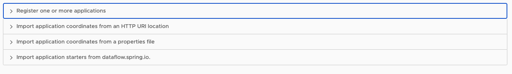
1. Enter the information as it is shown in the following image:
   
1. Click the **IMPORT APPLICATION(S)** button on the bottom of the page.

### Create Task Definitions

In this section, we create two task definitions: `timestamp-task` and `timestamp-task-2`. Each task definition launches on a specific platform.

To create the `k8-timestamp` definition:

1. Click the **Tasks** tab on the left side of the UI, as the following image shows:  
   
1. Click the **CREATE TASK** button.
1. Type `timestamp` in the text box.
1. Click the **CREATE TASK** button, as the following image shows:
   
1. When the **Create Task** dialog appears, enter `k8-timestamp` in the **Name** field.
1. Click the **CREATE THE TASK** button, as the following image shows:
   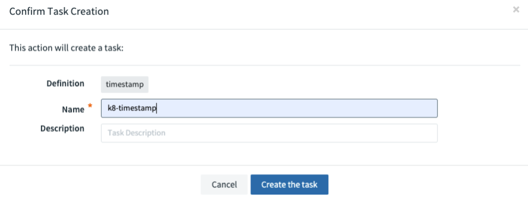

To create the `cf-timestamp` definition:

1. Click the **Tasks** tab on the left side of the UI, as the following image shows:  
   
1. Click the **CREATE TASK** button.
1. Type `maven-timestamp` in the text box.
1. Click the **CREATE TASK** button, as the following image shows:
   
1. When the **Create Task** dialog appears, enter `cf-timestamp` into the **Name** field.
1. Click the **CREATE THE TASK** button, as the following image shows:
   

Now both task definitions are available, as the following image shows:  
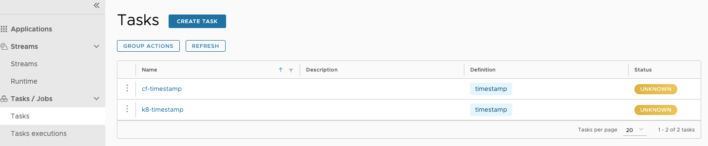

### Launching Tasks

In this section, we launch `cf-timestamp` on the `cfzone` (Cloud Foundry) platform and then launch k8-timestamp on the `kzone` (Kuberntes) platform.

1. Click the option control on the left side of the row associated with the `cf-timestamp` task definition and select the **Launch** option, as the following image shows:
   
1. Now select the platform you want the `cf-timestamp` to be launched -- in this case, the `cfzone` namespace -- as the following image shows:
   
1. Click the **LAUNCH THE TASK** button at the bottom of the page.

To verify that the application ran, you can view the result in the task execution page or launch the following `cf apps` command to view the application in the configured org and space:

```shell script
cf tasks cf-timestamp
Getting tasks for app cf-timestamp in org scheduling / space glenn as admin...
OK

id   name                                                                          state       start time                      command
7    cf-timestamp                                                                  SUCCEEDED   Mon, 15 Jun 2020 18:09:00 UTC   JAVA_OPTS="-agentpath:$PWD/.java-buildpack/open_jdk_jre/bin/jvmkill-1.16.0_RELEASE=printHeapHistogram=1 -Djava.io.tmpdir=$TMPDIR -XX:ActiveProcessorCount=$(nproc) -Djava.ext.dirs=$PWD/.java-buildpack/container_security_provider:$PWD/.java-buildpack/open_jdk_jre/lib/ext -Djava.security.properties=$PWD/.java-buildpack/java_security/java.security $JAVA_OPTS" && CALCULATED_MEMORY=$($PWD/.java-buildpack/open_jdk_jre/bin/java-buildpack-memory-calculator-3.13.0_RELEASE -totMemory=$MEMORY_LIMIT -loadedClasses=14335 -poolType=metaspace -stackThreads=250 -vmOptions="$JAVA_OPTS") && echo JVM Memory Configuration: $CALCULATED_MEMORY && JAVA_OPTS="$JAVA_OPTS $CALCULATED_MEMORY" && MALLOC_ARENA_MAX=2 SERVER_PORT=$PORT eval exec $PWD/.java-buildpack/open_jdk_jre/bin/java $JAVA_OPTS -cp $PWD/. org.springframework.boot.loader.JarLauncher
```

Now, to launch a task in the default name space on the `kzone` (kubernetes) platform:

1. Click the option control on the row associated with the `k8-timestamp` task definition and select the **Launch** option, as the following image shows:
   
1. Now select the platform you want the `k8-timestamp` to be launched -- in this case, the `kzone` namespace, as the following image shows:
   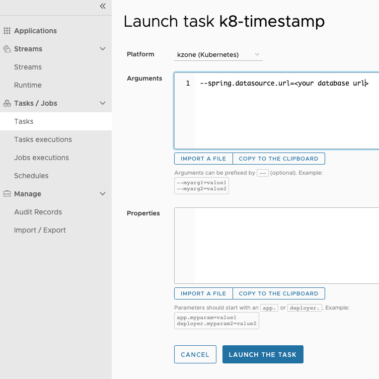
1. Click the **LAUNCH THE TASK** button at the bottom of the page.

To verify that the pod ran, you can view the result in the task execution page or by launching the following `kubectl` command to view the pods in the `default` namespace:

```shell script
kubectl get pods
NAME                        READY   STATUS      RESTARTS   AGE
k8-timestamp-rpqw00d175     0/1     Completed   0          39s
```

### Scheduling Tasks

In this section, we create two schedules, each on a different platform.
By using Spring Cloud Data Flow's shell, we create a schedule that launches the `cf-timestamp` task definition once a minute on the `cfzone` Cloud Foundry platform and a `k8-timestamp` task definition on the `default` namespace of a minikube.

1. Create the schedule for the Cloud Foundry platform:

```shell script
task schedule create --name timestamp-task-cf-sched --definitionName cf-timestamp --expression "*/1 * ? * *"  --platform cfzone --properties "app.maven-timestamp.spring.datasource.url=<your database url>"
```

1. Verify that the schedule was created, run the`task schedule list --platform cfzone` command and view the result:

```shell script
task schedule list --platform cfzone
╔═══════════════════════╤════════════════════╤════════════════════════════════════════════════════╗
║     Schedule Name     │Task Definition Name│                     Properties                     ║
╠═══════════════════════╪════════════════════╪════════════════════════════════════════════════════╣
║timestamp-task-cf-sched│cf-timestamp        │spring.cloud.scheduler.cron.expression = */1 * ? * *║
╚═══════════════════════╧════════════════════╧════════════════════════════════════════════════════╝
```

1. Verify that the application that was defined by the task definition has been deployed to the Cloud Foundry by running the `cf apps` command on the org and space that you configured:

```shell script
cf apps
Getting apps in org scheduling / space glenn as admin...
name                    requested state   instances   memory   disk   urls
cf-timestamp            stopped           0/1         3G       1G
```

1. Verify that the scheduled `timestamp-task-cf-sched` actually launched by running the `cf job-history timestamp-task-cf-sched` command on the org and space you configured:

```shell script
cf job-history timestamp-task-cf-sched
Getting scheduled job history for timestamp-task-cf-sched in org scheduling / space glenn as admin
1 - 6 of 6 Total Results
Execution GUID                         Execution State   Scheduled Time                  Execution Start Time            Execution End Time              Exit Message
4c588ee2-833d-47a6-84cb-ebfcc90857e9   SUCCEEDED         Mon, 15 Jun 2020 18:07:00 UTC   Mon, 15 Jun 2020 18:07:00 UTC   Mon, 15 Jun 2020 18:07:00 UTC   202 - Cloud Controller Accepted Task
```

1. Delete the schedule by running the SCDF shell `task schedule destroy` command:

````shell script
```shell script
task schedule destroy --name timestamp-task-k8-sched --platform kzone
Deleted task schedule 'timestamp-task-k8-sched'
````

1. Create the schedule for the Kubernetes platform:

```shell script
task schedule create --name timestamp-task-k8-sched --definitionName k8-timestamp --expression "*/1 * * * *" --platform kzone --properties "app.timestamp.spring.datasource.url=<your database url>"
```

1. Verify that the schedule was created by running the`task schedule list --platform kzone` command and view the result:

```shell script
task schedule list --platform kzone
╔═══════════════════════╤════════════════════╤════════════════════════════════════════════════════╗
║     Schedule Name     │Task Definition Name│                     Properties                     ║
╠═══════════════════════╪════════════════════╪════════════════════════════════════════════════════╣
║timestamp-task-k8-sched│k8-timestamp        │spring.cloud.scheduler.cron.expression = */1 * * * *║
╚═══════════════════════╧════════════════════╧════════════════════════════════════════════════════╝
```

1. Now verify that the application that was defined by the task definition has been deployed to the Kubernetes by running the `kubectl get pods` command on the default namespace:

```shell script
glennrenfro ~/scripts: kubectl get pods
NAME                                       READY   STATUS      RESTARTS   AGE
timestamp-task-k8-sched-1592246880-4fx2p   0/1     Completed   0          14s
```

1.  Now delete the schedule by running the SCDF shell `task schedule destroy` command:

```shell script
task schedule destroy --name timestamp-task-k8-sched --platform kzone
Deleted task schedule 'timestamp-task-k8-sched'
```
