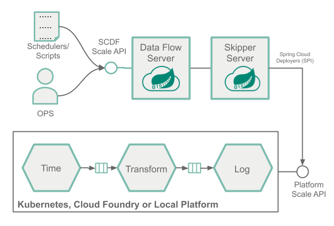
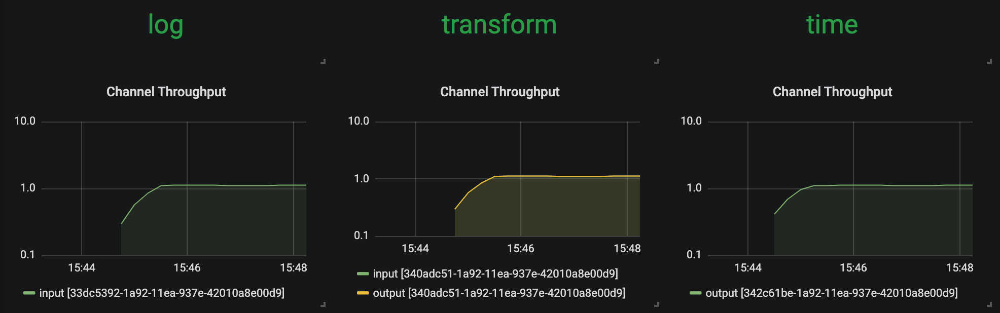
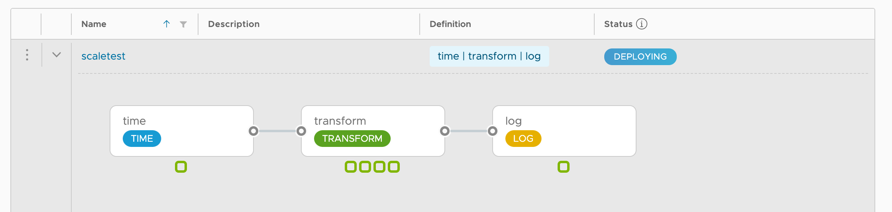
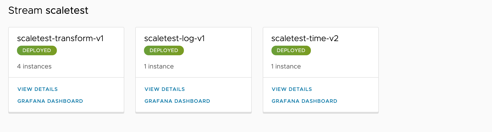
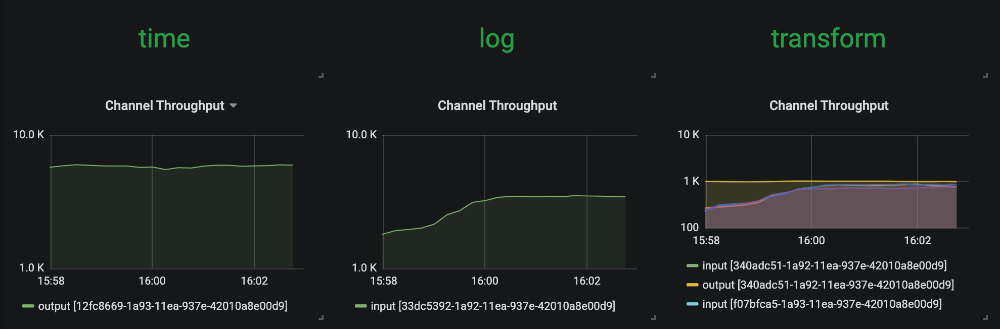
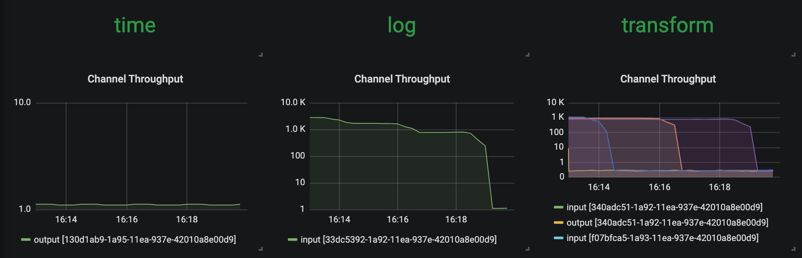

# Scale-out a streaming pipeline with SCDF shell

To learn about the basic scaling concepts in Spring Cloud Data Flow, see the [Scaling](%currentPath%/feature-guides/streams/scaling/) guide.

## Overview

We deploy a streaming data pipeline, simulate a resource strangling scenario (for example, a high CPU spike), and use the SCDF shell to manually increase the number of consumer application instances to handle the increased load, as the following image shows:



This manual approach lets operators and developers intervene and scale out when they observe high load in a given application. For example, a retail store may want to design a system that can scale out upfront to meet the high load and demanding days, such as Black Friday.

When a more sophisticated approach is required to control the scale-out and scale-in operations in an automated manner, with the help of SCDF's monitoring support using Prometheus, you can configure and set up autoscaling rules. See the [Autoscale streaming data pipelines with SCDF and Prometheus](%currentPath%/recipes/scaling/autoscaling/) recipe to learn how to do this.

## Prerequisite

This recipe uses the Kubernetes platform. Follow the [Kubectl](%currentPath%/installation/kubernetes/kubectl/) or the [Helm](%currentPath%/installation/kubernetes/helm/) installation instructions to setup Spring Cloud Data Flow with Kafka broker. Then run the following commands:

```shell
helm install --name my-release stable/spring-cloud-data-flow --set kafka.enabled=true,rabbitmq.enabled=false,kafka.persistence.size=10Gi
```

Then register the latest [kafka-docker](https://dataflow.spring.io/kafka-docker-latest) app starters.

Then start a SCDF Shell and connect it to your Data Flow Server:

```shell
server-unknown:>dataflow config server http://<SCDF IP>
```

## Scaling Recipe

This section shows a recipe for scaling an application.

### Create a Data Pipeline

To create a data pipeline, run the following command:

```shell
stream create --name scaletest --definition "time --fixed-delay=995 --time-unit=MILLISECONDS | transform --expression=\"payload + '-' + T(java.lang.Math).exp(700)\" | log"
```

The `time` source generates current timestamp messages on a fixed time-interval (995ms = ~1 msg/s), the `transform` processor performs a math operation to simulate high CPU processing, and the `log` sink prints the transformed message payload.

### Deploy a Data Pipeline with Data Partitioning

To deploy a data pipeline with data partioning, run the following command:

```shell
stream deploy --name scaletest --properties "app.time.producer.partitionKeyExpression=payload,app.transform.spring.cloud.stream.kafka.binder.autoAddPartitions=true,app.transform.spring.cloud.stream.kafka.binder.minPartitionCount=4"
```

The `producer.partitionKeyExpression=payload` property configures the time output binding for partitioning. The partition key expression uses the message payload (for example, the `toString()` value of the current timestamp) to compute how the data needs to be partitioned to the downstream output channels.
The `spring.cloud.stream.kafka.binder.autoAddPartitions` deployment property instructs the Kafka binder to create new partitions when required. This is required if the topic is not already over-partitioned.
The `spring.cloud.stream.kafka.binder.minPartitionCount` property sets the minimum number of partitions that the Kafka binder configures on the topic, which is where the transform-processor is subscribing for new data.

Once the `scaletest` stream is deployed you should see the following:


Singe application instances for each application.

Use the SCDF's built-in Grafana dashboard to review the [stream application's throughput and the other application metrics](%currentPath%/feature-guides/streams/monitoring/#prometheus-1):



The `time`, `transform`, and `log` applications maintain the same message throughput (~1 msg/s). The `transform` handles the current load.

### Increase the Data Pipeline Load

Now we increase the load by increasing the time source's message production rate. By changing the time source's `time-unit` property from `MILLISECONDS` to `MICROSECONDS`, the input rate increase from one to thousands of messages per second.
Note that the [stream rolling-update](%currentPath%/stream-developer-guides/continuous-delivery/) functionality lets you perform a rolling update of only the time application without stopping the entire stream:

```shell
stream update --name scaletest --properties "app.time.trigger.time-unit=MICROSECONDS"
```

Now the `time` source emits messages with a rate of `~5000 msg/s`. The `transform` processor, though, is capped at around `1000 msg/s`. In turn, it halts the throughput of the entire stream to a certain level. This is an indicator that the `transform` has become the bottleneck, as the following image shows:


### Scale-Out

Use the SCDF Shell to scale the `transform` instances to four:

```shell
stream scale app instances --name scaletest --applicationName transform --count 4
```

As a result of the previous command, three additional transform instances are deployed, as the following images show:




With the help of the additional instances of the `transform` processor, the entire data pipeline catches up to match with the `time` source's production rate.



### Decrease the Data Pipeline Load and Scale-In

Now we reduce the source's data production rate back to the original rate (1 msg/s):

```shell
stream update --name scaletest --properties "app.time.trigger.time-unit=MILLISECONDS"
```

The extra `transform` processor instances no longer alter the overall throughput rate. These extra instances can be scaled back in (that is, removed), as follows:



Doing so lets us reduce the number of transform application instances to the original capacity. To reduce the number of instances, run the following command:

```shell
stream scale app instances --name scaletest --applicationName transform --count 1
```

The following image shows the result:

