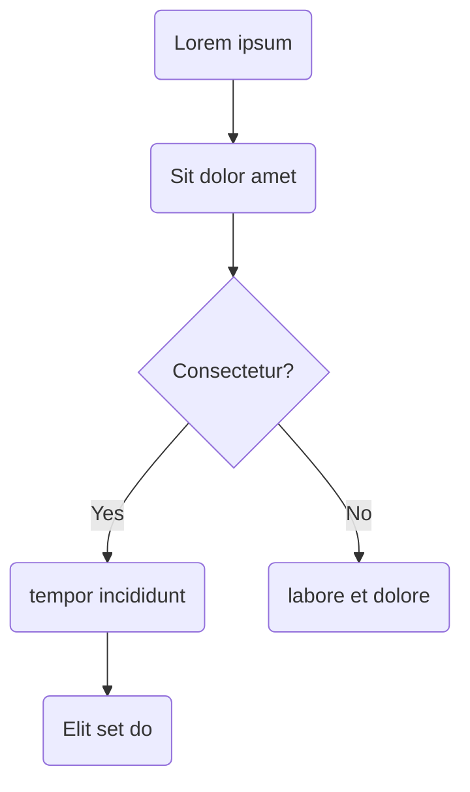

# Markdown syntax

Lorem ipsum dolor %version% sit amet, **consectetur adipiscing** elit, sed do eiusmod tempor incididunt ut labore et dolore _magna aliqua_. Ut enim ad minim veniam, quis [nostrud exercitation](http://spring.io) ullamco.

[[note]]
| Lorem ipsum dolor sit amet, consectetur adipiscing elit, sed do eiusmod tempor incididunt ut labore et dolore magna aliqua. Ut enim ad minim veniam, quis nostrud exercitation ullamco.

## Basics

### Links

**Internal links**:

- [Markdown Lorem](%currentPath%/markdown/lorem/)
- [Installation](%currentPath%/installation/)
- [Features](/features)

**External links**:

- [Spring.io](https://spring.io/)

### Unordered list

- Lorem ipsum dolor sit amet, consectetur adipiscing elit.
- Lorem ipsum dolor sit amet, consectetur adipiscing elit.
- Lorem ipsum dolor sit amet, consectetur adipiscing elit.
  - Lorem ipsum dolor sit amet, consectetur adipiscing elit.
- Lorem ipsum dolor sit amet, consectetur adipiscing elit.
  - Lorem ipsum dolor sit amet, consectetur adipiscing elit.
    - Lorem ipsum dolor sit amet, consectetur adipiscing elit.
    - Lorem ipsum dolor sit amet, consectetur adipiscing elit.
  - Lorem ipsum dolor sit amet, consectetur adipiscing elit.
  - Lorem ipsum dolor sit amet, consectetur adipiscing elit.
- Lorem ipsum dolor sit amet, consectetur adipiscing elit.

### Ordered list

1. Lorem ipsum dolor sit amet, consectetur adipiscing elit.

- Lorem ipsum dolor sit amet, consectetur adipiscing elit.
- Lorem ipsum dolor sit amet, consectetur adipiscing elit.
  1. Lorem ipsum dolor sit amet, consectetur adipiscing elit.
- Lorem ipsum dolor sit amet, consectetur adipiscing elit.
  1. Lorem ipsum dolor sit amet, consectetur adipiscing elit.
  1. Lorem ipsum dolor sit amet, consectetur adipiscing elit.
  - Lorem ipsum dolor sit amet, consectetur adipiscing elit.
  - Lorem ipsum dolor sit amet, consectetur adipiscing elit.
  - Lorem ipsum dolor sit amet, consectetur adipiscing elit.
- Lorem ipsum dolor sit amet, consectetur adipiscing elit.

### Tables

| Option | Description                                          |
| ------ | ---------------------------------------------------- |
| lorem  | Lorem ipsum dolor sit amet, consectetur adipisicing. |
| ipsum  | quis nostrud exercitation ullamco.                   |
| dolor  | tempor incididunt ut labore et dolore magna aliqua.  |

### Sample code

Lorem ipsum dolor sit amet, consectetur adipiscing elit, sed do eiusmod tempor incididunt ut labore et dolore magna aliqua. Ut enim ad minim veniam, quis nostrud exercitation ullamco.

#### Inline code

Lorem ipsum dolor sit amet, `consectetur_adipiscing_elit()` , sed do eiusmod tempor incididunt ut labore et dolore magna aliqua. Ut enim ad minim veniam, quis nostrud exercitation ullamco.

#### Block code

```java
{/* highlight-range{8-14} */}
@EnableBinding(Sink.class)
public class LoggingSink {

  @StreamListener(Sink.INPUT)
  public void log(String message) {
      System.out.println(message);
  }

  public Launcher(String name, String type, Scheduler scheduler) {
  	this.name = name;
  	this.type = type;
  	this.scheduler = scheduler;
  }

  public Scheduler getScheduler() {
  	return scheduler;
  }

  public void setScheduler(Scheduler scheduler) {
  	this.scheduler = scheduler;
  }
}
```

### Images

[Remark Images](https://github.com/gatsbyjs/gatsby/tree/master/packages/gatsby-remark-images) is used to optimize images.


### Blockquotes

> Lorem ipsum dolor sit amet, consectetur adipisicing elit, sed do eiusmod tempor incididunt ut labore...

### Callouts

Lorem ipsum dolor sit amet, consectetur:

[[danger]]
| Lorem ipsum dolor sit amet, consectetur adipiscing

[[warning]]
| Lorem ipsum dolor sit amet, consectetur adipiscing

[[note]]
| Lorem ipsum dolor sit amet, consectetur adipiscing

[[success]]
| Lorem ipsum dolor sit amet, consectetur adipiscing

[[tip]]
| Lorem ipsum dolor sit amet, consectetur adipiscing

Callout with a title and paragraphs:

[[note | Title callout sample]]
| Lorem ipsum dolor sit amet, **consectetur adipiscing elit**, sed do eiusmod tempor incididunt ut labore et dolore magna aliqua. Ut enim ad minim veniam, quis nostrud exercitation ullamco.
|
| Lorem ipsum dolor sit amet, consectetur adipiscing elit, sed do eiusmod tempor incididunt ut labore et dolore magna aliqua. Ut enim ad minim veniam, quis nostrud exercitation ullamco.

### Mermaid



## Advanced

### Variables

You can define variable in the file `/content/documentation/variables.json`.

Default variables:

| Name          | Description     | Value         |
| ------------- | --------------- | ------------- |
| `version`     | Current version | %version%     |
| `currentPath` | currentPath     | %currentPath% |

**Usage:**

| Name      | Description | Value     |
| --------- | ----------- | --------- |
| `foo`     | Foo         | %foo%     |
| `bar.foo` | Bar Foo     | %bar.foo% |

Lorem [ipsum dolor %foo%](https://spring.io/%foo%) sit amet, consectetur `adipisicing %foo%`, sed **do eiusmod %foo%** tempor.

```html
<div>
  <a href="https://spring.io">%version%</a>
</div>
```

[[tip]]
| Lorem ipsum dolor sit amet, consectetur **%foo%** adipiscing

### Tabulation

**Usage:**

<!--TABS-->
<!--First-->

Lorem ipsum dolor sit amet, consectetur adipisicing elit, sed do eiusmod tempor incididunt ut labore et dolore magna aliqua. Ut enim ad minim veniam, quis nostrud exercitation ullamco laboris nisi ut aliquip ex ea commodo consequat.

Duis aute irure dolor in reprehenderit in voluptate velit esse cillum dolore eu fugiat nulla pariatur. Excepteur sint occaecat cupidatat non proident, sunt in culpa qui officia deserunt mollit anim id est laborum.

<!--Second-->

Duis aute irure dolor in reprehenderit in voluptate velit esse cillum dolore eu fugiat nulla pariatur. Excepteur sint occaecat cupidatat non proident, sunt in culpa qui officia deserunt mollit anim id est laborum.

<!--END_TABS-->

<!--TABS-->
<!--JavaScript-->

```js
console.log('Hello, world!')
```

<!--Python-->

```py
print('Hello, world!')
```

<!--C-->

```C
#include <stdio.h>

int main() {
   printf("Hello World!");
   return 0;
}
```

<!--Pascal-->

```Pascal
program HelloWorld;
begin
  WriteLn('Hello, world!');
end.
```

<!--END_TABS-->

### Download Github file

**Markdown:**

```markdown
`download: https://raw.githubusercontent.com/spring-cloud/spring-cloud-dataflow-samples/master/dataflow-website/batch-developer-guides/batch/batchsamples/billrun/src/main/resources/schema.sql`
```

**Usage:**

With a custom title `download: https://raw.githubusercontent.com/spring-cloud/spring-cloud-dataflow-samples/master/dataflow-website/batch-developer-guides/batch/batchsamples/billrun/src/main/resources/schema.sql title=download sql file`, with the default title `download: https://raw.githubusercontent.com/spring-cloud/spring-cloud-dataflow-samples/master/dataflow-website/batch-developer-guides/batch/batchsamples/billrun/src/main/resources/schema.sql`

### Embed Github code

**Markdown:**

```markdown
`embed-code:https://raw.githubusercontent.com/spring-cloud/spring-cloud-dataflow-samples/master/dataflow-website/batch-developer-guides/batch/batchsamples/billrun/src/main/resources/schema.sql`

`embed-code:https://raw.githubusercontent.com/spring-cloud/spring-cloud-dataflow/master/spring-cloud-dataflow-autoconfigure/src/main/java/org/springframework/cloud/dataflow/autoconfigure/local/ProfileApplicationListener.java`
```

**Usage:**

`embed-code:https://raw.githubusercontent.com/spring-cloud/spring-cloud-dataflow-samples/master/dataflow-website/batch-developer-guides/batch/batchsamples/billrun/src/main/resources/schema.sql`

`embed-code:https://raw.githubusercontent.com/spring-cloud/spring-cloud-dataflow/master/spring-cloud-dataflow-autoconfigure/src/main/java/org/springframework/cloud/dataflow/autoconfigure/local/ProfileApplicationListener.java`

### Embed Youtube video

**Markdown:**

```markdown
`youtube:https://www.youtube.com/embed/rvAr0KYXBhk`
```

**Usage:**

`youtube:https://www.youtube.com/embed/rvAr0KYXBhk`
