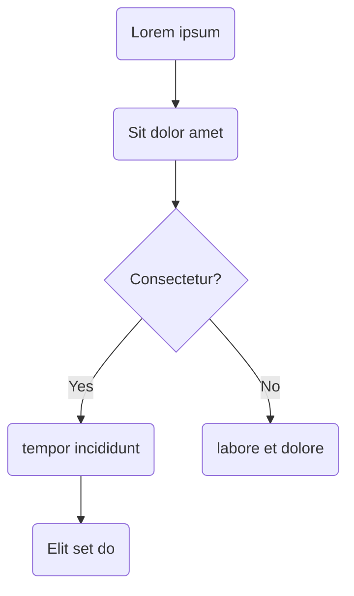

# Writing Markdown

<!--IMPORTANT-->

Please write your markdown following the [one sentence per line](https://rhodesmill.org/brandon/2012/one-sentence-per-line/) style to make diffs easier in the future.

<!--END_IMPORTANT-->

Markdown is an unstructured text format (as opposed to structured formats, such as Docbook, DITA, and S1000D). Essentially, it supports the creation of content with a minimum of markup (hence the name, Markdown). The notion is that for paragraphs, you can "just type". Headings and other ordinary items one generally finds in a document require simple and minimal markers. Other things can require some complexity, such as creating settings in other files (variables, for example, require defining the variables in a JSON file).

## Basics

This section covers how to add common items (such as headings, images, and links) to a Markdown document.

### Highlighting Text

Markdown offers a number of formatting options for text. You can make text be bold, italic, or both. You can also use strikethrough.
You should limit any kind of text highlighting to only the most crucial terms.

#### Bold, Italic, and Bold-italic

You can highlight text by making part of it be **bold**, _italic_, or **_both_**. To do so, wrap bold text in two asterisks (`**`), wrap italic text in one asterisk (`*`), and wrap bold-italic text in three asterisks (`***`). The following listing shows how to do so:

```markdown
**Bold**
_Italic_
**_Bold-italic_**
```

#### Strikethrough

You can add ~~strikethrough~~ highlighting to text by wrapping the text in double tilde characters (`~~`). The following listing shows how to do so:

```markdown
~~strikethrough~~
```

### Headings

You can create headings by using hash characters (`#`) at the start of a line. The more hash characters, the less important the heading is. For example, a level-three heading starts with three hash characters.

A page must contain only **one level-one heading**, the page's title.
The following listing shows such a heading (the one for this section):

```
## Heading Level 2
### Heading Level 3
### Heading Level 4
```

### Links

You can create links to other pages in the site, to other sites on the Internet, and to other locations within the same page (the latter generally being called cross-references)

The following examples show how to create links to other pages within our site:

```markdown
[Markdown Lorem](%currentPath%/markdown/lorem/)
[Installation](%currentPath%/installation/)
[Features](/features)
```

<!--IMPORTANT-->

The first two examples use the `% currentPath %` variable (which evaluates to `documentation` in these cases). See [Using Variables](#using-variables).

<!--END_IMPORTANT-->

The following example shows how to create a link to another site on the Internet:

```markdown
[Spring.io](https://spring.io/)
```

The following example (from the preceding tip) shows how to create a link to another place in the document:

```markdown
[Using Variables](#using-variables)
```

Note that the target of a cross-reference must be a heading. Also, the format for the target is all lower-case with spaces replaced by hyphens. Always use only one hash character, no matter what level the heading may be.

### Unordered Lists

You can create unordered (in other words, bulleted) lists by putting a hyphen at the start of each list item. You can create nested lists by indenting list items. The following example shows a list with multiple nested lists (including an ordered list):

- List item in an unordered list.
- List item in an unordered list.
- List item in an unordered list.
  - List item in a nested unordered list.
- List item in an unordered list.
  - List item in a nested unordered list.
    - List item in a nested unordered list.
    - List item in a nested unordered list.
  - List item in a nested unordered list.
  - List item in a nested unordered list.
- List item in an unordered list.
  1. Ordered list within an unordered list, first item.
  1. Ordered list within an unordered list, second item.

The following example shows the Markdown markup that defines the preceding list:

```
- List item in an unordered list.
- List item in an unordered list.
- List item in an unordered list.
  - List item in a nested unordered list.
- List item in an unordered list.
  - List item in a nested unordered list.
    - List item in a nested unordered list.
    - List item in a nested unordered list.
  - List item in a nested unordered list.
  - List item in a nested unordered list.
- List item in an unordered list.
  1. Ordered list within an unordered list, first item.
  1. Ordered list within an unordered list, second item.
```

### Ordered list

You can create ordered (in other words, numbered) lists by starting the first list item with `1.`. Subsequent list items can start with `1.` or with a hyphen. You can nest lists (including unordered lists) by indenting list items. The following example shows an ordered list (with an unordered nested list):

1. List item in a numbered list.

- List item in a numbered list.
- List item in a numbered list.
  1. List item in a nested numbered list.
- List item in a numbered list.
  1. List item in a nested numbered list.
  - List item in a nested numbered list.
  - List item in a nested numbered list.
  - List item in a nested numbered list.
  - List item in a nested numbered list.
- List item in a numbered list.
  - List item in a nested unordered list.
  - List item in a nested unordered list.

The following example shows the Markdown markup that defines the preceding list:

```
1. List item in a numbered list.
- List item in a numbered list.
- List item in a numbered list.
  1. List item in a nested numbered list.
- List item in a numbered list.
  1. List item in a nested numbered list.
  - List item in a nested numbered list.
  - List item in a nested numbered list.
  - List item in a nested numbered list.
  - List item in a nested numbered list.
- List item in a numbered list.
  - List item in a nested unordered list.
  - List item in a nested unordered list.
```

<!--NOTE-->

**NOTE:** The first list item in a list determines whether the list is unordered or ordered. In the preceding list, the first list item of the last nested list (the nested unordered list) starts with a hyphen, while the other nested lists start with `1.`. Consequently, the last nested list is unordered (or bulleted rather than numbered).

<!--END_NOTE-->

### Tables

You can insert tables into documents that you create with Markdown. The following example shows a simple table:

| Color  | Complementary Color |
| ------ | ------------------- |
| Red    | Green               |
| Blue   | Orange              |
| Yellow | Purple              |

The following Markdown markup defines the preceding table:

```markdown
| Color  | Complementary Color |
| ------ | ------------------- |
| Red    | Green               |
| Blue   | Orange              |
| Yellow | Purple              |
```

Note that the row of dashes separates the table header from the table body. As a result, you can have more than one row in the table header.

#### Alignment within Tables

You can left-justify, center, and right-justify the contents of a column (but not individual cells). To do so, insert colons before (to left-justify), both before and after (to center), or after (to right-justify) the dashes in the row that separates the table header from the table body.

The following example shows how to left-justify a table column (which is rarely needed):

```markdown
| Color |
| :---- |
| Red   |
```

The following example shows how to center a table column:

```markdown
| Color |
| :---: |
|  Red  |
```

The following example shows how to right-justify a table column:

```markdown
| Color |
| ----: |
|   Red |
```

### Sample code

You can (and nearly always should when writing for developers) add code to your Markdown documents. Markdown offers two ways to do so: inline code snippets and code blocks.

#### Inline Code

To create an inline code snippet, wrap the code in backticks. The following example shows how to do so

```markdown
`System.out.println("Hello, world!");`
```

The result of the preceding example is `System.out.println("Hello, world!");`.

#### Code Blocks

You can add code blocks by using lines of triple backticks before and after the code block. The following example shows how to do so:

````markdown
```java
{/* highlight-range{8-14} */}
@EnableBinding(Sink.class)
public class LoggingSink {

  @StreamListener(Sink.INPUT)
  public void log(String message) {
      System.out.println(message);
  }

  public Launcher(String name, String type, Scheduler scheduler) {
  	this.name = name;
  	this.type = type;
  	this.scheduler = scheduler;
  }

  public Scheduler getScheduler() {
  	return scheduler;
  }

  public void setScheduler(Scheduler scheduler) {
  	this.scheduler = scheduler;
  }
}
```
````

Note that the preceding listing does not show the trailing line with three backticks. Markdown does not handle blocks within blocks, so we were forced to remove that line. Remember to add it to your code blocks, lest you have a mess in your document.

The preceding example produces the following code block:

```java
{/* highlight-range{8-14} */}
@EnableBinding(Sink.class)
public class LoggingSink {

  @StreamListener(Sink.INPUT)
  public void log(String message) {
      System.out.println(message);
  }

  public Launcher(String name, String type, Scheduler scheduler) {
  	this.name = name;
  	this.type = type;
  	this.scheduler = scheduler;
  }

  public Scheduler getScheduler() {
  	return scheduler;
  }

  public void setScheduler(Scheduler scheduler) {
  	this.scheduler = scheduler;
  }
}
```

<!--TIP-->

**TIP:** You can add the type of code (Java in the preceding example) at the end of the first row of backticks that begins the code block. Doing so is a best practice, as it helps the rendering engine properly highlight the code and is useful if you create tabbed content. (See [Creating Content Tabs](#creating-content-tabs).)

<!--END_TIP-->

### Images

You can insert images in your Markdown content. To do so, make a link to the image and precede it with an exclamation point (`!`). The following example shows how to insert an image:

```markdown

```

The result of the preceding image link is the following image:


Note that we use [Remark Images](https://github.com/gatsbyjs/gatsby/tree/master/packages/gatsby-remark-images) to optimize images.

### Block Quotations

Use a block quotation for a quotation that is longer than one line or that you want to stand alone as its own paragraph. You can make a block quotation by using a right angle bracket (`>`) at the start of the quotation's line.

The following code block shows how to create a block quotation:

```
> This line is formatted as a block quotation.
```

## Advanced

You can use a number of advanced techniques in your Markdown documentation.

### Using Variables

You can define variables in the following file: `/content/documentation/variables.json`.

#### Default Variables

The following default variables are already defined:

| Name        | Description     | Value           |
| ----------- | --------------- | --------------- |
| version     | Current version | % version %     |
| currentPath | currentPath     | % currentPath % |

<!--IMPORTANT-->

**IMPORTANT:** In the "Value" column of the preceding table, you would remove the spaces between the value and the % characters when you use the variable. We had to add spaces to stop the values from being inserted in this table.

<!--END_IMPORTANT-->

#### Defining Variables

To define a variable, you must add an entry to `/content/documentation/variables.json`. The following listing defines three variables, one of which is `version`:

```json
{
  "version": "v2.0.1.RELEASE",
  "thing1": "thing1",
  "thing2": {
    "thing1": "thing2"
  }
}
```

The following table definition shows how to insert a variable's value in a table:

```markdown
| Name            | Description   | Value             |
| --------------- | ------------- | ----------------- |
| `thing1`        | Thing1        | % thing1 %        |
| `thing2.thing1` | Thing2 Thing1 | % thing2.thing1 % |
```

<!--IMPORTANT-->

**IMPORTANT:** In the "Value" column of the preceding table, you would remove the spaces between the value and the % characters when you use the variable. We had to add spaces to stop the values from being inserted in this table.

<!--END_IMPORTANT-->

You can also insert a variable in a link ([%thing1%](https://spring.io/%thing1%)), in code (`adipisicing %thing1%`), and in highlighted text (bold in this case: **%thing1%**).

You can also insert a variable in a code block, as the following example shows:

```html
<div>
  <a href="https://spring.io">%test-variable%</a>
</div>
```

<!--NOTE-->

**NOTE:** The value of `%test-variable%` shown in the preceding example does not match the content shown earlier. That happens because the build system for the site has logic to figure out which version definition to use and chose a different version in this case. That logic is in `gatsby-config.js`.

<!--END_NOTE-->

You can also use a variable in an admonition, as the following example shows:

<!--TIP-->

Here's a variable in a tip: **%thing1%**. It is also bold.

<!--END_TIP-->

### Admonitions

There are five common admonitions in the software industry (and many other industries): Warning, Caution, Note, Important, and Tip. The following admonitions offer an example of each one:

<!--WARNING-->

**WARNING:** Use a warning admonition to warn readers about potential data loss or other potentially catastrophic problems. Note that, in the broader technical writing community, warnings are used for things that can kill or injure people. In software, they are reserved for data loss. The following code block shows how to make a warning admonition:

<!--END_WARNING-->

The following listing shows how to create a warning in Markdown:

```markdown
<!--WARNING-->

Your warning admonition goes here.

<!--END_WARNING-->
```

<!--CAUTION-->

**CAUTION:** Use a caution to warn readers about potentially problematic operations, especially those that can cause a lot of extra work or rework. The following code block shows how to make a caution admonition:

<!--END_CAUTION-->

The following listing shows how to create a caution in Markdown:

```markdown
<!--CAUTION-->

Your caution admonition goes here.

<!--END_CAUTION-->
```

<!--NOTE-->

**NOTE:** Use a note to point out something related to the main point of the surrounding paragraphs. If it is important, use an important admonition. Usually, notes contain content that is helpful but not crucial. Crucial content should be in the body of the section or called out with other admonitions. The following code block shows how to make a note admonition:

<!--END_NOTE-->

The following listing shows how to create a note in Markdown:

```markdown
<!--NOTE-->

Your note admonition goes here.

<!--END_NOTE-->
```

<!--IMPORTANT-->

| **IMPORTANT:** Use an important admonition to call out things that the reader must not overlook. If there is one thing the reader absolutely must know, that's a case for using an important admonition. The following code block shows how to make an important admonition:

<!--END_IMPORTANT-->

The following listing shows how to create an important admonition in Markdown:

```markdown
<!--IMPORTANT-->

Your important admonition goes here.

<!--END_IMPORTANT-->
```

<!--TIP-->

**TIP:** Use a tip to let readers know about shortcuts, ways to save time, and so on. The following code block shows how to make a tip admonition:

<!--END_TIP-->

The following listing shows how to create a tip in Markdown:

```markdown
<!--TIP-->

Your tip admonition goes here.

<!--END_TIP-->
```

#### Admonitions with Titles, Paragraphs, Code ...

Admonitions can have titles. Generally, you should use a title on an admonition when you plan to refer to the admonition from elsewhere in the document (from other pages in a multi-page layout) or when you want to create a kind of "aside" within your content.

Admonitions with titles should be used infrequently, because their titles compete with the other titles on the page (potentially causing confusion).

```markdown
<!--NOTE-->

**My Title**

This example makes a note, but you can add a title to any admonition.

<!--END_NOTE-->
```

You can make an admonition with multiple paragraphs. To do so, add a pipe character before each line, including the blank lines between paragraphs. The following code block shows how to create a note with two paragraphs

```markdown
<!--NOTE-->

This example makes a note with multiple paragraphs, but any admonition can have multiple paragraphs.

Here's a second pargraph.

<!--END_NOTE-->
```

You can make an admonition with both a title and multiple paragraphs. The following code block shows how to do so:

```markdown
<!--NOTE-->

**Your Title**

This example makes a note, but you can add a title and multiple paragraphs to any admonition.

Here's a second paragraph.

<!--END_NOTE-->
```

### Mermaid

Mermaid (https://mermaidjs.github.io/) is a graphing tool that we have included to support creating graphs and similar art. The following example shows a Mermaid graph:



The following example shows the code used to create the preceding Mermaid graph:

````

````

(Note that a quirk of Markdown required putting each line into its own listing. Otherwise,
it renders as a graph.)

### Code Callouts

You can add callouts to code. Callouts let you identify a line and then provide more detail about that line after the listing. The following example shows a listing with callouts:

```java
@EnableBinding(Sink.class)
public class LoggingSink {

  @StreamListener(Sink.INPUT)
  public void log(String message) {
      System.out.println(message);
  }

  public Launcher(String name, String type, Scheduler scheduler) {
  	this.name = name;
  	this.type = type;                                               // <1>
  	this.scheduler = scheduler;                                     // <2>
  }

  public Scheduler getScheduler() {                                 // <3>
  	return scheduler;
  }

  public void setScheduler(Scheduler scheduler) {
  	this.scheduler = scheduler;
  }
}
```

- <1> Code callout 1 description.
- <2> Code callout 2 description.
- <3> Code callout 3 description.

<!--TIP-->

**TIP:** You can format the descriptive paragraphs as you would any other paragraphs. You can add bold and italic text, add links, and use variables within those paragraphs.

<!--END_TIP-->

### Creating Content Tabs

You can create tabbed content within a page. The following code block shows how to do so:

```markdown
<!--TABS-->

<!--First-->

First tab content.

You can have multiple paragraphs.

<!--Second-->

Second tab content.

<!--END_TABS-->
```

The following example shows four tabs, each showing how to print "Hello, World" in a different programming language:

<!--TABS-->

<!--JavaScript-->

```js
console.log('Hello, world!')
```

<!--Python-->

```py
print('Hello, world!')
```

<!--C-->

```C
#include <stdio.h>

int main() {
   printf("Hello World!");
   return 0;
}
```

<!--Pascal-->

```Pascal
program HelloWorld;
begin
  WriteLn('Hello, world!');
end.
```

<!--END_TABS-->

### Downloading Github Files

You can set up a link from which readers can download content from Github. To do so, you need to use the `download` verb. The following example shows how to do so:

```
`download: https://raw.githubusercontent.com/spring-cloud/spring-cloud-dataflow-samples/master/dataflow-website/batch-developer-guides/batch/batchsamples/billrun/src/main/resources/schema.sql`
```

The result of the preceding example is this `download: https://raw.githubusercontent.com/spring-cloud/spring-cloud-dataflow-samples/master/dataflow-website/batch-developer-guides/batch/batchsamples/billrun/src/main/resources/schema.sql` link.

#### Defining the Download Link Text

You need not always have "Download" as the link text. The following example shows how to define the link text for a download:

```
`download: https://raw.githubusercontent.com/spring-cloud/spring-cloud-dataflow-samples/master/dataflow-website/batch-developer-guides/batch/batchsamples/billrun/src/main/resources/schema.sql title=link`
```

The result of setting the link text is that you can write sentences such as "You can download the file from this `download: https://raw.githubusercontent.com/spring-cloud/spring-cloud-dataflow-samples/master/dataflow-website/batch-developer-guides/batch/batchsamples/billrun/src/main/resources/schema.sql title=link`".

### Embedding Markdown Template

You can add markdown templates to include them in the pages. To do so, you need to use the `TEMPLATE` verb.

<!--CAUTION-->

The templates are injected on the creation page. If you update a template content, you have to update the parent page to see the changes.

The template file name has to start with the character \_.

<!--END_CAUTION-->

The following example includes the file `template/_sample.md` in the page.

```markdown
<!--TEMPLATE:template/sample.md-->
```

The result of the preceding example is the following content:

<!--TEMPLATE:template/sample.md-->

### Embedding Github Code

Sometimes, it is better to show code rather than link to it. To do so, you need to use the `CODE` verb. The following example shows how to do so:

```markdown
<!--CODE:https://raw.githubusercontent.com/spring-cloud/spring-cloud-dataflow/master/spring-cloud-dataflow-autoconfigure/src/main/java/org/springframework/cloud/dataflow/autoconfigure/local/ProfileApplicationListener.java-->
```

The result of the preceding example is the following code listing:

<!--CODE:https://raw.githubusercontent.com/spring-cloud/spring-cloud-dataflow/master/spring-cloud-dataflow-autoconfigure/src/main/java/org/springframework/cloud/dataflow/autoconfigure/local/ProfileApplicationListener.java-->

### Embedding Videos

You can embed a YouTube video. To do so, you need to use the `VIDEO` verb. The following example shows how to do so:

```markdown
<!--VIDEO:https://www.youtube.com/embed/rvAr0KYXBhk-->
```

The result of the follwoing example is the followinb embedded video:

<!--VIDEO:https://www.youtube.com/embed/rvAr0KYXBhk-->
