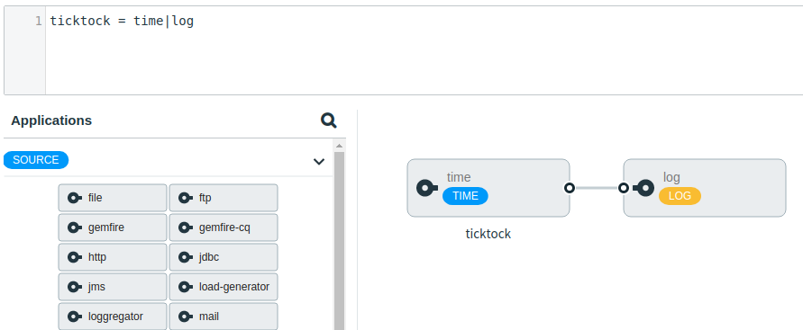

## UI Changes to Stream Editor

Stream Editor went through a much-needed touch of love and should now be more visually appealing. Here’s a simple screenshot what it looks like:

## Maven Preemptive Authentication

Support for using Maven Wagon transport for HTTP has been added to the Maven Artifact Resolver infrastructure. The driver for this was a request from a user to be able to use preemptive authentication with JFrog’s artifactory. Use of it is currently optional via a property but we’re looking to make it default sometime in the future and possibly introduce more wagon transports which might provide interesting options to place your artifacts behind ssh, git or whatever Apache Wagon is able to provide. If you have a particular interest or experience of it, let us know.

## Various Bug Fixes and Enhancements

Apart from a list above more detailed lists can be found from [Iteration 159](https://github.com/spring-cloud/spring-cloud-dataflow/milestone/92?closed=1) and [Iteration 160](https://github.com/spring-cloud/spring-cloud-dataflow/milestone/95?closed=1).

- Audit can now track platform info
- Better error handling for platform-specific task cron scheduling
- Using Scheduled task arguments from a previous execution
- Task scheduling via shell
- Task Java DSL improvements
- Missing docs for scaling API

## Project Build Changes

Starting from this version we’ve changed all Data Flow family projects to have our own parent pom in spring-cloud-dataflow-build order to have easier dependency handling and not to be so tightly dependant with spring-cloud-build.

We’ve been using Travis CI in GitHub to build commits and pull requests and we’re finally migrating to GitHub actions starting with spring-cloud-dataflow and spring-cloud-deployer-local. Experience is so good that we’re rolling these out to other repos as well.

Integration testing is difficult and complex and for this we’ve been using our own scripting against various CF and K8s environments. In those environments, we should only really test environment-specific things so we’ve started to move some of these tests into docker and docker-compose so that it would be easier for any user to run tests that are not environment-specific.

## Stay in touch...

As always, we welcome feedback and contributions, so please reach out to us on [Stackoverflow](https://stackoverflow.com/questions/tagged/spring-cloud-dataflow) or [GitHub](https://github.com/spring-cloud/spring-cloud-dataflow/issues) or via [Gitter](https://gitter.im/spring-cloud/spring-cloud-dataflow).
